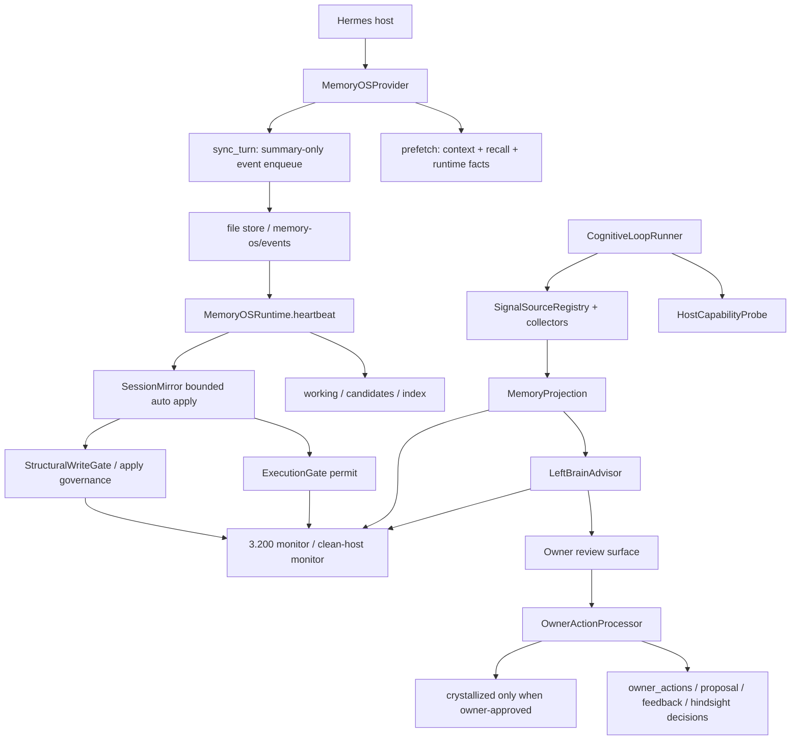

# Memory-OS 工程全景审计

审计日期: 2026-06-04

审计对象: `D:\Hermes agent manager\Hermes-Memory-OS`

Historical first-round audit baseline: `1ed4ef414f9d4a46eb363cbc09e4964622508938`

Current P0 deployed baseline: `799b69d25d4d679e2d38a6d97e2f31c3f361db01`

证据级别:
- `code`: 本地代码和 README 审查。
- `local`: 本地测试、静态检查、写面检查结果。
- `live`: 10.20.3.200 和 10.20.2.66 只读或部署后证据。
- `drift`: 代码、README、live monitor 或历史证据之间的口径漂移。

## 1. 总结结论

Memory-OS 不是独立聊天服务、不是通用执行器、不是替代 Hermes 的调度和对话层。它是 Hermes host 内的文件优先记忆与治理运行时，核心职责是:

- 为 Hermes 提供可检索、可审计、可治理的记忆状态。
- 把 session、owner action、signal source、Hindsight 风险、proposal、label 等信号投影成 Memory-OS 自己的治理证据。
- 用 ExecutionGate 和 StructuralWriteGate 把自动执行、自动写入变成机器可审计的 bounded lane。
- 把真正需要 owner 的动作收敛到不可逆、对外、高风险边界。

当前架构已经从早期文档阶段进入 live lane 阶段。已 live 的重点能力包括:

- SessionMirror owner-channel 批准后毕业为 heartbeat bounded auto apply。
- runtime heartbeat、projection、left-brain advisor、reversible labels 等自动执行面通过 ExecutionGate 记录 permit envelope。
- StructuralWriteGate 已覆盖 Memory-OS 和 `plugins/modules` 的直接 JSONL 写面。
- Hindsight governance suggestion 已进入 owner-review surface，但仍是 metadata-only/report-only，不直接写、删、降级 Hindsight。

当前最大风险不是单点越权写，而是闭环快速扩展后产生的工程漂移:

- 10.20.3.200 复测 live monitor PASS，说明之前 `memory_projection_stale_after_deploy` 是部署后 projection 尚未自然刷新造成的时间窗口问题。
- 10.20.2.66 复测 clean-host monitor WARN 且 `FAIL=[]`，projection freshness 已证明。
- cron onboarding 默认已转为 `active-closure` profile，README/install help、
  onboarding、monitor 和 live enabled-state 已在 P0 修复中收敛到 2 个必需 job。
- owner-review backlog 仍较高，digest cap 已存在但 backlog 治理还没完全闭合。

这些风险在进入 58 号高风险 authority lane 前必须收敛。

## 2. 架构边界

README 明确的边界仍然成立:

- Hermes owns: 对话、外部发送、scheduler/cron transport、channel selection、origin-local routing、agent 话术和 host runtime。
- Memory-OS owns: helper output、state transition、token/ledger、audit、monitor、projection、governed apply。

Memory-OS 当前不应该直接接管:

- Telegram/owner channel transport。
- Hermes 自有 cron job 的业务逻辑。
- Hindsight store 的直接 retain/reject/demote apply。
- route/score authority。
- identity/relationship 写入。
- crystallized 长期记忆自动写入。
- 外部消息发送。

## 3. 系统主视图

## 4. 主调用链

### 4.1 对话记忆入口

入口: `plugins/memory/memory_os/__init__.py`

链路:

1. Hermes 加载 `MemoryOSProvider.initialize()`。
2. `prefetch()` 读取 task anchor、runtime facts、context router、memory sources、low-clue recall、Hindsight shadow substrate。
3. `sync_turn()` 跳过 owner-review 命令，把对话压成 summary-only event，写入 Memory-OS 事件队列。
4. heartbeat 后续把事件转为 working memory、candidate、index。

关键边界:

- provider 只接收 Hermes 对话和记忆上下文，不拥有对话输出。
- owner-review 命令被排除在普通 turn sync 之外，避免审批命令进入普通记忆污染。

### 4.2 Heartbeat 自动运行链

入口: `plugins/memory/memory_os/runtime.py`

链路:

1. `MemoryOSRuntime.heartbeat()` 创建 `runtime_heartbeat_core` ExecutionGate envelope。
2. 检查 boundary false 后处理事件队列、working decay、candidate、index sync。
3. 调用 `auto_apply_graduated_session_mirror()`。
4. SessionMirror 写入前解析并校验 `xgate_*` permit。
5. 通过 StructuralWriteGate 或 apply governance ledger 记录 bounded append-only 证据。
6. heartbeat completion 写回 ExecutionGate postcheck。

关键边界:

- SessionMirror 是当前已经毕业的自动写 lane。
- 每次默认 bounded，且以 permit scope 作为硬输入，不允许写出 scope 后再补日志。

### 4.3 Cognitive loop 和左脑投影链

入口: `plugins/memory/memory_os/cognitive_loop.py`

核心步骤:

1. portable modules 运行，如 confabulation、proposal queue、pipeline check、reflection、judge 等。
2. `HostCapabilityProbe` 采集 Hermes host 能力和运行布局。
3. `SignalSourceRegistry` 和 collectors 采集 metadata-only 信号。
4. `MemoryProjection` 把信号投影到 canonical evidence。
5. `LeftBrainAdvisor` 从 projection 产生 owner-visible finding。
6. owner review digest 或 proposal-followup adapter 把 finding 推入正常治理面。

关键边界:

- 53 之后 `cognitive_loop` report 不再因通用 bounded serializer 漏掉尾部 required steps。
- projection 和 advisor 都需要 ExecutionGate permit。
- projection 不应保存 raw body 或 secret。

### 4.4 Owner action 链

入口: `plugins/memory/memory_os/owner_actions.py`

链路:

1. owner channel digest 中生成稳定 token。
2. owner 回复 approve/reject/demote/retain 等 action。
3. OwnerActionProcessor 解析 token、scope、action kind。
4. 仅 owner-approved 的状态机可以执行 state transition。
5. 结果写入 owner action ledger、proposal action ledger、feedback ledger、hindsight curation decision ledger 等。

关键边界:

- `approve_proposal` 仍不等于实际 apply。
- Hindsight curation 当前只写 Memory-OS decision ledger，`actual_hindsight_write/delete=false`。
- `allow_speak_once`、crystallized 写、revoke/demote/delete、route/score、identity 仍应属于永久或高风险 owner boundary。

### 4.5 Cron 执行链

入口:

- `scripts/memory_os_owner_cron_onboarding.py`
- `scripts/memory_os_execution_gate_runner.py`
- `plugins/memory/memory_os/hermes_cron_adapter.py`

已形成的目标链:

1. onboarding 发现 Hermes cron 能力。
2. 注册 Memory-OS owned job。
3. 每个 Memory-OS job 通过 gate runner 获取 permit envelope。
4. runner 带 `MEMORY_OS_EXECUTION_GATE_ENVELOPE_ID` 执行 helper。
5. completion 写入 postcheck 和 evidence path。
6. monitor 从 registry/live scheduled job 派生覆盖检查。

当前漂移:

- 当前代码默认 `active-closure` profile，只安装当前自动闭环所需 job，并保留 `full` profile。
- README 和 install help 仍有 7 个 operational cron jobs 的旧描述。
- 这会影响安装、monitor、用户理解和后续审计口径，必须统一为一个 source of truth。

### 4.6 部署与监控链

入口:

- `scripts/install_memory_os.sh`
- `scripts/deploy_memory_os.py`
- `scripts/memory_os_3_200_monitor.py`
- `scripts/write_surface_check.py`
- `scripts/static_hygiene.py`

部署原则:

- installer 默认 safe，不删除、不清理、不重启 Hermes。
- deploy wrapper 支持 preflight/dry-run/apply/postcheck/report。
- live validation 需要区分 deploy PASS、monitor PASS、owner-visible smoke、runtime smoke。

当前已知 live 状态:

- 本地/双机 HEAD 为 `799b69d25d4d679e2d38a6d97e2f31c3f361db01`。
- 10.20.3.200 live monitor PASS，`WARN=[]`、`FAIL=[]`。
- 10.20.2.66 clean-host monitor WARN、`FAIL=[]`。
- 双机 fast cron probe PASS: active registry=2, enabled Memory-OS jobs=2,
  optional outside active registry=0。

## 5. 数据流和主要落盘面

Memory-OS 采用 file-first 设计。主要数据类别如下:

| 类别 | 典型路径 | 写入来源 | 风险 |
| --- | --- | --- | --- |
| 对话事件 | `memory-os/events` | `MemoryOSProvider.sync_turn` | 中，可能污染候选记忆 |
| working/candidate/index | `memory-os/*` | heartbeat | 中，影响检索和候选 |
| crystallized | `memory-os/crystallized` | owner action | 高，只应 owner-approved |
| ExecutionGate envelope | `memory-os/system/execution_gate_envelopes.jsonl` | runtime, cognitive loop, cron runner | 中，是自动执行审计基线 |
| owner actions | `memory-os/system/owner_actions.jsonl` | owner channel action | 高，状态机入口 |
| proposal ledgers | `memory-os/system/*proposal*` | proposal/advisor/owner action | 中高，影响后续 apply |
| memory projection | `memory-os/system/memory_projections.jsonl` | MemoryProjection | 中，影响左脑治理视图 |
| left-brain advisor reports | `memory-os/system-modules/left_brain_advisor/reports.jsonl` | LeftBrainAdvisor | 中，影响 owner digest |
| Hindsight curation decisions | `memory-os/system/hindsight_curation_decisions.jsonl` | owner action | 中，目前不写 Hindsight |
| reversible labels | `memory-os/system-modules/reversible_labels/*.jsonl` | GroundTruthMiner | 低中，可过期可撤销 |
| monitor reports | script output | monitor | 低，不应作为唯一用户闭环 |

关键控制点:

- StructuralWriteGate 对 Memory-OS/system 和 system-modules 的 JSONL append 做 permit 校验。
- write surface check 当前已覆盖 `plugins/memory` 和 `plugins/modules`。
- projection collector 必须保持 metadata-only，不能引入 raw message body 或 secret。

## 6. 部署运行方式

当前项目有三类运行方式:

1. 插件安装:
   - `scripts/install_memory_os.sh`
   - 启用 Hermes memory provider、shell plugin、Memory-OS modules、heartbeat、cognitive loop、cron helper。

2. 部署闭环:
   - `scripts/deploy_memory_os.py --host ... --phase ...`
   - 负责 preflight、dry-run、apply、postcheck、deployment manifest、monitor probe。

3. 运行时和定时任务:
   - Hermes 调用 provider 和 heartbeat。
   - Hermes cron 触发 Memory-OS owned helpers。
   - gate runner 负责 per-execution envelope。

审计建议:

- 部署文档必须持续写明 `active-closure` 和 `full` 的差异。
- clean-host 缺 pytest 是 ops tooling hygiene，但会降低远端验证完整性。
- deploy PASS 不能替代 monitor PASS，更不能替代 owner-visible workflow PASS。

## 7. 已打开和未打开的能力面

已打开:

- bounded SessionMirror auto apply。
- runtime heartbeat ExecutionGate。
- MemoryProjection metadata-only projection。
- LeftBrainAdvisor owner-visible finding。
- reversible labels 低风险 lane。
- Hindsight governance suggestion 和 owner-gated decision ledger。
- StructuralWriteGate 写面扫描和 direct JSONL append 分类。

仍未打开:

- 58 高风险 authority lanes。
- route/score 自改。
- identity/relationship 写入。
- Hindsight store 真实 retain/reject/demote apply。
- crystallized 长期记忆自动写入。
- 对外消息发送自动化。
- bounded mirror expansion。
- candidate aggregation。
- proposal_followup full_auto。

## 8. 最大风险排序

1. full monitor 过重，需要 fast probe / full monitor 性能预算。
2. owner-review backlog 和 review_suggested 噪音仍可能拖慢真实 owner 闭环。
3. Hindsight curation 容易被误解为已经作用于 Hindsight store，但当前只是 Memory-OS advisory decision ledger。
4. internal docs 被 `.gitignore` 忽略，GitHub main 代码和本地治理证据可能长期分叉。

## 9. 第一轮审计结论

工程全景已经清楚:

- 项目定位: Hermes 插件式 Memory/Governance OS。
- 模块分层: provider/runtime/gates/projection/advisor/owner action/modules/scripts/monitor。
- 主调用链: provider sync/prefetch、heartbeat、cognitive loop、owner action、cron gate、deploy monitor。
- 数据流: summary event 到 working/candidate/index，再到 owner-approved crystallized 和 governed ledgers。
- 部署: safe installer + deploy wrapper + Hermes cron + live monitor。
- 最大风险: 当前不是缺少治理概念，而是治理面扩展后出现 cron baseline drift、owner burden、Hindsight curation 语义边界和 ignored internal evidence 风险。

进入下一轮前建议先做工程基线收敛:

1. 固化 fast cron probe，并补 fast boundary/runtime probe。
2. 把 projection freshness 的时间窗口写入部署后验证说明，避免部署后立刻 monitor 的假 FAIL 被误判成链路断裂。
3. 继续保留本地定向测试、write_surface_check、static_hygiene 和双机 monitor 作为每轮变更前置门槛。
