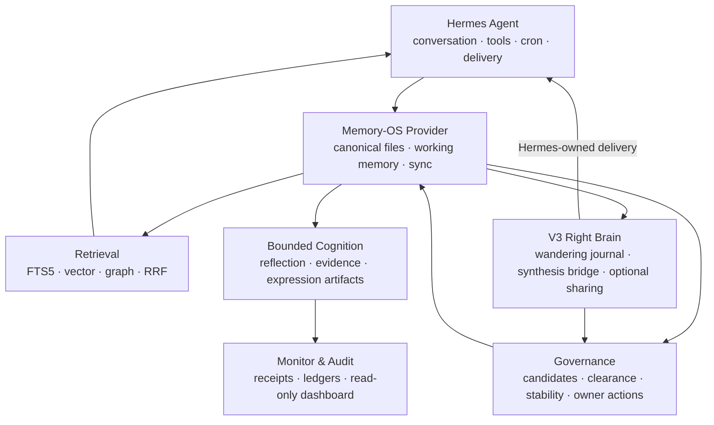

# Hermes Memory-OS

<p align="center">
  
</p>

<p align="center">
  <strong>Memory that can remember, doubt, forget — and eventually dream.</strong>
</p>

<p align="center">
  A file-first memory and cognition runtime for long-running
  <a href="https://github.com/NousResearch/hermes-agent">Hermes Agent</a> profiles.
</p>

<p align="center">
  <a href="LICENSE"></a>
  
  
  
</p>

Hermes Memory-OS gives a long-running agent more than a larger context window.
It gives the agent an inspectable memory lifecycle: experiences enter working
memory, evidence is accumulated, contradictions stay visible, durable beliefs
must clear governance gates, and every important transition remains auditable.

Hermes remains the host. It owns conversation, tools, scheduling, transport,
retry, and channel delivery. Memory-OS owns bounded memory state, retrieval,
cognition artifacts, approval state machines, and operational evidence.

## Why Memory-OS

Most agent memory systems answer one question: **what should be retrieved?**
Memory-OS also asks:

- Should this experience become a durable belief at all?
- What evidence supports it, and what contradicts it?
- Is it provisional, contested, superseded, or permanent?
- Can the owner inspect, reject, or correct it through the normal agent channel?
- Can the system forget without turning forgetting into a failure?
- Can an agent have thoughts that are not tasks, reports, or alerts?

That last question defines the V3 right brain: a governed space that can
associate freely, remain silent, share a thought, or let it disappear — without
quietly rewriting what the system believes.

## Core Capabilities

### Living memory, not a transcript archive

- Profile-local canonical files remain the source of truth.
- Working memory is separated from owner-approved crystallized memory.
- Provisional records pass evidence, clearance, stability, and owner gates
  before becoming permanent.
- Contradictory memories remain visible through contested projections instead
  of being silently overwritten.
- Evidence increments, absorption audits, superseded state, provenance, and
  sensitivity-aware fail-closed rules make belief changes explainable.
- Rebuildable SQLite indexes provide speed without becoming the authority.

### Hybrid retrieval with a deterministic floor

- SQLite FTS5 full-text search.
- Optional local vector similarity through `sentence-transformers`.
- Optional graph traversal from retrieved anchors.
- Reciprocal Rank Fusion across enabled lanes.
- Unicode-boundary and permanent-memory fallbacks when richer lanes return no
  result.
- Every optional lane is knob-gated and can degrade safely to pure FTS5.

### Owner governance through Hermes

- Review digests arrive in the owner-facing Hermes channel.
- Stable `oa_...` action tokens survive re-rendering and retries.
- Approve, reject, feedback, and bounded apply operations pass through one
  audited state machine.
- Approval is not execution: only proposal kinds with an explicit target,
  rollback, monitor evidence, and apply contract can change runtime state.
- A read-only dashboard exposes health and evidence without adding hidden write
  controls.

### A right brain with the freedom not to perform

- Portable cognition modules produce evidence, proposals, reflection artifacts,
  expression drafts, cadence reports, and feedback signals.
- A wandering journal holds associations, interpretations, and claim-like
  insights without forcing every thought to become a task or a memory.
- The wandering prompt defines boundaries, not a destination. A cycle with no
  output is complete and healthy.
- Thoughts may quietly disappear, become governed synthesis candidates, or be
  shared as inner monologue.
- Sharing has a maximum rate and cooldown, but no quota, catch-up send,
  reworded resend, or emergency lane.
- Owner inspection is allowed and visible: querying the journal writes a small
  `{queried_at, scope}` trace instead of observing invisibly.
- Memory-OS never sends directly to Telegram, Discord, Signal, Slack, Matrix,
  or another platform. Hermes owns delivery.
- Right-brain expression is bounded by Hermes delivery, content deduplication,
  outcome capture, and no-send validation.

### Optional Hindsight substrate

Hindsight can be adopted as a governed derived projection while local files
remain authoritative. Raw conversation turns are not exported by default.
Retain, retract, advisory recall, and reflection each have separate controls,
and the projection ledger remains auditable.

## How the V3 Right Brain Works

The V3 contract is deliberately different from an autonomous task loop. Its
purpose is not to optimize output volume. Its purpose is to give the agent a
bounded place for non-instrumental thought while keeping durable belief changes
fully governed.

| Principle | Final behavior |
| --- | --- |
| Direction stays open | The wandering prompt gives boundaries and seeds, but no required direction or success criterion. Producing nothing is a normal result. |
| Three depths of thought | `association` holds fragments and free associations; `interpretation` explores meaning; `claim` is a belief-like statement that must enter the governed synthesis path. |
| Three possible fates | A thought may be annihilated, proposed, or shared. Annihilation is the default and is not treated as failure. |
| Dreams do not bypass evidence | A `claim` can become memory only as a `derivation="synthesis"` candidate with complete provenance, then clearance, stability, and owner gates. |
| Expression has a ceiling, not a quota | Rate and cooldown knobs may limit sharing. There is no minimum frequency, catch-up send, reworded resend, or emergency channel. |
| Observation leaves a trace | The journal is not proactively shared, but the owner may inspect it. A query writes a lightweight `{queried_at, scope}` trace: the door may open, but never invisibly. |
| Forgetting is a right | Expired thoughts disappear quietly. Monitoring may count annihilation for operations, but must not score it as good, bad, or anomalous. |
| Disabled until earned | `wandering_enabled` defaults to `false`. Activation follows the memory evidence gate and a 30-day coexistence period before rhythm knobs are reconsidered. |

In one sentence: **give her boundaries, not direction; dreams must pass gates,
thoughts may vanish; the door may open, but opening it leaves a trace; whether
she speaks is hers to decide.**

## Quick Start

### Requirements

- Linux host with an existing Hermes Agent profile
- Python 3.11+
- `git`
- `systemctl --user` for timer-based runtime loops; cron fallback remains
  available where user systemd is unavailable

### Install the operational profile

```bash
git clone https://github.com/btnalit/Hermes-Memory-OS.git
cd Hermes-Memory-OS

HERMES_HOME=/root/.hermes \
  bash scripts/install_memory_os.sh --yes --operational --hindsight auto
```

`--operational` installs and enables:

- the `memory_os` Hermes memory provider;
- the `memory-os-agent-os` shell plugin;
- heartbeat and cognitive-loop runtime integration;
- portable cognition, governance, and expression modules;
- the 14-job `active-closure` Hermes cron profile;
- owner-channel discovery from `channel_directory.json`;
- post-install verification that fails loudly when core components are missing.

The installer does **not** restart `hermes-gateway.service`.

### Choose an install posture

| Preset | Intended use | Notable behavior |
| --- | --- | --- |
| `--operational` | Normal full installation | Enables the operational cognition preset, runtime loops, and `active-closure` automation. |
| `--production-safe` | Conservative non-interactive rollout | Keeps core runtime integration but explicitly disables DeepReflection. |
| `--test-host` | Disposable or isolated validation host | Enables the complete test-host surface for integration checks. |

Examples:

```bash
# Conservative install with Hindsight disabled.
HERMES_HOME=/root/.hermes \
  bash scripts/install_memory_os.sh --yes --production-safe --hindsight off

# Install helpers and runtime, but do not create recurring Hermes jobs.
HERMES_HOME=/root/.hermes \
  bash scripts/install_memory_os.sh --yes --operational \
  --no-enable-owner-cron-onboarding

# Preview without writing.
HERMES_HOME=/root/.hermes \
  bash scripts/install_memory_os.sh --yes --operational --dry-run
```

For all options:

```bash
bash scripts/install_memory_os.sh --help
```

## Deployment Wrapper

`scripts/deploy_memory_os.py` separates rollout into `plan`, `preflight`,
`dry-run`, `apply`, and post-install checks. A gateway restart requires both
`--allow-restart` and an explicit restart command.

```bash
# Fresh profile, local apply on the target host.
python scripts/deploy_memory_os.py \
  --hermes-home /root/.hermes \
  --profile fresh \
  --phase apply \
  --mode production-safe \
  --hindsight off

# Existing profile, remote dry-run before any write.
python scripts/deploy_memory_os.py \
  --host hermes-media \
  --remote-repo-root /opt/Hermes-Memory-OS \
  --hermes-home /root/.hermes \
  --profile upgrade \
  --phase dry-run \
  --mode operational \
  --hindsight auto
```

Automated rollout defaults the low-clue LLM judge to bounded active voting with
the current Hermes provider/model. Select `--llm-judge-preset report-only` for
observation only, or `--llm-judge-preset none` to disable it.

## Automation Profiles

The default `active-closure` profile contains 14 jobs:

| Area | Jobs |
| --- | --- |
| Owner loop | owner review digest, expression feedback, memory-source feedback |
| Governance | proposal follow-up OpsGate, candidate aggregation, fact judge |
| Memory maintenance | index sync, event stats refresh, state overlay refresh, entity index refresh, working-memory cleanup |
| Integrity and substrates | L3 probe verification, Hindsight advisory digest, Hindsight health probe |

Most maintenance and governance jobs run with `deliver=local` and no agent.
Owner-facing jobs resolve the configured owner channel through Hermes.

The `full` profile adds three optional jobs:

- right-brain expression through `deliver=origin`;
- module cadence reporting;
- right-brain expression outcome capture.

Enable it explicitly:

```bash
HERMES_HOME=/root/.hermes \
  python scripts/install_memory_os_plugin.py \
  --run-owner-cron-onboarding \
  --owner-cron-owner-approved \
  --owner-cron-profile full
```

Switching an upgraded host back to `active-closure` pauses known optional jobs;
it does not delete them.

## Verify the Installation

```bash
HERMES_HOME=/root/.hermes hermes memory
HERMES_HOME=/root/.hermes hermes plugins list
HERMES_HOME=/root/.hermes hermes memory-os-agent-os status
HERMES_HOME=/root/.hermes hermes memory-os-agent-os doctor
HERMES_HOME=/root/.hermes hermes memory-os-agent-os modules status
HERMES_HOME=/root/.hermes hermes memory-os-agent-os modules validate-no-send
```

Expected provider/plugin relationship:

```text
memory.provider = memory_os
plugins.enabled includes memory-os-agent-os
plugins.enabled does not include memory_os
```

`memory_os` is selected as a provider. It is not enabled as a general Hermes
plugin.

## Owner Interaction

The owner acts through the normal Hermes conversation, not a root shell.
Display labels such as `A1`, `R1`, and `F1` are transient; the durable identity
is the printed `oa_...` token.

```text
memory approve oa_<token>
memory reject oa_<token>
memory apply oa_<token>
memory feedback oa_<token> too_mechanistic
memory feedback oa_<token> like_expression
```

Hermes interprets the utterance and handles clarification. Memory-OS receives a
structured action and applies it idempotently through `OwnerActionProcessor`.

## Read-Only Dashboard

Generate and serve a bounded snapshot on port `3693`:

```bash
python scripts/memory_os_monitor_dashboard_snapshot.py \
  --hermes-home /root/.hermes \
  --profile main \
  --output monitor_dashboard/snapshot.generated.js

python scripts/serve_memory_os_monitor_dashboard.py \
  --host 0.0.0.0 \
  --port 3693 \
  --snapshot-hermes-home /root/.hermes \
  --snapshot-profile main \
  --snapshot-interval-seconds 60
```

Install it as a system service when appropriate:

```bash
sudo python scripts/install_memory_os_monitor_dashboard_service.py \
  --repo-root /opt/Hermes-Memory-OS \
  --hermes-home /root/.hermes \
  --profile main \
  --host 0.0.0.0 \
  --port 3693 \
  --python-bin /usr/bin/python3 \
  --enable
```

The dashboard is presentation-only. It has no approve, apply, execute, or send
controls.

## Architecture



### Boundary summary

| Hermes owns | Memory-OS owns |
| --- | --- |
| Conversation and clarification | Canonical memory and rebuildable indexes |
| LLM/tool execution | Candidate, clearance, and stability state |
| Cron scheduler and retry | Bounded helper outputs and execution envelopes |
| Platform adapters and delivery | Owner action tokens and audited transitions |
| Origin/local channel routing | Monitor fields, receipts, and projection ledgers |

## Safety Defaults

- No direct platform sends from Memory-OS.
- No arbitrary external execution.
- No identity writes without an explicit owner-approved path.
- No unapproved crystallized-memory writes.
- No raw-turn Hindsight retain by default.
- No proposal apply without a bounded target and rollback contract.
- Sensitive mixed-scope candidate clusters fail closed.
- Canonical files remain authoritative; derived indexes and substrates are
  rebuildable or retractable.
- Optional lanes are disabled, report-only, shadowed, or knob-gated until their
  promotion evidence exists.

## Repository Layout

```text
memory_os_agent/               Minimal Hermes compatibility surface
plugins/memory/memory_os/      Provider, lifecycle, retrieval, governance
plugins/memory-os-agent-os/    Hermes shell plugin and owner-review tools
plugins/system/                Runtime contracts and coordination primitives
plugins/modules/               Portable cognition/governance/expression modules
scripts/                       Install, deploy, cron, monitor, and validation tools
monitor_dashboard/             Read-only operational dashboard
tests/                         Provider, module, installer, and monitor tests
docs/                          Public operator documentation
```

Start with [Quickstart](docs/quickstart.md) and
[Configuration](docs/configuration.md). Internal plans, audit notes, resolver
work, and validation history are intentionally excluded from the public
repository.

## Development

```bash
python -m pip install -e ".[dev]"
python -m pytest -q
```

Contract and public-checkout checks:

```bash
python scripts/memory_os_import_cycle_check.py --repo-root .
python scripts/memory_os_write_surface_check.py
python scripts/memory_os_static_hygiene_check.py
python scripts/memory_os_public_checkout_probe.py --source head --strict
python scripts/memory_os_public_checkout_probe.py --source working-tree --strict
git diff --check
```

Do not treat a local test as live deployment evidence. Scheduler, owner-channel,
installer, monitor, and delivery changes require verification through their real
Hermes seam before they are described as live.

## License

MIT. See [LICENSE](LICENSE).
