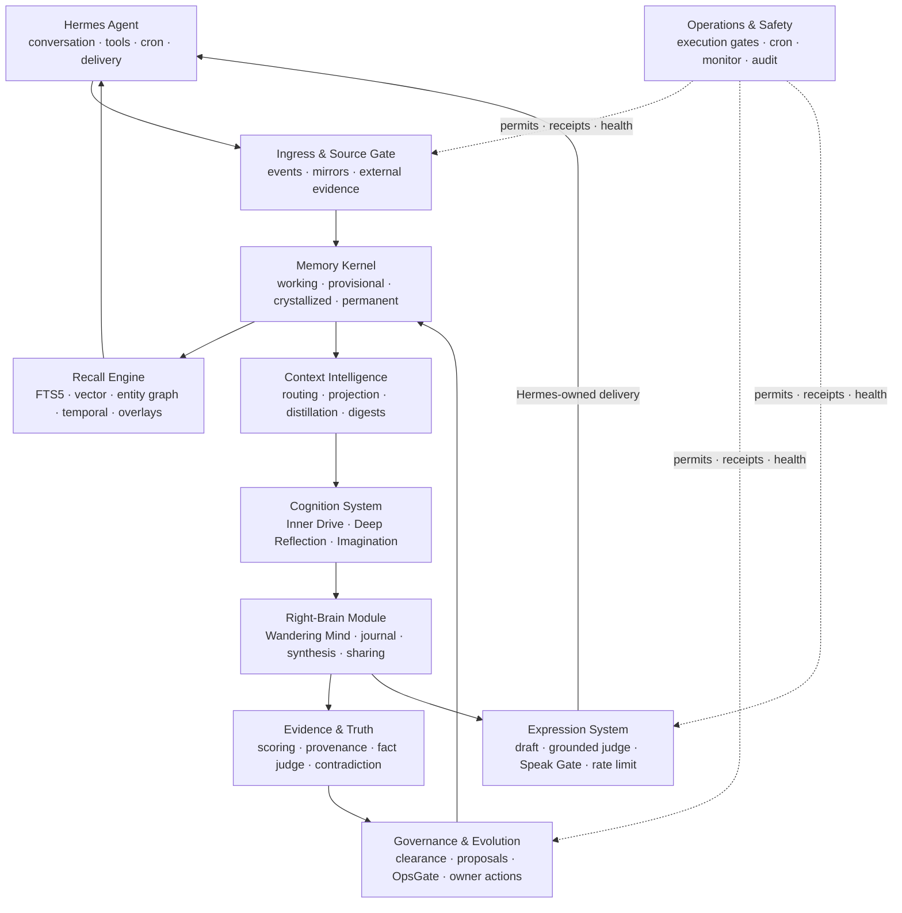
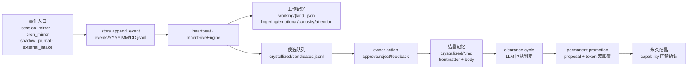
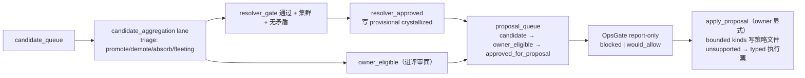

# Hermes Memory-OS 深度拆解分析文档

> 分析基准：`/root/Hermes-Memory-OS` 工作树（commit `ae4180b`，2026-08-05）
> 分析方法：6 个并行子代理对全部子系统逐文件精读（约 196K 行 Python），交叉 grep 验证调用关系，经独立顾问第二意见复核。
> 证据等级约定：**[代码]** = 有具体文件/行号佐证；**[文档]** = 来自 README.md / CLAUDE.md 的描述；**[部署待确认]** = 需要生产主机侧验证的部署事实。
> 本文件为独立分析产物，不属于项目官方文档。
> **2026-08-05 审计**：第 9 章全部声明及关键正文断言已对 HEAD `9254bf1` 逐条复核（约 35 条：确认 30、部分属实 4、推翻 1——§6.4 信封竞态）。更正与升级已内联标注（搜索「2026-08-05 审计」）。
> **2026-08-05 修复批次**：审计确认的十项真实缺陷已在分支 `worktree-analysis-audit-fixes` 一次修复——D2 / M2(R2) / M3 / M6 / M7 / M8 / M9 / M10 / D13 / speak_gate 无锁写，另有 R10 / T3 / CLAUDE.md C1+C2 三项小修。已修项在下文标注「✅ 已修复」；未修项（R1 / T1 / T4 / M1 / D 系列死代码等）保持开放并如实标注。修复细节见稳定化清单 CG 节。

---

## 目录

1. [项目概览](#1-项目概览)
2. [运行模型](#2-运行模型)
3. [内存生命周期与数据模型](#3-内存生命周期与数据模型)
4. [安全机制：三重门控](#4-安全机制三重门控)
5. [检索引擎与召回系统](#5-检索引擎与召回系统)
6. [治理、所有者交互与自我进化](#6-治理所有者交互与自我进化)
7. [认知系统与右脑模块](#7-认知系统与右脑模块)
8. [集成、运维与评估体系](#8-集成运维与评估体系)
9. [已知地雷与反模式](#9-已知地雷与反模式)
10. [目录结构速查](#10-目录结构速查)
11. [记忆动态图谱专项审计与修复方案（2026-08-06 增补）](#11-记忆动态图谱专项审计与修复方案2026-08-06-增补)
12. [State Overlay 陈旧缓存缺陷族（2026-08-06 增补）](#12-state-overlay-陈旧缓存缺陷族2026-08-06-增补)
13. [合并修复任务排期与 V3 前置核实（2026-08-06 增补）](#13-合并修复任务排期2026-08-06-增补)

---

## 1. 项目概览

### 1.1 这是什么系统

Hermes Memory-OS 是一个**文件优先（file-first）的长期运行 agent 内存与治理运行时**，以 `memory_os` provider 的身份嵌入 [Hermes Agent](https://github.com/NousResearch/hermes-agent)（宿主）。它的定位不是"更大的上下文窗口"，而是一个**可检视的内存生命周期**：体验进入工作记忆 → 证据累积 → 矛盾保持可见 → 持久信念必须通过治理门 → 每个重要转变可审计。

**是什么 / 不是什么**：

| | 说明 |
|---|---|
| 是 | 有界内存状态、检索、认知产物、审批状态机、运维证据的所有者 |
| 是 | 可移植的"agent 操作系统"：内存内核 + 多通道召回 + 认知模块 + 证据与真值检查 + 所有者治理 + 安全自我进化 + 表达式控制 + 运维控制面 |
| 不是 | 对话、工具执行、调度、传输、重试、渠道投递的所有者（这些归 Hermes） |
| 不是 | 一个简单的检索插件（是分层 Agent OS） |

**[代码]** 关键证据：
- `pyproject.toml`：`name = "hermes-memory-os"`，`requires-python = ">=3.11"`，**运行时依赖为空** `dependencies = []`（可选 dev/llm 依赖）
- `plugins/memory/memory_os/plugin.yaml`：`hooks: [on_session_end]`，provider 以 `memory.provider = memory_os` 方式选择，**不作为常规插件启用**（README）

### 1.2 规模与组成

**[代码]** 统计（2026-08-05 工作树）：

| 目录 | Python 行数 | 角色 |
|---|---|---|
| `plugins/memory/memory_os/` | 60,081 | 核心 provider：生命周期、检索、治理、认知循环、V3 右脑 |
| `plugins/modules/` | 16,068 | 可移植模块：cognition / context / evidence / expression / governance / messaging |
| `plugins/system/` | 609 | 模块化基础设施骨架（bus / contracts / lifecycle / scheduler） |
| `plugins/seam/` | 1,312 | 外部集成 seam（external_evidence / hermes_memory_os / ragflow） |
| `scripts/` | 29,424 | 安装、部署、cron 助手、监控、校验工具（约 100 个） |
| `tests/` | 86,110 | 217 个测试文件（provider / 脚本 / 系统模块化 / eval） |
| `eval/` | 1,878 | RH-31 评估框架（21 个指标 adapter） |
| `memory_os_agent/` | 79 | 最小 Hermes 兼容面（provider ABC 回退） |
| `monitor_dashboard/` | 0 (JS/CSS/HTML) | 只读监控仪表盘（端口 3693） |

### 1.3 核心设计约束

1. **文件优先**：canonical 数据存 JSONL / Markdown 文件（`$HERMES_HOME/memory-os/`），SQLite 索引只是可随时重建的缓存。**[代码]** `index.py` docstring："This index can be deleted and rebuilt from the store at any time."
2. **Hermes 拥有投递**：Memory-OS 从不直接向 Telegram/Discord/Slack 等平台发送，真正"发送"是写入 `<hermes_home>/delivery/outbox/*.json` 由 Hermes 网关消费。**[代码]** `speak_gate.py::_deliver_to_owner`
3. **INV-5：热路径零 LLM**：模型调用只属于离线 cron lane，绝不在 `prefetch` / `sync_turn` / `heartbeat` 上。**[代码]** `low_clue_recall.py` 热路径强制 `_without_live_judge`（LLM 关闭）
4. **完成 ≠ 产出**：ExecutionGate 信封只证明 lane 跑了，不证明它产出了什么；无输出的 lane 必须记录"为什么"。**[文档]** CLAUDE.md「Completion Is Not Output」
5. **外部权威必须降级**：一切非本地 canonical 的事实都是 `advisory_only=True` 的派生投影，LocalArtifact 是唯一主权威。**[代码]** `plugins/memory/memory_os/substrates/base.py`、`plugins/memory/memory_os/substrates/router.py`
6. **三重门控**：ExecutionGate（机器 permit）→ StructuralWriteGate（写面分类）→ OwnerGate（人类信任边界），详见第 4 章。
7. **无静默失败**：宽 `except Exception` 必须记录有界 `error_record`；监控聚合被抑制的错误计数。**[文档]** CLAUDE.md「No Silent Failures」

### 1.4 顶层架构图



---

## 2. 运行模型

### 2.1 Provider 生命周期（Hermes 视角）

入口：`plugins/memory/memory_os/__init__.py::MemoryOSProvider`（2538 行）。**[代码]**

| 阶段 | 行为 |
|---|---|
| `initialize(session_id)` | 解析 `HERMES_HOME` → `MemoryOSRoots` → 加载配置 → 构建 store/index/embedder → 同步身份清单 → 启动事件队列工作线程 → 恢复跨会话任务锚（24h 内，`ANCHOR_RECOVERY_MAX_AGE_HOURS=24`） |
| `prefetch(query)` | 为 Hermes 组装有界上下文（见 5.3）；owner 评审回复命中时返回上下文块；低线索/诊断查询走专门分支 |
| `sync_turn(user, assistant)` | **摘要式**事件写入（`_turn_summary` 截断 140 字符）→ 事件队列；owner 评审控制面命令被跳过不污染记忆 |
| `on_session_end` | 墓碑化活动任务锚（防 zombie anchor 跨会话复活） |
| `get_tool_schemas()` | 暴露 3 个工具：`memory_os_status`（只读状态）、`memory_os_review_reply`（approve/reject/defer/revoke/allow/feedback/apply）、`memory_os_review_surface`（只读分页评审面） |

**事件队列**：`_enqueue` 有界队列（默认 128），满时按 `drop_action` 记审计；后台 worker 线程落盘。**[代码]** `__init__.py:1027`

**任务锚（task anchor）**：`prefetch` 每次调用刷新当前前台任务锚，支持跨会话恢复（24h 内）、deferred 任务、取消、压缩恢复防御（写入 superseded 墓碑）。**[代码]** `__init__.py:1252-1583`

### 2.2 Heartbeat 主循环（`runtime.py`）

入口 `MemoryOSRuntime.heartbeat()`（479 行），整体包在 ExecutionGate 信封 `runtime_heartbeat_core`（`risk_class=deterministic_maintenance`）内。**[代码]**

**实际执行顺序**（**[代码]** `runtime.py:110-147`；原与 CLAUDE.md 描述相反——CLAUDE.md 已于 2026-08-05 修复批次更正为与代码一致）：

```
1. SessionMirror 自动应用（最前！）→ 可能向事件库写事件
2. store.read_events()（按 ts 排序全量读）
3. 事件统计缓存 build_event_stats → runtime/event_stats.json（best-effort，失败仅记 suppressed error）
4. select_events_for_inner_drive：去重 + 每 source_class 上限 20 + self_activity ≤15% 配额
5. 二级去重：与候选队列已有 source_event_ids 比对（防 2000-ID 窗口外重复）
6. InnerDriveEngine.process_event → working item 和/或 CrystallizedCandidate → append_candidate_queue
7. 工作记忆衰减 decay_items + 修剪 prune_expired_items（在候选生成之后）
8. 状态写入 heartbeat_state.json（全量 processed_event_ids ledger + 最近 2000 观测窗口）
9. MemoryOSIndex.sync_from_store（索引同步）
10. complete_execution_gate_envelope + 有意义的审计
```

**关键含义**：SessionMirror 自动应用产生的新事件在**同一心跳周期**内即被 `read_events()` 读到并进入候选生成——文档描述的"周期隔离"不存在，这是生命周期耦合而非装饰性顺序差异。**[代码] + [文档] 第二意见确认**

### 2.3 Cron 双表体系（`cron_registry.py`，847 行）

**Lane（23 个，2026-08-06 增 state_source_mirror）vs Group（9 个）**，区分是承重设计：**[代码]**

- **Lane = 治理身份**：`lane_id`、`raw_script`、`helper_kind`（即 risk_class）、`due_interval_minutes`、`due_policy`（interval/calendar）。一次运行一个 ExecutionGate 信封，**永不坍缩**。
- **Group = Hermes 调度面**：`hermes cron create` 实际创建的是 group job；成员共享同一 tick wrapper。

**active-closure 默认 8 个 Hermes cron job 覆盖 22 lanes**（`module_cadence_report` 为 full profile 专属；`clearance_cycle` 已于 2026-08-06 经 owner 决策激活）：

| Group job | Schedule | 成员 lanes |
|---|---|---|
| `memory-os-tick-derived` | `2,17,32,47 * * * *` | event_stats_refresh, index_sync, state_overlay_refresh, entity_index_refresh |
| `memory-os-tick-governance` | `7,37 * * * *` | proposal_followups_opsgate（+ clearance_cycle 延迟） |
| `memory-os-tick-evidence` | `12 * * * *` | hindsight_health_probe, fact_judge, candidate_aggregation, l3_probe_verification, v3_wandering, session_fact_extraction |
| `memory-os-tick-daily` | `5 0 * * *` | exposure_rollup, v3_seed_evidence, v3_journal_sweep, working_cleanup, hindsight_advisory_digest |
| `memory-os-owner-review-digest` | `0 9 * * *` | owner_review_digest（owner 面，单成员） |
| `memory-os-memory-sources-feedback-request` | `30 10 * * *` | memory_sources_feedback_request |
| `memory-os-expression-feedback-request` | `0 5 * * 0` | expression_feedback_request |
| `memory-os-full-monitor-refresh` | `30 2 * * *` | full_monitor_refresh（重负载 ≤180s） |

**关键规则**（**[代码]** `cron_registry.py` + **[文档]** CLAUDE.md 交叉确认）：

1. 组 cron 节奏 = 成员中最细的；每个 lane 用 `due_interval_minutes` 保持自身节奏，`cron_group_runner._is_due()` 跳过未到期成员；`calendar` 策略（v3_seed_evidence）每 UTC 日最多一次，防跨日漂移。
2. **加 lane 触 6 处**：① registry lane 定义 ② 所属 group `member_keys` ③ `knob_overrides.py`（如有 knob）④ `install_memory_os_plugin.py`（`SOURCE_*` 常量 + `_write_operational_helper_scripts` 逐项枚举）⑤ `memory_os_3_200_monitor.py::ERROR_RECORD_EMITTING_COMPONENTS`（若发 error_record）⑥ 重新生成部署 registry 快照。
3. **⚠ registry 快照静默失效点**：`cron_group_runner._load_group` 优先读 `<hermes_home>/memory-os/system/memory_os_cron_registry.json`，只要快照 member_keys 非空就**不回退编译内注册表**——已上线主机上新注册的 lane 会静默不出现（无告警）；而 `execution_gate_runner._load_spec` 会回退。失效点精确在组会员解析，不在 permit 签发。**[代码]** `scripts/memory_os_cron_group_runner.py:296-322`
4. tick 分钟刻意错峰（:02/:17/:32/:47、:07/:37、:12、00:05），避免同分钟争抢 `execution_gate_index.json`。
5. 每 lane 禁用：`cron_lane_disabled.json`（v1 带 reason/actor/disabled_at），损坏时**不**禁用任何 lane（fail-safe）。
6. 旧式独立 job 列于 `LEGACY_PER_LANE_CRON_JOBS`（16 个），onboarding **暂停而非删除**（回滚路径）。
7. **唯一创建者约束**：只有 `memory_os_owner_cron_onboarding.py` 能创建 Memory-OS cron job。
8. `classify_hermes_cron_jobs` 存在于**三处**（`hermes_cron_adapter.py`、`plugins/seam/hermes_memory_os/cron_adapter.py`、monitor 内嵌回退），生产读 seam 副本——改一处必须同步三处。

### 2.4 认知循环（`cognitive_loop.py`，1465 行）

`CognitiveLoopRunner.run_once()` 是**测试宿主 no-send 调度器**（`apply=True` 强制要求 `test_host=True`）。**[代码]**

- 串行编排 **37–40 个步骤**（视 legacy 右脑开关而定；2026-08-05 审计实测 `_step_functions`，原「约 43」不准），每步结果 `_bounded()` 裁剪（剔除 raw_body/body/content/transcript 等键）后存入共享 `context`。
- 全程持 legacy right-brain 读锁 + `ScheduleCoordinator` 1 小时 TTL 文件锁；锁冲突返回 `lock_held`。
- **文档/代码偏差（已消除）**：实际仅 **4 个步骤**显式开信封（`ground_truth_miner`、`memory_projection`、`left_brain_advisor`、`spontaneous_expression`），其余依赖模块内部治理面（StructuralWriteGate 等）。CLAUDE.md 原"每个步骤 ExecutionGate 包裹"的说法已于 2026-08-05 修复批次更正。
- 边界聚合 `_boundary_state()` 递归扫描所有步骤结果，任一 `actual_send/actual_execute/...` 为 True → 整周期 `status="error"`（fail-loud 有意设计）。
- 生产认知编排实际由各 cron lane 承担，cognitive_loop 更多是**集成测试/监控证据表面**。

### 2.5 部署姿态与安装

**[代码]** `scripts/install_memory_os.sh`（859 行）+ `scripts/install_memory_os_plugin.py`（1950 行）+ `scripts/deploy_memory_os.py`（1110 行）：

| 姿态 | 用途 | 关键行为 |
|---|---|---|
| `--operational` | 常规完整安装 | 启用 operational 认知预设、运行时循环、active-closure cron onboarding |
| `--production-safe` | 保守非交互部署 | 显式禁用 DeepReflection |
| `--test-host` | 一次性验证主机 | 启用完整 test-host 表面 |

- 安装器**不重启** `hermes-gateway.service`、不删数据；真实写盘委托给 Python 安装器。
- `deploy_memory_os.py` 分 6 phase：`plan → preflight → dry-run → apply → postcheck`（+ upgrade profile 门控：preflight 不 pass 则 apply blocked）；gateway 重启需 `--allow-restart` + 显式重启命令。
- 安装预设：`--deep-reflection-preset`（none/production-safe/observe/auto-bounded/operational）、`--memory-sources-preset`、`--llm-judge-preset`（none/report-only/bounded-vote）、`--hindsight`（auto/off/adopt/active/wizard）。

---

## 3. 内存生命周期与数据模型

### 3.1 生命周期管线

**[代码]** 综合 `runtime.py` / `inner_drive.py` / `crystallized.py` / `permanent_promotion.py`：



**各阶段要点**：

- **事件**：`EventEnvelope`（`memory-os.event.v0`）实有 **9 处生产写点**（2026-08-05 审计更正，原「5 个生产者」少计）：session_mirror / cron_mirror / shadow_journal / external_intake / state_source_mirror / provider `__init__.py:1059` / `migrator.py:382` / `feedback_bridge.py:595` / `session_fact_extraction.py:525`。⚠ `promotion_state` 字段在所有写点中**恒为 `"raw"`**，无任何代码将其迁移——字段暗示的状态机未实现（预留扩展点或死字段）。**[代码]** `schema.py`
- **工作记忆**：四类（`lingering` 18h/50 条、`emotional` 48h/30、`curiosity` 24h/30、`attention` 6h/20），权重指数半衰期衰减（`weight * 0.5^(elapsed/half_life)`），Top-N cap 逐出最低权重项，过期 72h 宽限期。**[代码]** `working.py`
- **候选生成**：`InnerDriveEngine.process_event` 按事件 kind 分类——`conversation_turn` 进 working(lingering, 0.6) + candidate（除非 `_is_obvious_fragment` 碎片检测拦截）；`journal_card_observed` 低权重(attention, 0.25) 不发 candidate；cron/session/runtime 事件 skip。**[代码]** `inner_drive.py:317-390`
- **候选治理**：`candidates.jsonl` → `read_effective_candidates` 投影四源状态（队列 + triage + 结晶记录 + owner_actions）→ owner 处置（approve/reject/demote/fleeting/discard）→ `write_approved_record` 写结晶 Markdown。**[代码]** `crystallized.py`
- **清关周期**（clearance cycle）：LLM 判官产出 `clear`/`conflict`/`unknown` 回执，fail-closed；空语料恒 clear；LLM 不可用 → unknown/judge_unavailable。⚠ **该 lane 注册但从未安装进 cron**（文档明示 activation deferred）。**[代码]** `clearance_cycle.py` + `cron_registry.py`
- **永久晋升**：proposal（`ppm_` 前缀）+ token（`ppmt_`，`secrets.token_urlsafe(32)` 真 bearer secret，只存 hash）双账簿状态机，48h token 过期，3/7/14/30 天投递提醒。仅此路径能把 provisional 翻为永久（capability 单例）。**[代码]** `permanent_promotion.py`

### 3.2 数据模型速查（schema 版本）

**[代码]** `schema.py` + 各写入方：

| 记录 | schema | 存储形态 | 关键字段 |
|---|---|---|---|
| Event | `memory-os.event.v0` | `events/{YYYY-MM}/{YYYY-MM-DD}.jsonl` 追加 | id(`evt_`), ts, profile, source, kind, summary, safe_ref, tags, sensitivity, body_policy, hashes, promotion_state |
| WorkingItem | `memory-os.working.v1`（读兼容 v0） | `working/{kind}.json` 单文件原子替换 | id(`wrk_`), kind, status, created/updated_at, text, source_event_id, tags, weight, last_decayed_at, expired_at |
| Candidate | 无独立 schema_version（手写校验） | `crystallized/candidates.jsonl` | candidate_id(`cand_<event_id>`), kind, body, source_event_ids, sensitivity, tags, bridge_state, rejection_count |
| Crystallized | `memory-os.crystallized.v0` | `crystallized/*.md` Markdown frontmatter 追加 | id(`cry_`), candidate_id, approved_by/at, source_event_ids, sensitivity, canonical_state, provisional(expires_at/recurrence), provenance, contested_refs |
| Audit | `memory-os.audit.v0` | `audit/write_audit.{YYYYMM}.jsonl` 月度分片 | id(`audit_`), ts, action, status, target, details |
| ClearanceReceipt | `memory-os.clearance_receipt.v0` | `system/clearance_receipts.jsonl` + snapshot | receipt_id(`clr_`), verdict, conflict_refs, corpus_watermark, invalidation_mode, unknown_reason |
| ExecutionGateEnvelope | `memory-os.execution_gate_envelope.v0` | `system/execution_gate_envelopes.jsonl` + sidecar index | envelope_id(`xgate_`), stage(permit/completion), lane_id, risk_class, scope_hash, boundary, permit_decision |
| Proposal/Token/Delivery | `memory-os.permanent-promotion-{proposal,token,delivery}.v1` | `system/permanent_promotion_*.jsonl` | proposal_id(`ppm_`), status, clearance, token_hash, expires_at |

**invalidate-not-delete 原则**：revoke/demote/provisional 过期/失效均不物理删除，只改 `canonical_state` / 追加 `invalidated_at`；图边失效同理（`state='invalidated'`）。**[代码]** `crystallized.py::INACTIVE_CANONICAL_STATES`

### 3.3 文件布局（`$HERMES_HOME/memory-os/`）

**[代码]** `roots.py` + 各写入方实际路径：

```
memory-os/
├── events/{YYYY-MM}/{YYYY-MM-DD}.jsonl     # 事件日志（按月/日分片）
├── working/{lingering|emotional|curiosity|attention}.json
├── crystallized/*.md                        # 结晶记忆（frontmatter+body 追加）
│   ├── candidates.jsonl / candidates.archive.jsonl
│   ├── candidate_triage.jsonl / candidate_aggregation_status.jsonl
├── identity/manifest.json                   # 身份源清单（provider initialize 时由 _sync_identity_manifest 写入）
├── index/memory_os.db                       # SQLite 索引（可重建，非真相源）
├── audit/write_audit.{YYYYMM}.jsonl         # 月度分片审计
├── quarantine/malformed_events.jsonl        # 畸形事件隔离（✅ 已修复：签名去重 sidecar malformed_events_index.json，首见才落账）
├── runtime/event_stats.json                 # O(1) 统计缓存
├── graph/edges.jsonl                        # 图边（canonical）
├── system/                                  # 派生/治理账本（约 30 个 JSONL）
│   ├── execution_gate_envelopes.jsonl + execution_gate_index.json
│   ├── clearance_receipts.jsonl + clearance_receipt_snapshot.json
│   ├── corpus_change_events.jsonl
│   ├── permanent_promotion_{proposals|open|deliveries}.jsonl
│   ├── owner_action_tokens.jsonl / owner_actions.jsonl
│   ├── owner_action_context_consumptions.jsonl
│   ├── exposure_rollup.jsonl + exposure_rollup_snapshot.json
│   ├── contested_pairs.jsonl / absorption_audit.jsonl
│   ├── memory_projections.jsonl / memory_projection_summary.json
│   ├── wandering_journal.jsonl / v3_body_packet_manifests.jsonl
│   ├── v3_wandering_runs.jsonl / v3_journal_sweep_status.json
│   ├── graph_layer_shadow.jsonl / substrate_recall_shadow.jsonl
│   ├── continuity_freshness.jsonl / recall_plan_observations.jsonl
│   ├── cron_lane_state.json / cron_lane_disabled.json
│   ├── memory_os_cron_registry.json          # ⚠ 快照（部署后必须重生成）
│   └── seam_config.json                       # 外部证据 seam 配置（默认全禁用）
└── system-modules/                          # 模块产物（advisor reports 等）
```

### 3.4 关键不变量

1. **锁内去重防 TOCTOU**：`append_candidate_queue` 单锁内 check + append。**[代码]** `crystallized.py:1115`
2. **v0→v1 读时迁移**：working 文档读时补 `last_decayed_at`/`expired_at` 并升版本。**[代码]** `working.py:read_document`
3. **守恒断言 fail-closed**：`compact_candidate_queue` 先归档后替换，计数不守恒即拒绝。**[代码]** `crystallized.py:1613`
4. **canonical 先写，索引后写**：`write_governed_edge` 先写 `graph/edges.jsonl`，成功后才写索引。**[代码]** `index.py:979-1031`
5. **回执快照四重校对**：`clearance_snapshot_freshness` 校验 hash/size/count/watermark。**[代码]** `clearance_receipts.py`
6. **缺失 provenance 不算干净**：`provenance.is_tainted` 查找失败 fail-closed（tainted=True），非污染证明 ≠ clean。**[代码]** `provenance.py`

---

## 4. 安全机制：三重门控

这是本系统安全哲学的核心，也是接手者最需要完全理解的部分。**[代码]** 综合 `execution_gate.py` / `structural_write_gate.py` / `owner_actions.py` / `owner_write_authority.py`

### 4.1 ExecutionGate（机器执行许可）

**permit 信封生命周期**（`execution_gate.py`）：

```
start_execution_gate_envelope()
  → 生成 xgate_<ts>_<sha256[:10]> 记录（stage=permit）
     · lane_id / risk_class / trigger_surface / scope(+scope_hash) / boundary
     · TTL 默认 900s；boundary 任一 True → permit_decision="blocked"
  → 执行自动工作
  → complete_execution_gate_envelope()
     → 追加 stage=completion 记录（execution_status + postcheck）
     · 幂等：同一信封重复完成是规范 no-op，completion_count 收敛为 1
```

**resolve 校验链**（`resolve_execution_gate_permit`）：lane 匹配 → risk_class 匹配 → permit_decision=="allowed" → boundary 无 True → 未过期（`require_fresh`）→ 未使用（`require_unused`，即 completion_count==0）→ scope_hash 匹配。失败返回机器可读 reason 枚举（`execution_gate_lane_mismatch` 等 10 种）。

**防伪造**（`resolve_trigger_class`）：仅当 OS 环境变量 `MEMORY_OS_EXECUTION_GATE_ENVELOPE_ID` 非空时返回 `"natural_cron"`，否则 `"manual"`；环境变量在调用时读取，只有 cron runner 子进程拥有它——手动调用无法通过传参伪造 natural_cron。**[代码]** `execution_gate.py:32`

**⚠ runner 双实现漂移风险**：`scripts/memory_os_execution_gate_runner.py` 自带的 `_append_permit`/`_update_sidecar_index` 与 `execution_gate.py` 是**两套独立实现，共享同一 JSONL 文件与 schema**（runner 的 scope 形状不同：registry_key/raw_script/helper_present/smoke_mode）。当前因 lane_id 命名空间隔离不碰撞，但格式一旦漂移，全量扫描验证会静默误判。**[代码]** `scripts/memory_os_execution_gate_runner.py`

### 4.2 StructuralWriteGate（写面分类门）

`append_governed_jsonl()`（`structural_write_gate.py`，168 行）：自动 JSONL 追加必须：

1. 目标路径位于 `memory_os_root` 或 `hermes_home/system-modules` 之内；
2. 携带**新鲜且未使用**的匹配 ExecutionGate permit（lane/risk/scope 全匹配）；
3. payload 自身 boundary 无 True；
4. 注入 `structural_write_governance` 元数据块（write_owner/lane_id/risk_class/envelope_id/scope_hash/permit_status/raw_body_included:false）。

**例外路径**（显式、非静默）：`write_owner="owner_action"` + `allow_owner_action_without_envelope=True` 时豁免 permit（`permit_status="not_required"`），仅 owner 权威路径可用；`knob_overrides` 存储声明为设计豁免。`scripts/memory_os_write_surface_check.py` 强制全仓 `unclassified_count=0`。

**⚠ 治理缝隙（系统性事实）**：`store.py`（append_event/append_crystallized_record/write_working_document）、`working.py` 全部写路径、`jsonl_io.py` 基元**不执行 permit 校验**——grep 确认零引用。"所有自动写入需通过执行门"在核心存储路径上靠**上层调用方自觉**开信封（runtime heartbeat、session_mirror auto-apply、cognitive_loop），无写面强制力；例如 `migrator.import_shadow_bundle` 的 `store.append_event` 完全无信封。对照：`append_candidate_triage` 无 envelope 直接 PermissionError。**[代码]** store.py/working.py + grep 验证

### 4.3 OwnerGate（人类信任边界）

**oa_ vs ppmt_ token 的本质区别**：

| | `oa_` token | `ppmt_` token |
|---|---|---|
| 生成 | `oa_ + sha256("action_type\|target_type\|target_id")[:14]` | `secrets.token_urlsafe(32)` |
| 性质 | **公开、非秘密**（任何人可离线重算） | 真 bearer secret |
| 安全性来源 | recorded digest 绑定 + 消费账本防重放 | 秘密本身 + 48h 过期 |

**OwnerGate 关键机制**：

1. **canonical 写必须绑定 recorded digest**：`verify_owner_write_binding` 校验 action 类型白名单 + digest 来源（仅 `recorded_digest`/`latest_recorded_digest`/`latest_owner_home_digest` 可信）+ token 哈希出现在 rendered digest 中 + action/target/owner/channel/review_item_id 全匹配。**[代码]** `owner_write_authority.py`
2. **消费防重放**：`_consume_owner_write_context` 写 `owner_action_context_consumptions.jsonl`（`status="consumed"`），重复 → `owner_write_context_already_consumed`。**[代码]** `owner_actions.py`
3. **永久人类门控操作**：crystallized 写（approve_candidate/cluster/external_evidence）、revoke/demote、proposal apply、外部发送（speak ticket 24h）、digest 投递（owner_triggered）、永久提升。
4. **⚠ 身份写：无正面路径**：`ACTION_TYPES` 中**不存在**任何身份写动作，所有边界 `actual_identity_write=False`——语义是"不存在"而非"默认拒绝"（新增身份写能力需要同时创建 ACTION_TYPE、OwnerWrite 绑定、边界声明）。**[代码]** `owner_actions.py::ACTION_TYPES` + 顾问第二意见
5. **revoke/demote 永不渲染进 digest**：`_crystallized_revoke_action_token_map` 离线重算，无正面动作路径（默认拒绝）。

### 4.4 边界（boundary）体系

所有自动/治理工作结果携带边界布尔组（`actual_send` / `actual_execute` / `actual_identity_write` / `actual_relationship_write` / `actual_crystallized_approval` / `hindsight_exported`），`_boundary_state()` 递归扫描，任一 True 即 fail-loud。`any_boundary_true` 只匹配**裸 `bool True`**（truthy int 不匹配）——这迫使 `provisional_write_postcheck` 用字符串 + int 计数表达成功，否则合法可逆 provisional 写也会触发边界告警。**[代码]** `execution_gate.py` / `cognitive_loop.py`

---

## 5. 检索引擎与召回系统

### 5.1 通道概览与"声明 vs 实现"差距

**[代码]** 综合 `recall_types.py` / `recall_facade.py` / `retrievers/`（以下第 5 章简写路径均位于 `plugins/memory/memory_os/` 下）：

**统一协议**：`BaseRetriever`（`@runtime_checkable` Protocol）——所有通道返回统一 `RecallObject`（recall_type/content/score/source_ref/metadata/authority_class/freshness/task_revision/claim_key），`format_context` 渲染为有界 markdown。

**RetrieverFacade**（`recall_facade.py`）注册 5 个 retriever：StateOverlay / IndexedFTS / Crystallized / EntityGraph / Temporal。fail-open 语义：单通道异常 → 空列表。`recall_arbitration.mode`（shadow/apply_canary）为持久权威，`prefetch_facade_enabled` knob 为调用时 kill switch。

| 通道 | RecallType | 实现位置 | 激活条件 | 默认权威 |
|---|---|---|---|---|
| 状态覆盖 | STATE_OVERLAY | `retrievers/state_overlay.py` | 总是 | state_projection |
| 结晶记忆 | CRYSTALLIZED | `retrievers/crystallized.py` | 总是 | owner_confirmed |
| 索引 FTS | INDEXED_FTS | `retrievers/indexed_fts.py` | 索引存在 | indexed_derived |
| 向量 | VECTOR | ⚠ **无独立 retriever**，内嵌 `prefetch._crystallized_lines` | `vector_retrieval_enabled` knob（默认 False） | indexed_derived |
| 实体图 | ENTITY_GRAPH | `retrievers/entity_graph.py` | 索引存在 | indexed_derived |
| 时间 | TEMPORAL | `retrievers/temporal.py` | **查询含时间关键词** | indexed_derived |
| Working | WORKING | ⚠ 无 retriever，内嵌 `prefetch._working_lines` | 总是 | session_working |
| Hindsight | HINDSIGHT | ⚠ retriever 类未接线，实际走 substrate 路径 | substrate recall_mode=shadow/active | external_unverified |
| 外部证据 | EXTERNAL_EVIDENCE | ⚠ **无任何通道实现**（仅事件 source_class 标记） | — | external_unverified |

**⚠ R1（高优先级）**：`RecallType` 枚举声明 9 通道，facade 仅注册 5 个；VECTOR/WORKING 无 retriever 类、EXTERNAL_EVIDENCE 无任何实现——枚举是"假契约"，调用方无法通过 facade 统一访问向量/working 通道。**[代码]** `recall_types.py:14-28` vs `plugins/memory/memory_os/__init__.py:252-261`（2026-08-05 审计校正行号；`retrievers/hindsight.py` 确认全库零 import）

### 5.2 混合检索与融合

**RRF 仅用于 crystallized lane 内选集**（`prefetch.py::_rrf_union`，k=60）：融合 FTS5（limit 60）与向量（limit 60）命中，`score = Σ 1/(k+rank+1)`；⚠ 返回 `set` 丢失分数顺序——RRF 只决定"哪些 record 进 crystallized section"，不参与最终排序（排序靠文件名/mtime）。

**跨通道去重阶梯**（`recall_arbitration.py::build_recall_plan`）：

```
L0 同 source_ref 跨通道精确去重（exact_source_duplicate）
L1 内容指纹 sha256 去重（exact_duplicate）
L3 Jaccard ≥0.88 近重复抑制（near_duplicate）
L4 相似度 [0.70,0.88) 不抑制，互链 ambiguity_related
   冲突：同 claim_key 分组，owner_confirmed 级多指纹 → 全抑制；
        否则低权威抑制（lower_authority_conflict）
   预算：_rank_key（权威→新鲜度→分数→输入序）按字符累加，超预算抑制
```

**确定性兜底**（保证检索永不失败）：

| 兜底 | 触发 | 机制 |
|---|---|---|
| Unicode 边界 floor recall | FTS5+向量零命中 | `_tokenize_for_floor_match` 按 `unicodedata` Z/P 类别切分 + 整句 token 计分 |
| 永久记忆保底 | 总是 | MAX_TOTAL=20、MAX_PERMANENT=15、MAX_PROVISIONAL=5（provisional 保底 5 席） |
| 索引缺失 | index_path 不存在 | 退化为文件扫描 |
| FTS5 语法错误 | 原始 query 不合 MATCH | `_like_hits` LIKE 兜底 |

### 5.3 预取（prefetch）管线

**[代码]** `prefetch.py`（2900 行）：`build_prefetch(query, budget_chars=2200 默认, ...)` 四分支：

```
① 诊断查询接地（_should_ground_diagnostic_query）→ 只给 Runtime Facts，抑制历史召回
② foreground_task_only → 仅 Current Foreground Task + Last Session
③ context_router apply 启用 → 路由选定 section（required_titles fail-closed）
④ 正常路径 → _build_prefetch_sections（16 section）→ _format → _fit_budget
每分支末尾 _record_memory_sources 归因台账
```

**16 个 section 顺序**：Recall Clarification Guard → Current Foreground Task → Identity Memory → Memory State Overlay → Continuity Bridge → Last Session → Recent Cross-Session → Conversation Carryover → Working Memory → Relationship Memory → Crystallized Review Candidates → Crystallized Memory → Substrate Recall → Indexed Recall → Recent Event Summaries → Related Memory（图边）。

**预算控制**：`_fit_sections_budget` 迭代丢弃最低优先级 section（`_budget_keep_priority`：Runtime Facts 130 > Guard 110 > Foreground 105 > Substrate 100 > Indexed 90…），required_titles 永不丢弃，预算不足时逐行裁剪正文（每行 220 字符 + 密钥 `[redacted]`）。

**上下文路由**（`context_router.py`，560 行）：`plan_context_route` 按 ingress 分类产生 8 种路由（foreground_control/diagnostic/ambiguous_recall/candidate_review/architecture/active_task/casual_continuity 等）；`route_context_sections` 用 score_then_budget + INCLUDE_THRESHOLD=0.30 + 风险惩罚（diagnostic_style/mechanism_leak/stale_runtime 各 −0.80）。

**低线索召回**（`low_clue_recall.py`，1544 行）：触发词（"还记得…/do you remember…"）→ 五源候选收集（deferred 任务/working/近 30 事件/memory_sources/feedback）→ 聚类 → 源多样性选择 → 决策（ask_keyword/confirm_one/direct_resume/ask_choice）。**热路径注入 guard 文本强制 `_without_live_judge`**（INV-5 合规）。

### 5.4 索引重建契约（`index.py`，1541 行）

- **staging 原子重建**：写 `.rebuild.db` → 建 schema → 索引 7 类数据（events/working/candidates/crystallized/audit/edges/entities）→ WAL checkpoint → 对 live 索引 TRUNCATE → 清理 sidecar → `os.replace` 原子替换。
- **FTS5**：优先 `tokenize='trigram'`（CJK 友好），回退 `unicode61`；`memory_fts(record_type, record_id, title, text)`。
- **隐私投影**：`_PRIVATE_PROJECTION_KEY_PARTS`（api_key/body/content/password/secret/token/transcript 等 12 项）——事件 safe_ref 结构化字段命中即跳过子树，敏感 key 不进 FTS 可检索文本。
- **WAL**：PASSIVE → busy≥3 升级 FULL → >100MB 升级 TRUNCATE。
- **双重校验**：`IndexedFTSRetriever` 召回时逐字符对照 canonical 正文（`source_body.strip() != row["text"].strip()` → 跳过），防 stale 索引越权。**[代码]** `retrievers/indexed_fts.py`

**R2（✅ 已修复，2026-08-05 批次）entity_index schema 漂移**：原 `index.py` 建表仅 6 列（无 entity_class/weight），`query_related_records` 依赖 weight 列——rebuild 后实体图通道 `OperationalError` 被吞 → 静默 []；且填充路径丢弃 class/weight，**sync_from_store 每次清空重填还会把已治好的权重抹平回默认**（审计补充发现）。修复：DDL + `_ensure_column` 迁移 + 8 列 INSERT 三处对齐，查询失败改 logger.warning；守卫测试用真实生产者（rebuild）建库并 pin 存量 6 列库的就地迁移。**[代码]** `index.py:566-584,1100` + `entity_index.py:116-176`

### 5.5 召回质量评估框架

**[代码]** `recall_golden.py`（413 行）+ `eval/memory_os/`：

- `GoldenSet/GoldenQuery/GoldenResult`（含 `must_hit` 负例）；`evaluate_recall()` **走完整 `build_prefetch` 管线**做 counterfactual 测试 + section 级归因。
- `eval/memory_os/runner/run.py`：RH-31 评估（**只支持 synthetic fixture、report-only**——不读 Hermes 私密 transcript、不写 Memory-OS canonical 状态）；21 个 adapter（grep/memory_os_fts/context_projection/low_clue_candidates/memory_sources_replay/diagnostic_grounding + 15 个）；三态汇总（boundary_true/forbidden → fail，有失败 → warning，否则 pass）。
- R10（✅ 已修复，2026-08-05 批次）：`evaluate_recall` 原用 `build_prefetch(budget=4000)` 与生产默认 2200 不一致——金标准高估实际召回；已对齐为 2200。

---

## 6. 治理、所有者交互与自我进化

### 6.1 提议治理管线（候选 → 提案 → OpsGate → apply）

**[代码]** 综合 `candidate_aggregation.py` / `proposal_queue.py` / `ops_gate.py` / `owner_actions.py`：



**管线关键不变式**：

1. `proposal_queue.transition()` 把 `approval_purpose` 恒设为 `proposal_queue_only`、`crystallized_approved=False`——**proposal 批准绝不授予 crystallized 批准**。**[代码]** `proposal_queue.py`
2. `apply_proposal` 前置校验链：proposal 存在 → `state=="approved_for_proposal"` → owner 显式 apply → ops_gate review 存在 → `decision=="would_allow"` → 执行。**不运行 shell、不发送消息**；仅 bounded kinds（expression_policy / memory_sources_policy / proposal_queue_legacy_template_cleanup）写本地策略文件。**[代码]** `owner_actions.py::apply_approved_proposal_execution_decision`
3. **Lane E 自动路由**（`auto_route_safe_proposal_followups_to_ops_gate`）：仅低风险 proposal（边界干净 + 不要求成熟）可自动路由进 OpsGate；自动级别由 7 天窗口 owner 决策对比校准（full_auto ≥20 样本/同意率≥90%/Wilson 95% 下界≥80%；limited_auto 3≤样本<20 全同意）。
4. **Resolver 仅写 provisional**：`resolver_gate.py::is_reversible`（sensitivity∈{normal,low,private} + 无身份信号 + 无副作用）+ `candidate_aggregation` 集群门（min_cluster_size）+ `crystallization_gate` 矛盾检查（FTS5 相似 + 图边 contradicts，fail-closed 拦截自动提升）。

### 6.2 LLM 治理通道（离线、保守、失败安全）

**`fact_judge.py` 是受治理 LLM lane 的参照实现**（**[代码]** + **[文档]** CLAUDE.md）：

- 不在热路径（cron lane `fact_judge`，per-tick 上限默认 8）；产物供 candidate_aggregation 旁路"size≥2 集群门"（单例持久事实通道）。
- **重试循环**：最多 1+2 次；typed 失败值：`llm_exception` / `llm_empty_content` / `llm_parse_failed` / `llm_missing_key`，保留在 verdict 的 `failure_reason`。
- 全部失败 → **确定性启发式回退** `_heuristic_durable`（durable/transient 标记匹配），**绝不 fail-open**（需正向标记才 True）。
- **适应性提示词**：活跃 crystallized <50 用 lean prompt，≥50 用 strict prompt（`LEAN_CAPTURE_THRESHOLD` 是 meta 常量，**不在 OVERRIDABLE_KNOBS**——系统不可自调）。

**LLM 借用 seam**（`low_clue_recall._call_hermes_runtime_model`）：唯一入口，借 Hermes 运行时（`hermes_cli.config.load_config` + `resolve_runtime_provider`），api 模式 chat_completions / codex_responses / anthropic_messages。Memory-OS **不拥有模型凭据/客户端/provider 选择**。

**其他治理模块**：`confidence_router`（三 band 路由 low/mid/high，`live_applied` 恒 False）、`judge_calibration`（canary 一致性）、`ground_truth_miner`（可撤销 owner 标签 90 天 TTL，自动路径双重门控 ExecutionGate + SWG）、`crystallized_revalidator`（矛盾观察 → `would_demote` flag-only）、`cascade_routing_policy`（按 band 提出路由策略，不自我应用）、`migration_controller`（owner 标签 <20 → cold_start → live-shadow）。

### 6.3 自我进化与可逆 knob 覆盖

**[代码]** `self_evolution.py`（1368 行）+ `knob_overrides.py`（916 行）+ `knob_ab_eval.py`（400 行）+ `override_sweep.py`：

- **knob 边界**：`OVERRIDABLE_KNOBS` 注册表（约 45 个，全部 `meta=False`、`scope="upper_layer"`）；base/Hermes knob 永不注册；`meta=True` 拒绝；A/B 阈值常量（AB_MARGIN=0.15、AB_MIN_OBS=5）刻意不在注册表（boundary-is-store 保护）。
- **生命周期**（invalidate-not-delete，JSONL 追加）：`provisional`（带 expires_at）→ `confirm_override()`（state=confirmed）→ `revert_override()`（state=reverted_<reason>，有效 reason 白名单）→ TTL 过期/cap eviction（MAX_OVERRIDES=30）/kill-switch（l4.kill_switch_enabled → revert ALL）。
- **A/B 仅收紧方向可自动决定**：override > prior（收紧）有真实数据可判；confirm rate 差 ≥+15pp → auto-confirm；≤−15pp → auto-revert；中间地带/观察不足 → 回退 owner（conservative）。
- **`self_evolution._knob_tune_proposals()` 当前返回 `[]`**——机制端到端验证完成但 knob tune 提案为空（干跑 Governor）。proposal 需 OpsGate `would_allow` 才 `proposal_queue.create_candidate`；结果硬编码 `direct_self_modify=False`、`actual_execute=False`。
- **`live_guard.py`**：检测组件从 live-shadow 跨界进入 acting（`ACTING_MARKER_FIELDS` 11 项 + autonomy_level）；`apply_automation_mode` 在 kill_switch 时强制 report-only。

### 6.4 左脑治理投影体系（信号 → 投影 → 顾问 → 所有者）

**[代码]** 综合 `signal_source_registry.py`（707 行）/ `signal_collectors.py`（1446 行）/ `memory_projection.py`（458 行）/ `left_brain_advisor.py`（557 行）：

```
signal_collectors（26 个只读元数据源）
  ├─ 字段白名单 allowed_payload_fields（状态/计数类字段）
  ├─ FORBIDDEN_PAYLOAD_KEYS 黑名单（raw_body/body/content/transcript/private_body/raw_transcript）
  └─ validate_signal_source_specs 强制 writes_allowed=False + metadata_only_no_raw_body
      → collect_and_project_signals（ExecutionGate + StructuralWriteGate 双重门控）
        → memory_projections.jsonl（dedup_key = sha256(scope+source_key+source_hash)[:24]）
        → compact（保留 boundary_true/raw_body 记录，short_lived 每源最近 3 条，归档 archive/）
      → run_left_brain_advisor（permit 门控 + boundary 熔断 + 跨周期 dedup 抑制）
        → reports.jsonl（finding 硬编码 allowed_action_type="review_only" + 8 个 False 边界）
      → owner_actions._left_brain_advisor_review_items（过滤 owner_visible，status="report_only"）
        → owner digest 可见面
```

- 信号收集**必须永不捕获原始消息体或密钥**——三重防线全部代码强制。**[代码]** `signal_collectors.py`
- 左脑顾问是 **report-only**：finding 结构硬编码 `allowed_action_type="review_only"`、`actions_suppressed=True`、8 个恒 False 边界字段；消费通路不创建审批 token、不 apply、不改策略。
- **信号被采集两次——但两次职责不同**（2026-08-05 审计更正）：cognitive_loop 的 `_signal_collection` 是**监控 required step** 的健康证据（裸采集、无信封），`_memory_projection` 内部的再采集带 ExecutionGate 信封标记（治理写资格）——两者不可互相替代，删步骤会连坐 monitor 契约。真正的死代码只有 `context["signal_collection_result"]` 赋值（全文件无读方，已删）。**[代码]** `cognitive_loop.py:1187-1206` + `memory_projection.py:159` + 监控 `required_steps`
- ✅（2026-08-05 审计更正，原竞态声明不成立）信封 start 与 resolve 之间**无并发竞态**：envelope_id 仅在同一调用栈内以参数传递、从不对第二消费者可见，且 `run_once` 全程持有 ScheduleCoordinator 排他锁；`require_fresh/require_unused` 是崩溃恢复与防篡改校验，不是竞态证据。**[代码]** `memory_projection.py:139-147`、`cognitive_loop.py:81-100`

---

## 7. 认知系统与右脑模块

### 7.1 V3 右脑架构全景

**[代码]** 综合 `v3_*.py` 系列 + `wandering_journal.py`（363 行）+ `docs/V3_INNER_LIFE_RUNBOOK.md`：

**硬边界**（V3 不 patch Hermes 核心）：

```
V2 canonical memory → bounded BodyStatePacket → isolated no-tool inference
→ private TTL journal → deterministic synthesis/outlet gates
→ SpeakGate or Proposal Intake only
```

**三种思维深度**（`_TIERS`）：`association`（片段/自由联想）、`interpretation`（探索意义）、`claim`（信念式陈述）。约束：**claim 只能 propose（不得 share）；非 claim 不能 propose**。**[代码]** `wandering_journal.py::_validate_and_build_entry`

**三种命运**（`_REQUESTED`）：`hold` / `share` / `propose`；湮灭是默认且不算失败。

**⚠ 生产接线状态（关键发现）**：

| 命运 | 接线状态 | 证据 |
|---|---|---|
| 湮灭（TTL sweep） | ✅ 已接线（`v3_journal_sweep` lane，tick_daily） | `cron_registry.py` |
| 漫游（wandering） | ✅ 已接线（`v3_wandering` lane，tick_evidence 360min） | `cron_registry.py` |
| 种子证据（seed） | ✅ 已接线（`v3_seed_evidence` lane，tick_daily calendar） | `cron_registry.py` |
| 合成（synthesis） | ⚠ **无生产调用方**（仅测试引用） | `v3_synthesis.py` + grep |
| 提议/分享出口（outlet） | ⚠ **无生产调用方**（仅测试引用） | `v3_outlet.py` + grep |

→ **"三种命运"目前只有湮灭真正在线**，README 的描述超前于接线状态。**[代码]** `cron_registry.py` 仅含 v3_wandering/v3_seed_evidence/v3_journal_sweep 三条 lane

**V3 各文件角色**：

| 文件 | 角色 |
|---|---|
| `v3_body_packet.py` | 确定性有界 BodyStatePacket + provenance-only manifest（**不写正文**，`body_text_included=False`）+ digest 校验 |
| `v3_ephemeral_adapter.py` / `v3_ephemeral_worker.py` | 无 session 推理通道：宿主 venv 子进程隔离、`tools=[]`、temperature=0、scrubbed 环境；经 `agent.auxiliary_client.call_llm`；要求显式注入 `host_agent_root`，绝不猜测 |
| `v3_wandering.py` | 漫游编排：quiet gate → seed → packet → infer → 边界/route 校验 → ingest |
| `wandering_journal.py` | 私有可变日志（`wandering_journal.jsonl`），fail-closed 查询留痕（`{queried_at, scope}` 写入同一文件），原子写（文件锁 + tmp + fsync + replace） |
| `v3_fate.py` | receipt 驱动的 fate 状态机（claim→complete_share/complete_proposal/close_outlet），无外部副作用 |
| `v3_retention.py` | TTL 硬删（湮灭默认命运）+ 反向 manifest 删除；内建 ExecutionGate envelope（`risk_class="private_ttl_hard_delete"`） |
| `v3_seed_evidence.py` | 每日种子证据 + **30 天激活闸门**（仅 `natural_cron` 行计数，环境变量防伪 BB.6-2） |
| `v3_synthesis.py` | 合成候选只吸收 association/interpretation（排除 claim），min_inputs/provenance_diversity/语义距离门 |
| `v3_outlet.py` | share → SpeakGateDeliveryOutlet（唯一 V3 外送适配器，写 Hermes outbox）；propose → V3ProposalSink（候选队列 `cand_v3_*`） |

**Quiet gate 六项合取**（`evaluate_v3_quiet_gate`，全满足才运行）：① `wandering_enabled=True`（默认 False）② 6 个正数 knob 齐备 ③ 当前 UTC 小时在 quiet hours 内 ④ seed 证据 `activation_evidence_ready=True`（30 连续自然日）⑤ state overlay 无 `active_projects`（无前台任务）⑥ 窗口内尝试数 < budget。→ **默认情况下 V3 完全不会运行**（fail-closed 设计）。**[代码]** `v3_wandering.py:145`

### 7.2 V3 数据流

```
MemorySources 归属 ledger → v3_seed_evidence（tick_daily）
  → 30 天快照（activation_evidence_ready）
    → v3_wandering（tick_evidence）：quiet gate → 种子（仅 natural cron 行）
      → body packet + manifest（无正文）→ HermesEphemeralAdapter（子进程 tools=[]）
        → 边界/route 校验 → ingest_thought_batch
          → wandering_journal.jsonl（tier/fate 状态）
            ├─ 过期 → v3_retention（湮灭，唯一在线命运）
            ├─ claim 级 → v3_synthesis（⚠ 未接线）
            └─ share/propose → v3_outlet（⚠ 未接线）
                 propose → 候选队列 → 既有治理管线
                 share   → ExpressionDraft → SpeakGate → outbox → Hermes 投递
```

### 7.3 Legacy 右脑退休合约

**[代码]** `legacy_right_brain_retirement.py` + `docs/LEGACY_RIGHT_BRAIN_RETIREMENT.md`：

- 退休范围：`wandering_mind` / `grounded_expression_judge` / `spontaneous_expression` / 两个右脑表达 cron 脚本。
- 退休后：3 个 legacy 步骤从认知循环缺席；`legacy_cognitive_loop_enabled=true` 无法复活（存在 retirement marker 即 fail-closed）；legacy cron 从注册表缺席；旧产物移入只读时间戳归档（manifest 含 hash/count，**不含私有正文**）。
- **删除是独立的一次性变更**，需 V3 稳定生产观测期 + owner 显式批准。
- ⚠ 退休操作要求 `legacy_cognitive_loop_enabled=False` 才允许 apply，否则 raise——升级路径上存在被配置卡住的可能性。**[代码]** `memory_os_retire_legacy_right_brain.py`

### 7.4 表达式系统

**[代码]** `plugins/modules/expression/`：

- **Expression Draft**（`expression_draft.py`）：有界预览（480 字符 clip），`raw_body_included=False`，确定性 `draft_id = expr_<ts>_<sha256[:12]>`。
- **Grounded Expression Judge**（`grounded_expression_judge.py`，584 行）：四类裁决 `grounded / confabulation / blind_spot / unresolvable`；`left_map_coverage_floor`（evidence ≥2）决定 delivery authority；仅 `advisory_ok` 放行；verdict 分布退化检查（`verdict_distribution_degenerate`）。
- **Speak Gate**（`speak_gate.py`，540 行）：四模式 would-send / owner-send / no-send / send；**`_deliver_to_owner` 先写 Hermes 原生 outbox 成功后再写 deliveries.jsonl**（防假阳性）；channel 归一化比对（去 `-` 换 `_` 小写）；`evaluate_proposal` 仅 `approved_for_proposal` 候选可递送。
- **速率限制**（`speak_rate_limit.py`）：纯函数 `under_speak_limit`，60 分钟滚动窗口，`max_per_hour` 默认 5；无配额/无补发/无紧急通道；`_parse_ts` 失败按远古处理（避免误限速）。
- ✅（已修复，2026-08-05 批次）speak_gate 的 deliveries.jsonl/would_send.jsonl 原用 `open("a")` 无文件锁——已改 `append_jsonl_locked`（写面登记同步更替）。**[代码]** `speak_gate.py:401,440`
- ⚠ `_resolve_owner_channel` 私有方法被跨模块调用（cognitive_loop、v3_outlet）——封装性风险；测试已把 `speak_gate_users` 白名单记为 `["v3_outlet.py"]`。

---

## 8. 集成、运维与评估体系

### 8.1 Substrate 抽象层（受治理派生投影）

**[代码]** `plugins/memory/memory_os/substrates/` + `plugins/memory/memory_os/adapters/hindsight.py`：

- **合约**（`base.py`）：`GroundingFact` 默认 `advisory_only=True`、`authority_class="derived_projection"`；`MemorySubstrateProvider` Protocol（name + health + recall）。
- **LocalArtifactProvider = 唯一主权威**（`local_artifact.py`）：`advisory_only=False`、`authority_class="local_canonical"`、confidence=1.0；只从活动结晶 frontmatter 读取。
- **SubstrateRouter**（`router.py`）：只调 `health().status=="ok"` 且能力含 recall 的 provider；`_rank_fact` tier0 = local_artifact + 本地权威类 → **本地事实永远优先**。
- **结构守卫** `_is_spoofed_local_authority_claim`：非 `local_artifact` 的 provider 自报 `local_canonical`/`owner_approved` → 从可见 facts **完全剔除**，仅计入 `external_authoritative_count`（检测不因剔除而消失）。**[代码]** `router.py:56`
- **GovernedHindsightSubstrate**（`substrates/hindsight.py`，282 行）：可选派生投影；retain 仅接受 `allowed_retain_sources`（默认 crystallized/owner_approved），`reject_raw_turns=True` 拒绝 raw/working；recall 保持 advisory；reflect off-hot-path 默认禁用；invalidate 用 `invalidate_not_delete`；kill switch（`l4.kill_switch_enabled`）强制禁用。
- **导出边界**（`adapters/hindsight.py`）：`HindsightAdapter.export_all()` 只导出**活动结晶化 + `approval_purpose=approve_for_crystallized` + `sensitivity=public`** 的记录；原始事件/草稿/待批候选一律 `HindsightExportRefused`。
- **台账**：`ledger.py`（SubstrateOperationLedger 追加式）+ `projection.py`（ProjectionLedger + projection_stale_count 一致性）。

### 8.2 镜像体系

**[代码]** `session_mirror.py`（1413 行）/ `cron_mirror.py` / `state_source_mirror.py` / `continuity.py`：

- **SessionMirror**：有界会话导入通道。owner 分级（`approve_session_mirror_apply`）后由 heartbeat 自动应用（`auto_apply_graduated_session_mirror`）；平台白名单（≤10 项，请求白名单须为批准白名单子集）；每轮 `auto_apply_max_sessions_per_run`（默认 1）；append-only（只写 summary-only 事件，不写 crystallized/policy/identity）；owner rejection 指纹从 **ledger**（而非可重建 state）读取——防重建静默丢失拒绝记录。**Backlog 13 教训内建**：扫描排序"从未导入的会话优先"（修复 637 次运行 0 发现的队首饥饿）；每次提前退出都写 `session_mirror_auto_apply_last_run.json`。
- **CronMirror / StateSourceMirror**：仅 CLI `modules run-once` 驱动（代码内无自动调度 lane，**[部署待确认]** 外部 cron 是否配置）。
- ⚠ **StateSourceMirror 生产默认发现 0 个 canonical 状态文件**：`roots.external_state_roots` 默认空；provider `from_hermes_home` 不传 `external_state_roots`；config 无 state_root 键——仅 CLI `--state-root` 显式传入才生效。**[代码]** `__init__.py:112`、`roots.py:67`
- **continuity.py**：四级新鲜度（FRESH/AGING/STALE/UNKNOWN），**披露不过滤**（owner ruling，`filters_applied=[]` 硬编码）；⚠ **实际仅 current_task 被评级**（其余三组为 schema 占位）；prefetch 每轮写 report-only `continuity_freshness.jsonl`（签名去重，每状态转换一行）。

### 8.3 外部证据 Seam

**[代码]** `plugins/seam/` + `external_intake.py` + `reconcile.py`：

- **免疫链**：`external_intake → tainted 事件（source_class=external_evidence, candidate_allowed=True）→ owner ack（owner_ack_external_evidence）→ 结晶化`。`provenance.is_tainted` 阻断未经 owner 确认的自动结晶化。**[代码]** `external_intake.py`
- **reconcile.py**：P3 洗钱（laundering）对账——找"内容重叠 tainted 外部引用但缺完整 provenance 链"的结晶记录；**仅产出 owner digest 可见 findings，永不自动 revoke/demote/delete**。
- ⚠ **两个 RAGFlow adapter 并存**：`plugins/seam/ragflow_evidence/adapter.py` 是桩（`retrieve` 抛 `NotImplementedError`）；`plugins/seam/external_evidence/ragflow_adapter.py` 是可用 HTTP 实现（fail-open）。桩的过时自述"唯一 ragflow 字面量位置"已于 2026-08-05 批次更正（T3）；**桩本身的去留仍属 owner 决策**。**[代码]** 两文件对比

### 8.4 监控与证据等级

**[代码]** `scripts/memory_os_3_200_monitor.py`（8690 行）+ `deploy_memory_os.py`：

| 证据等级 | 代码生成位置 | 语义 |
|---|---|---|
| `fast_probe_pass` | `deploy_memory_os.py:968`（cron + boundary 探针双 pass） | cron/gate 健康（秒级） |
| `live_monitor_pass` | `memory_os_3_200_monitor.py::_monitor_evidence_labels` | 全量生产健康（目标 ≤180s） |
| `clean_host_warn` | 同上（clean_host_{PASS\|WARN\|FAIL}） | 兼容主机（目标 ≤240s） |
| `local_pass` | ⚠ 无代码字面量（文档语义） | pytest 套件 |
| `deploy_pass` | ⚠ 无代码字面量（文档语义，对应 applied + 探针通过） | installer/deploy 成功 |

**分级规则**：`status = FAIL if fail else WARN if warn else PASS`；clean-host 模式下未注册的 WARN 码 → `clean_host_warn_unclassified` **FAIL**（新增 WARN 码必须同步 `CLEAN_HOST_WARN_CLASSIFICATIONS`）；production 模式下 `fail_if_production` 类 WARN 升级 FAIL。退出码 0=PASS/WARN、2=FAIL。

**监控关键契约**：完成新鲜度窗口取自 lane 的 `due_interval_minutes` 而非 group cron 表达式；`ERROR_RECORD_EMITTING_COMPONENTS`（33 个组件）驱动 error 可观测性；禁静默（ledger 收集失败 → `*_collection_failed` WARN，production 升级 FAIL）；`memory_os_monitor.py` 为 20 行中立入口。

### 8.5 系统层插件（`plugins/system/`）

**[代码]** 四个文件（合计 609 行）：

| 组件 | 角色 |
|---|---|
| `bus.py` | 模块协调追加式事件日志（`module_bus.jsonl`），只读消费者 |
| `contracts.py` | 可移植模块 manifest + 兼容性契约（compatible/incompatible/read_only_unknown_schema） |
| `lifecycle.py` | 模块安装/启用/禁用/状态/doctor；`enable()` 强制 send 投递需 `allow_send=True`（默认 no-send） |
| `scheduler.py` | TTL 文件锁协调（`ScheduleCoordinator`，过期替换 + 争用计数） |

这四个文件是"可移植 Hermes 模块"的运行环境骨架，与 Memory-OS 自身的 lane 调度/ExecutionGate 是**两套体系**。

### 8.6 构建、测试与 CI

**[代码]** `pyproject.toml` + `.github/workflows/ci.yml`：

```bash
python -m pip install -e ".[dev]"     # dev 依赖：pytest/PyYAML/numpy/tzdata(win32)
python -m pytest -q                   # 217 个测试文件
# 静态门（提交前）：
python scripts/memory_os_import_cycle_check.py --repo-root .
python scripts/memory_os_write_surface_check.py
python scripts/memory_os_static_hygiene_check.py
python scripts/memory_os_public_checkout_probe.py --source working-tree --strict
git diff --check
```

CI（25 分钟）额外跑：非编辑 wheel 清单校验 → mount-isolated 全套 pytest（policy gate）→ import-cycle / write-surface / static-hygiene / public-checkout / Closure Matrix 五道门 → 空白错误拒绝。

**开发流程约定**（**[文档]** CLAUDE.md，接手者必读）：改前读稳定化检查清单（`docs/resolver/hermes-memory-os-stabilization-checklist.md`，4366 行，含"经验教训"章节）；每条修复必须带**反事实测试**（无修复必 FAIL，有修复必 PASS）；改完更新检查清单（定义 of done 的一部分）。

---

## 9. 已知地雷与反模式

> 本章整理接手者最需要知道的地雷。每个条目解释**根因**而不只是现象，并标注证据位置。⚠ = 高风险，影响正确性或安全边界。

### 9.1 静默失效类（最危险：无告警地不工作）

| # | 地雷 | 根因 | 证据 |
|---|---|---|---|
| ⚠ M1 | **cron registry 快照静默失效**：已上线主机新增 lane 后 tick 不运行它，无任何告警 | `cron_group_runner._load_group` 优先读快照，member_keys 非空即不回退编译内注册表；重生成快照是部署步骤，忘记即静默 | `scripts/memory_os_cron_group_runner.py:296-322` + **[文档]** CLAUDE.md |
| ✅ M2（已修复 2026-08-05） | **entity_index schema 漂移 → 实体图通道静默降级**：rebuild 后 cron refresh 未跑期间 `query_related_records` 依赖的 weight 列缺失 → `OperationalError` 被捕获 → 返回 []；**（2026-08-05 审计补充）`sync_from_store` 每次清空重填也只插 6 列，会把已治好的表的 class/weight 反复抹平回列默认值**（index_sync 与 entity_index_refresh 同组同 30min 节奏，健康窗口取决于谁最后成功） | index.py 建表 6 列 + `_index_entities` 只插 6 列 vs entity_index 查询需要 class/weight 列；fail-open 掩盖错误 | `index.py:566-574,1100,160-162` vs `entity_index.py:116-159` |
| ✅ M3（已修复 2026-08-05） | **清关失效引擎全量重放 + entity_scoped 死路径**：`watermark=0` 恒从头重放 + corpus_change 事件从不带 `entity_set` → 每周期把上一周期新写回执全部再次失效。修复：**逐回执窗口化**（回执自带 `corpus_watermark` 即水位持久居所）+ `_emit_corpus_change_event` 传 frontmatter 经共享收集器归因实体集——clearance_cycle 激活前置就此关闭 | 原因：`invalidate_receipts_since(watermark=0)` 不持久化水位；`_emit_corpus_change_event` 只传 change_type/record_id | `clearance_receipts.py::invalidate_receipts_since`、`crystallized.py:66` |
| ⚠ M4 | **空 gated 集买到绿**：部署日无标记记录 → 计数 0 → 伪 PASS | 无 era 边界标记时旧记录永远不满足新契约，但空集计数=0 报 PASS | **[文档]** CLAUDE.md（`healthy_no_sample` 模式） |
| M5 | **完成 ≠ 产出**：信封只证明 lane 跑了；"无输入"与"坏了"从产物无法区分 | 无输出的 lane 未记录 why（closed reason code 集） | **[文档]** CLAUDE.md 三实例（low_clue_recall `""`、session_mirror 头饥饿、exposure_rollup 字节相同双退出） |
| ✅ M6（已修复 2026-08-05，签名去重 sidecar） | **隔离事件重复增长**：坏行留在源文件，每次 `read_events` 重复隔离（无去重键）→ `malformed_events.jsonl` 与审计账本**双双**无限增长；（2026-08-05 审计补充）与 M10 相乘——prefetch 每 turn 2-3 次全量扫描，一条坏行 = 每 turn 3-4 行垃圾 | `_quarantine_malformed_event` 不修复源行、无去重 | `store.py:102-169` |
| ✅ M7（已修复 2026-08-05，字段删除） | **`signal_collectors.action_required_count` 硬编码 0**：指标为占位而非真实测量。修复：从采集器与注册表白名单删除（owner_actions 账本记录的是已完成动作，"required" 无可派生语义；真实计数归 session_approval 所有）——指标出生即 triage 纪律 | collector 实现未派生 | `signal_collectors.py`、`signal_source_registry.py` |
| ✅ M8（已修复 2026-08-05，且实为 6 处） | **非原子快照写**：`exposure_rollup` 与 `contested_pairs` 的快照用裸 `write_text`（无 tmp+replace），崩溃可能留下半写文件。审计清扫另发现 4 处：**`cron_registry.py:654` 部署快照（M1 相邻——torn write 直接打断组解析）**、`cron_mirror` 状态、`memory_projection` summary、`cli` 验证报告。六处全部收敛到 `jsonl_io` 原子原语 | 快照写未复用原子写原语 | `exposure_rollup.py:440`、`contested_pairs.py:70`、`cron_registry.py:658` 等 |
| ✅ M9（已修复 2026-08-05） | **digest 投递子进程无超时**：`_send_owner_review_digest_via_hermes` 用 `subprocess.run(...)` 无 timeout，hermes 卡死会阻塞投递。修复：120s 超时 + typed `hermes_send_timeout`（rc=124）；全库 subprocess.run 清扫确认其余站点均已有超时，`deploy_clean_host._import_probe` 补 60s | 投递调用未设超时参数 | `owner_actions.py:4628` |
| ✅ M10（已修复 2026-08-05，单趟扫描 + `events=` 参数下传） | **prefetch 多次 JSONL 全量扫描**：`_event_lines` / `_continuity_bridge_lines` / `_select_continuity_events` 等 3+ 调用点各触发一次完整 `store.read_events()`（代码注释自认 pre-existing double-scan）。（2026-08-05 审计更正：原「is_tainted 每次调用树全量重读」半句已过时——`provenance._load_events` 已保证每次顶层调用树只读一次） | 无共享读取缓存 | `prefetch.py:585,2261,2429,2483` |

### 9.2 死路径 / 死代码 / 半接入

| # | 条目 | 说明 | 证据 |
|---|---|---|---|
| ⚠ D1 | **V3 propose/share 命运未接线** | synthesis/outlet 无生产调用方；只有湮灭在线；README 描述超前 | `cron_registry.py` + `v3_synthesis.py`/`v3_outlet.py` grep |
| ✅ D2（已修复 2026-08-05：`_write_absorption_audit` 直收 root Path；反事实测试补齐 `content_already_permanent` 零覆盖） | **`ProposalLedger.create_or_get` approved 分支必抛 `AttributeError`**（2026-08-05 审计升级为高危：自动晋升清扫循环 1734 行只捕 `PermanentPromotionError`——1736 行明确把 `content_already_permanent` 当预期异常静默，但 AttributeError 在 raise 之前先炸并穿透 handler；一旦任一记录落入 approved+同 hash 状态，之后每次清扫在同一记录上重复崩溃，与 CF 修过的「单坏候选打崩整条 lane」同形） | `__init__` 未设 `self.store`，`_write_absorption_audit(self.store.roots, ...)` 在 raise 之前求值；`content_already_permanent` 全库零测试覆盖；B6 吸收审计在该分支从未成功写过 | `permanent_promotion.py:314-316, 455-463, 1734-1737` |
| D3 | **`SchemaRegistry` 零调用方** | schema.py 内定义，生产代码无引用；版本常量与注册表可能漂移 | grep 验证 |
| D4 | **`CrystallizedFrontmatter` dataclass 未被生产使用** | 仅 fixtures 用；crystallized.py 用裸 dict | grep 验证 |
| D5 | **`promotion_state` 字段恒为 "raw"** | 5 个生产者全写 raw，无迁移代码 | `schema.py` + 各 producer |
| D6 | **`restraint.py` 无生产调用方** | 全库仅 tests 引用；low_clue_recall 有独立实现——策略可能漂移成两份 | grep 验证 |
| D7 | **`CrossProfileView` 有 schema 无实现** | identity/manifest.json 实际由 `__init__.py::_sync_identity_manifest` 在 initialize 时写入（非死代码）；`CrossProfileView` dataclass 无生产使用 | `__init__.py:160-186`、`schema.py` |
| D8 | **迁移器状态机声明 8 态仅赋值 5 态**（2026-08-05 审计更正） | `owner_review`/`approved_apply`/`rollback_ready` 从未被赋值；另 `shadow_bundle` 被赋值却不在 MIGRATOR_STATES 表内；「永不落地」需限定——影子事件确实经 `store.append_event` 落库（source=shadow_import），缺的是结晶/apply/rollback 路径 | `migrator.py::MIGRATOR_STATES`、`migrator.py:108` |
| D9 | **`InnerDriveRuntimeModule.run_once` 弃用** | 为从未构建的模块化调度器设计，仅测试使用；生产走 `runtime.py` heartbeat | `plugins/modules/cognition/inner_drive.py` docstring |
| D10 | **`deep_reflection.llm_enabled` 是前向残留** | 恒 False，无 LLM 调用 | `deep_reflection.py` |
| D11 | **`metadata_retention_plan` 恒为 dry-run** | `canonical_paths_touched=[]` 硬编码，无执行函数——规划器与执行器分离，保留策略从未落地 | `metadata_retention.py:138,152` |
| D12 | **quarantine 记录格式与 error_record 不一致** | `malformed_events.jsonl` 记录无 `schema_version`（对比 `jsonl_io` 的 `memory-os.error_record.v0`），两套畸形记录格式并存 | `store.py:153-160` vs `jsonl_io.py` |
| ✅ D13（已修复 2026-08-05：查询路径改持锁纯追加；trace 带 record_type/schema_version；retention 30 天窗口回收，含存量遗留形状） | **journal 查询 trace 永久增长 + 二次方 IO**（2026-08-05 审计升级：查询路径经 `_rewrite_records_under_lock` 每次**全文件重写**，文件越长每次查询越贵，不只是追加膨胀） | `query_journal` 每次查询向 journal 追加一行 `{queried_at, scope}`，而 TTL sweep 只删 `record_type=="thought"` 的条目——trace 无清理策略 | `wandering_journal.py:163-167`、`v3_retention.py:55` |
| D14 | **shadow 治理模块默认未启用**（2026-08-06 生产实证**推翻前提**：五个生产者经认知循环 systemd timer 一直在跑并产出——candidate_review 2264 决策/336 runs、confidence_router 2264 路由、cascade 336 提案、provisional 672 runs 且 `would_promote_count:0` 是诚实无产出报告；聚合端 `_lookup_confidence_route` 三处消费真实数据。原审计把"未 live-apply（影子）"误读为"未运行"。真正未开的只剩 **V7 影子→实操毕业**——逐组件 owner 信号阶梯，目前仅 retractable_label_miner 攒满 20 批准） | `enabled=False`/`live_applied=False` 是 live-apply 门而非运行门 | 生产 `system-modules/*` 产物 + `cognitive_loop.py:230-240` |
| D15 | **向量检索全表扫描（无 ANN）** | `vector_search` 逐行 numpy 余弦计算，无索引/无 ANN；数据量增长后热路径延迟线性上升 | `index.py::vector_search` |

### 9.3 双实现漂移（改一处必须同步多处）

| # | 条目 | 同步点 | 证据 |
|---|---|---|---|
| ⚠ T1 | **ExecutionGate runner 双实现** | `scripts/memory_os_execution_gate_runner.py::_append_permit/_update_sidecar_index` vs `execution_gate.py` 独立实现、共享同一文件 | `scripts/memory_os_execution_gate_runner.py` |
| ⚠ T2 | **`classify_hermes_cron_jobs` 三副本** | `hermes_cron_adapter.py` + `plugins/seam/hermes_memory_os/cron_adapter.py`（生产读此副本）+ monitor 内嵌回退 | CLAUDE.md 明示 |
| T3 | **两个 RAGFlow adapter 并存** | `plugins/seam/ragflow_evidence/adapter.py`（桩）vs `plugins/seam/external_evidence/ragflow_adapter.py`（可用）；桩的"唯一位置"自述已过时 | 两文件对比 |
| T4 | **双 FTS 路径** | `IndexedFTSRetriever::_fts5_safe_query` vs `prefetch._indexed_lines::index.search` 行为/结果集不一致 | `retrievers/indexed_fts.py:60-70` vs `index.py:252-271` |

### 9.4 文档 vs 代码差异清单（以代码为准）

| # | CLAUDE.md/README 声称 | 代码实际 | 证据 |
|---|---|---|---|
| ✅ C1（已闭合：CLAUDE.md 于 2026-08-05 批次更正为"4 步显式信封"） | 认知循环"每个步骤 ExecutionGate 包裹" | 仅 4 步显式信封，其余靠模块内部治理面 | `cognitive_loop.py` grep `start_execution_gate_envelope` |
| ✅ C2（已闭合：CLAUDE.md 于 2026-08-05 批次更正为真实顺序；代码顺序系有意的延迟优化，未改代码） | Heartbeat 顺序"事件→衰减→候选→索引→SessionMirror" | SessionMirror 在**最前**，衰减在候选**之后**；SessionMirror 事件与主处理**同周期合并** | `runtime.py:110-147` |
| C3 | `local_pass`/`deploy_pass` 证据等级 | **无代码字面量**（文档语义标签） | grep 验证 |
| C4 | 身份写"所有者永久门控" | **无正面路径**（ACTION_TYPES 无身份写动作） | `owner_actions.py::ACTION_TYPES` |

### 9.5 运维注意点

1. **fast probe PASS ≠ live monitor PASS**：证据等级不可互换；clean-host WARN 是预期，不代表生产健康。
2. **raw job 计数不是漂移信号**：生产 26 项（8 注册 = 7 enabled + 1 owner-disabled + 19 paused legacy）vs 文档 8——按 enabled/disabled/paused 分类比较。
3. **lane 空闲 ≠ lane 损坏**：先查 eligible input 是否存在，再看产物。
4. **`--llm-judge-preset` 默认**：自动化部署默认 bounded active voting（复用 Hermes provider/model）；`report-only` 观察、`none` 禁用。
5. **deploy 升级**：upgrade profile 下 preflight 不 pass 则 apply blocked；gateway 重启需显式 `--allow-restart` + 重启命令。
6. **V3 激活顺序**（runbook 明示）：R3 → R4 → R5 shadow → R5 实际表达；每步 owner 批准；rollback 是单向可逆（置 feature flag false，不删 canonical 数据）。

### 9.6 开放问题（需 owner 决策或主机侧验证）

1. **R1 意图**：VECTOR/WORKING 不注册为 retriever 是有意（内嵌 prefetch 属性能优化）还是迁移残留？→ 收敛 facade 或标注"内嵌通道"。
2. **R2 修复方向**：统一 entity_index 表结构（index.py 建表即含 class/weight 列）。
3. **HindsightRetriever 去留**：删除（substrate 路径为唯一事实源）还是接入 facade 作为 L2 通道。
4. **`clearance_cycle` 是否激活**：注册但从未安装进 cron。M3 已于 2026-08-05 批次修复（逐回执水位 + 实体归因），**技术前置已解除**——激活本身仍是 owner 决策（加入 tick_governance 组 + 重生成 registry 快照 + 部署验证）。
5. **[部署待确认]** 生产 `external_state_roots` 是否配置（决定 StateSourceMirror 是否实际镜像状态文件）。
6. **[部署待确认]** 生产 cron 实际状态（7+1+19=26）与监控分级触发情况需主机侧探针复核。
7. **[部署待确认]** V3 synthesis/outlet 是否被安装器间接启用（建议部署后 grep config.json 确认）。

---

## 10. 目录结构速查

```
Hermes-Memory-OS/
├── memory_os_agent/                # 最小 Hermes 兼容面（provider ABC 回退，79 行）
├── plugins/
│   ├── memory/memory_os/           # ★ 核心 provider（60K 行）
│   │   ├── __init__.py             # MemoryOSProvider 主入口（2538 行）
│   │   ├── runtime.py              # heartbeat 主循环（479 行）
│   │   ├── cognitive_loop.py       # 43 步测试宿主认知循环（1465 行）
│   │   ├── owner_actions.py        # 所有者操作状态机（9413 行）
│   │   ├── execution_gate.py       # 执行门 permit 信封（786 行）
│   │   ├── structural_write_gate.py# 结构写门（168 行）
│   │   ├── store.py / jsonl_io.py / schema.py / roots.py / ids.py / timeutil.py / audit.py
│   │   ├── working.py / crystallized.py / candidate_clusters.py / contested_pairs.py
│   │   ├── clearance_cycle.py / clearance_receipts.py / permanent_promotion.py
│   │   ├── index.py / prefetch.py / context_router.py / low_clue_recall.py
│   │   ├── recall_facade.py / recall_arbitration.py / recall_policy.py / recall_golden.py
│   │   ├── entity_index.py / entity_extractor.py / embedder.py
│   │   ├── memory_projection.py / signal_source_registry.py / signal_collectors.py
│   │   ├── left_brain_advisor.py / state_overlay*.py / session_mirror.py / continuity.py
│   │   ├── inner_drive.py / knob_overrides.py / config.py / cli.py（4011 行）
│   │   ├── v3_*.py / wandering_journal.py   # V3 右脑系列
│   │   ├── retrievers/              # 5 个召回通道
│   │   ├── substrates/              # LocalArtifact / Hindsight / router / ledger / projection
│   │   └── adapters/hindsight.py    # Hindsight HTTP 客户端 + 导出适配器
│   ├── memory-os-agent-os/          # Hermes shell 插件（operator 命令）
│   ├── modules/                     # 可移植模块（16K 行）
│   │   ├── cognition/               # deep_reflection / imagination_loop / wandering_mind / session_fact_extraction
│   │   ├── context/                 # abstraction_distillation / digest_consolidation / household_digest / symbolic_offloader
│   │   ├── evidence/                # confabulation / scoring
│   │   ├── expression/              # expression_draft / grounded_expression_judge / speak_gate / speak_rate_limit
│   │   ├── governance/              # ★ 20 个治理模块（candidate_aggregation / fact_judge / proposal_queue / ops_gate / self_evolution ...）
│   │   └── messaging/               # mailbox（no-send 边界）
│   ├── system/                      # bus / contracts / lifecycle / scheduler（609 行）
│   └── seam/                        # external_evidence / hermes_memory_os / ragflow_evidence
├── scripts/                         # ★ 运维面（29K 行，约 100 个）
│   ├── install_memory_os.sh / install_memory_os_plugin.py / deploy_memory_os.py
│   ├── memory_os_execution_gate_runner.py / memory_os_cron_group_runner.py
│   ├── memory_os_owner_cron_onboarding.py / memory_os_3_200_monitor.py（8690 行）
│   └── memory_os_*.py               # 各 lane helper / 校验 / 探针
├── monitor_dashboard/               # 只读仪表盘（端口 3693）
├── eval/memory_os/                  # RH-31 评估框架（21 adapter）
├── tests/                           # 217 个测试文件（86K 行）
├── docs/                            # 公开操作文档（本文件亦位于此）
├── pyproject.toml                   # Python 3.11+，运行时零依赖
└── CLAUDE.md                        # 项目约定与经验教训（接手必读）
```

---

## 11. 记忆动态图谱专项审计与修复方案（2026-08-06 增补）

> 审计动机：owner 表示已无法确定该模块实际现状。方法：代码接线核查 + hermes-media 生产实测双重验证（当日）。**结论先行：生产端活着、治理端断链、消费端全关**——proposer 每 6h 照常产边，但 98.6% 的边永久滞留 candidate 态且无审批出口；唯一注入通道的 knob 已于 2026-07-01 静默过期。当前图谱对实际召回输出的贡献为零，唯一真实工作的消费点是 crystallization_gate 的 contradicts 标记。

### 11.1 实际架构（注意与 CLAUDE.md 描述的差异）

- **不存在 `graph_layer.py` 文件**（CLAUDE.md 架构节所列"三件套"之一；所述 "weight normalization" 亦无实现——weight 列存在但无归一/衰减逻辑）。属文档漂移，以下为实际分布。
- 存储与状态机：规范账本 `graph/edges.jsonl`（file-first）→ index sync 投影 `memory_edges` 表；状态机 `candidate → owner_eligible → active → invalidated`，G3 只作废不删。**[代码]** `index.py:552-586,983-1029,1497-1528`
- 生产者（全部为 cognitive loop 步骤，由 systemd user timer `hermes-memory-os-cognitive-loop.timer` 每 6h 驱动——**不在 Hermes cron 组内**，wrapper 由 installer `_write_cognitive_loop_artifacts` 写入）：
  - `structural_edge_proposer`：Dice≥0.30 / 引用 / 1h 时间窗，无开关；只应产 co_occurs 类却在产 refines（见 E2）。
  - `llm_edge_proposer`：有界投票；co_occurs/evidence_for 直写 active，refines/contradicts/depends_on 写 candidate。
  - `vector_edge_proposer`：knob 门控（生产开启至 2027-06，阈值 owner 定制 0.9/0.78/0.2）。
  - `contradiction_lane`：knob 门控（生产关闭）。**[代码]** `cognitive_loop.py:259-264,954-1113`
- 消费者：prefetch「Related Memory」段（仅查 `state='active'`，limit=8，`graph_layer_injection_enabled` 门控 default=False，注入行已带 `source_ids` 归因）**[代码]** `prefetch.py:1896-2056`；`crystallization_gate`（contradicts 边标记结晶候选）；recall facade `EntityGraphRetriever`（生产 facade 为 shadow 模式，不影响输出）。
- 审批面：`approve_edge` / `reject_edge` owner action + digest「Pending Edge Review」区段。**[代码]** `owner_actions.py:3918-3928,6308-6338`

### 11.2 生产实测（hermes-media，2026-08-06）

| 指标 | 值 |
|---|---|
| 边总数 | 2149（近一周 +164，最新 08-06 01:36Z） |
| 状态分布 | candidate 2118 / active 31 / **owner_eligible 0** |
| 状态×来源 | active 31 条全部为 llm 自动边；owner 从未批准过任何边 |
| 来源分布 | structural 1909 / vector 207 / llm 33 |
| 关系分布 | refines 1951（91%）/ co_occurs 194 / contradicts 3 / depends_on 1 |
| 重复三元组 | 332 组、769 冗余行（36%），最严重同一条边 8 次 |
| 节点规模 | 结晶记录仅 25 条；structural 边只覆盖 42 个 from 节点；top-5 hub 全为 06-26 记录（189–275 边/个） |
| 7/30 后 structural 产出 | 160 条中 125 条（78%）为既有三元组原样重提 |
| shadow 账本 | 4 条（全部晚于注入 knob 过期日），最后 07-27 |
| llm proposer | 自 07-07 起每轮 skipped |
| entity_index | 24 实体，绝大多数为路径/URL 正则碎片 |

### 11.3 六项缺陷（E1–E6）

| ID | 缺陷 | 根因与证据 |
|---|---|---|
| **E1 审批断链**（最核心） | digest 只渲染 `state='owner_eligible'`，三个 proposer 全写 `candidate`，**全代码库无任何 candidate→owner_eligible 迁移路径**——owner 从未、也不可能见到边审批项 | `transition_edge_state` 生产调用点仅 approve(→active)/reject(→invalidated)；词表漂移家族（同 exposure_rollup 前例）；测试直接调 `transition_edge_state` 走通状态机 = fixture 词表陷阱，从未红过。**[代码]** `owner_actions.py:6319` vs proposer 写入态；**[生产实测]** owner_eligible=0 |
| **E2 关系词表污染** | structural 用 Dice 词元重叠提名 `refines`（语义精化），结构相似证明不了语义关系 → refines 占 91%，图成毛球 | **[代码]** `structural_edge_proposer.py:_detect_relation`；**[生产实测]** refines 1951/2149 |
| **E3 重复边 + 队头配对偏置** | dedup 查询 `limit=1000` 被 2118 条 candidate 超穿；配对 `order by created_at` 升序 + 200 对截断 → 永远在最老 ~20 条记录间重复配对（session_mirror 队头模式的图谱翻版） | **[代码]** `structural_edge_proposer.py:258-274`；**[生产实测]** 36% 重复、78% 周产出为重提 |
| **E4 llm 通道环境性死亡** | `_resolve_hermes_default_runtime` 在 systemd wrapper 环境失败：`hermes_runtime_import_failed`（宿主 `agent.portal_tags` 缺失），已在 /opt 直测复现；且 cognitive loop step 包装器**不透传 skip reason**——报告只见 skipped 不见为什么（Completion Is Not Output 形态） | **[生产实测]** 07-07 后 0 条 llm 边；**[代码]** `cognitive_loop.py:1019-1028` 无 reason 字段 |
| **E5 消费端静默关闭** | `graph_layer_injection_enabled` override 仅存活 06-24→07-01 即过期，之后回默认 False；**无任何监控项报告输出型 knob 的 override 过期** | **[生产实测]** knob 账本 + shadow 账本 4 条全在过期后 |
| **E6 实体层空转** | 25 条结晶记录抽出 24 个实体且多为路径碎片；EntityGraphRetriever 只在 shadow facade 里跑（注意：与已修的 M2/R2 schema 漂移不同——这是**抽取质量**问题） | **[生产实测]** entity_index 内容抽样 |
| **E7 边状态迁移是易失的**（2026-08-06 审查新发现） | `transition_edge_state` **只更新 SQLite、不回写 `graph/edges.jsonl`**，而 `index_sync`（30 分钟一次）对 memory_edges 做 clear+全量重投影 → **任何边状态迁移最多存活 30 分钟**，owner 的 approve_edge/reject_edge 权威会被静默回滚。现存 31 条 active 幸存只因它们**出生即 active** 写进了 JSONL。E1 修好后 owner 第一次批准就会踩中它 | **[代码]** `index.py:1497-1545`（transition 无 JSONL 写）+ `index.py:158-159`（sync clear+reproject）+ `_write_edge_canonical` 仅在 write_governed_edge 调用 |

### 11.4 方案决策（2026-08-06 会话定向；修复方向 owner 已认可）

**图源三档原则**（回答"图谱取哪里的源最优"）：**边端点寿命必须 ≥ 边本身寿命；规范边只连规范记录；其余一律可重建投影。**

1. 语义边（refines/contradicts/depends_on）→ 只在结晶层做（唯一 ID 永久稳定、值得 LLM 成本的层）。
2. 溯源边（derived_from/evidence_for）→ 从既有元数据免费挖：CF 后溯源链完整（crystallized→source_event_ids→event→session，candidate 同），元数据在结晶批准时已过 OwnerGate，可 auto-active 写跨层边。**这是最大空白红利**：prefetch 锚点大量落在 event/working 段，现图只有结晶↔结晶边 → 锚点查不到边（shadow 月命中 4 次即证据）。
3. working/event 层共现 → 只进 SQLite 投影，不进 `graph/edges.jsonl`（节点会衰减，写规范账本 = 未来悬挂边）。candidates 之间不建边（状态机太活跃），只保留溯源。

**消费决策**（回答"直接注入 vs 回写状态层"）：**直接注入，不回写状态层。** 理由：① 查询相关性是图谱全部价值——直接注入是以本轮 FTS 锚点为起点的一跳展开，回写状态层则变成锚点无关的静态摘要，与 working/overlay 重复；② 权威污染——图谱是 derived_projection（advisory_only），回写记忆层 = 派生喂派生 + 未审 candidate 边间接影响准规范层，违背单向火墙精神（exposure firewall 同源先例）；③ 注入机制本身已建好且合规（8 行/220 字符/weight≥0.3/跨段去重/失效抑制/source_ids 归因/shadow 审计/fail-open），问题全在供给与治理侧。状态层合法回流的是**治理信号而非边内容**：contradicts→crystallization_gate（已在工作）、contradicts→left_brain_advisor report-only 发现、hub 度数→候选 triage 提示——离线、报告导向、不碰召回排序。

### 11.5 修复与优化方案（实施顺序即优先级；未动工）

**Phase 0 — 止血（先停重复产出）**
1. **去重下沉写入口**：`write_governed_edge` 成为去重权威——SQLite 对 (from,to,relation) 建 partial unique index（`state != 'invalidated'`）+ JSONL 追加前指纹校验；废除各 proposer 的 query-with-limit 去重。反事实：存量超千条时重复写入必须被拒。
2. **structural 收回 refines 提名权**：structural 只许提 co_occurs（+时间窗）；refines/contradicts/depends_on 收归 llm proposer 专有。比调 Dice 阈值治本。
3. **配对去偏置**：未建边记录优先的稳定序（持久指纹，照 session_mirror CD.5 修法），废除 `order by created_at` 头部截断。

**Phase 1 — 治理接通**
4. **存量一次性压缩**：769 冗余行 keep-earliest、其余转 invalidated（G3 合规不删），给晋升通道干净起点。
5. **candidate→owner_eligible 晋升通道**：聚合式晋升（照 candidate_aggregation 思路），digest 每期只放 top-K by weight、支持按簇批量 approve/reject；candidate 边 N 天未晋升由 cleanup lane 转 invalidated（TTL auto-demote，照候选队列模式）。防止 1380 组唯一三元组淹死 digest。
6. **词表双向守卫测试**（E1 反事实）：digest 查询态集合 vs proposer 实际写出态集合双向断言——"生产者写的状态没有消费出口"永远无法静默复发（CC 修法同型）。

**Phase 2 — 供给与环境**
7. **溯源边挖掘 lane**：source_event_ids → derived_from/evidence_for auto-active 跨层边（离线、幂等、有界）。
8. **llm 运行时环境修复**：wrapper env / `agent.portal_tags` 缺失修复——**须经 installer 落地**（wrapper 由 `_write_cognitive_loop_artifacts` 生成，只改主机现场会被下次安装覆盖）；同时 step 包装器透传 `reason`。
9. **knob 过期可见性**：输出型 knob 的 override 过期进 monitor（INFO 起步，E5 这类"启用后静默失效"应为 WARN）。
10. **proposer 产出契约落盘**：last_run 封闭原因码 + 扫描/合格/新提/去重跳过计数，monitor INFO 可见（Completion Is Not Output 通例推广）。

**Phase 3 — 激活（owner 决策点）**
11. **注入 knob 续期**：前置条件 = E1–E3 已修 + active 边有真实供给；续期时带明确 expires_at 与复查日期。
12. **权重反馈闭环**（"活"的最便宜实现）：离线 lane 读 shadow 账本命中记录 → 命中边加权、未命中缓慢衰减（metadata_retention 模式）；只影响图谱段内排序，不碰全局 ranking（守 exposure firewall 精神）。
13. **实体层先关**：`entity_index_enabled` 置回 False，待结晶量上来（session_fact_extraction 供给）+ 抽取器过滤 path/uuid 类只留专名后再开。

**顺序约束**：1→2→3 必须先于 5（否则晋升通道会把重复垃圾送进 digest）；4 先于 5（同理）；11 必须晚于 E1–E3（现 active 边仅 31 条 llm 自动边，先开注入没有内容）。

---

## 12. State Overlay 陈旧缓存缺陷族（2026-08-06 增补）

> 症状入口：owner 观察到 Memory State Overlay 的 Active 区块长期显示 `(insufficient data)`，而同一轮 prefetch 里 `Current Foreground Task` 正常渲染。核查结论：**真缺陷、既有（2026-07-07 引入）、与 CG 批次及 M10 单趟扫描无关**；且属同一模式的实例共 3 个，另含一处方向相反的 fail-open。

### 12.1 缺陷本体（S1）

`prefetch._state_overlay_lines` 的快路径：只要 `system/state_overlay/current.json` 存在且可解析，`overlay` 即非 None → **慢路径整段跳过**，而入参 `current_task_anchor` **只在慢路径中被使用** → live 锚点被完全丢弃。函数内**不存在任何过期检查**。**[代码]** `prefetch.py:1146-1166`

因果链闭合：`build_state_overlay` 的 `active_projects` **唯一来源就是 `current_task_anchor`**（取首个非 `#` 行、截 200 字符），无第二供给路径可兜底 ⇒ 缓存陈旧即 Active 陈旧/空。**[代码]** `state_overlay.py:78-99`

- **陈旧窗口 = 最长约 30 分钟**（非 15）：`state_overlay_refresh` 的 `due_interval_minutes=30`，而 `tick_derived` 组每 15 分钟触发一次 —— lane 会跳过一半的 tick。正是 CLAUDE.md 所记「组 cron 节奏 ≠ 成员有效节奏」。**[代码]** `cron_registry.py:371-377`
- **docstring 撒谎（S2）**：现文案 "falling back to a fresh build only when the cache is missing **or stale**" —— 代码里没有 stale 判定（与 RRF docstring 同族）。其中 "~30 min" 反而是唯一说对的部分。
- **归属核实**：该快路径由 **`a5cb265`（2026-07-07）** 引入（"fix: address all 10 code-review findings from d9d05ab"）；`git log -L 1146,1160` 显示该区间**仅此一个提交**。`06ced21`（2026-07-30）存在但从未触及这几行。**结论：非本轮改动引入，且比先前判断早三周。**
- **生产实测（2026-08-06）**：缓存 mtime 16:18:08Z、龄 26.2 分钟，`active_projects=ok(1)`，内容为锚点台账 11:11:39Z 那一行；`active_task_anchor.jsonl` 共 2894 行，11:07/11:09/11:11 连续三次写入 —— 台账在写、缓存不动，与症状一致。

### 12.2 同模式清扫（CLAUDE.md 规则 5）

| ID | 实例 | 状态 |
|---|---|---|
| **S1** | `prefetch._state_overlay_lines` —— 主路径，live 锚点被丢 | **有实时影响** |
| **S3** | `retrievers/state_overlay.py:87-104` `StateOverlayRetriever.retrieve` —— 从 scope 取 `current_task_anchor` 后**同样在缓存存在时丢弃**，docstring 同样声称 fallback | 当前被 facade shadow 模式掩盖；转 `apply_canary` 即显形。**必须与 S1 同批修**，否则修一留一 |
| **S4** | `v3_wandering.py:174-181` quiet gate —— 读同一份缓存的 `active_projects.data`，空即不返回 `foreground_task` → 判定 `quiet=True` | ~~休眠（`wandering_enabled=False`）~~ **2026-08-06 二次核查更正：生产 config `wandering_enabled: true`、六个必需 knob 齐全、quiet hours UTC [16,22]** —— 唯一拦截是 `activation_evidence_ready=False`，而那是**自动计算值**（30 连续有效日即自行翻 True），不是 owner 开关。S4/S5 从"休眠风险"升级为"仅剩一道自动闸门" |

### 12.3 附加发现（原始诊断未覆盖）

- **S5 · quiet gate 方向反了（fail-open）**：`v3_wandering.py:175-178` 的 `except (OSError, json.JSONDecodeError) → overlay={}` ⇒ `active_projects=[]` ⇒ **读取失败被判为"主人不忙"⇒ 放行漫游**。管辖自主表达的门必须 fail-closed。且其正确数据源与 S1 **不同**：cron 上下文没有 live 锚点，应直读耐久台账 `task_state.read_effective_current_task()`（即 refresh 脚本自身所用的源），而非派生缓存。
- **S6 · `casual_continuity` 的前台抑制今日已在泄漏**：router 按 section 名排除 `current foreground task`（`context_router.py:425-432`，确为**主动策略**而非 bug），但 **`Memory State Overlay` 不在排除表内**，而其 `active_projects` 携带锚点首 200 字符（生产样本含 `untrusted_tool_result` 片段）⇒ 闲聊路由下前台任务内容仍从 Overlay 侧漏入上下文。**该泄漏非修复引入**（缓存新鲜时今日即在发生），但修复会使其稳定化 —— 需 owner 裁定：Overlay 的 active_projects 在该路由下应被抑制，还是作为"摘要级"保留。

### 12.4 修法（方向已定，四点补强）

**采用「覆盖」而非「加过期检查」**：15/30 分钟的窗对每轮都在变的前台任务仍太粗，且过期即走全量重建会把慢路径放上热路径。快路径照读缓存（保住 O(1)），**若 live `current_task_anchor` 非空则覆盖 `active_projects` 这一节**，其余 section 继续用缓存。

1. **单一生产者**：将 `state_overlay.py:78-99` 的 active_projects 投影抽为 helper，`build_state_overlay` 与覆盖点**共用** —— 禁止手写第二份投影（词表漂移的标准起点）。
2. **`task_revision` 会错配**：覆盖后缓存中的 `task_revision`/`task_source_at`/`task_record_id`（cron 时刻读数）不再对应 active_projects，而 `retrievers/state_overlay.py:107` 正在读 `overlay_task_revision` ⇒ 覆盖时必须一并置空或标记（如 `source="task_anchor:live"`）。
3. **反事实测试必须两条**：仅「缓存空 + live 非空 → 渲染含锚点」不充分 —— 一个"仅在空时填充"的实现能通过它，却把更糟的情形留着。**必须补第二条**：缓存含旧锚点 A + live 为 B → 渲染必须是 B。
4. **落地范围**：S1+S3 同批同 helper；S4+S5 单独一批（改读耐久台账 + fail-closed），R4 激活前置；S6 为策略题待 owner 裁定。

---

## 13. 合并修复任务排期（2026-08-06 增补）

> 覆盖第 11 节（图谱 E1–E6）与第 12 节（Overlay S1–S6）全部缺陷。**交付方式：owner 2026-08-06 决定不分批 —— 全部修完后一次提交、合并、部署、验证。** 下表因此是**实施顺序清单**而非并行批次划分；顺序约束仍然有效（它们是正确性约束，不是排期偏好）。全部未动工；完成后按惯例登记 stabilization checklist（单节记录整轮）。

### 13.1 工作项（按实施顺序）

| # | 工作项 | 对应缺陷 | 主要文件 | 反事实测试 |
|---|---|---|---|---|
| **W0** | **边状态迁移持久化**：`transition_edge_state` 追加整行更新记录到 `graph/edges.jsonl`（同 edge_id，last-writer-wins —— `_index_edges` 按行序 insert-or-replace on edge_id 主键，已核实语义成立），G3 合规（历史行保留）；守卫测试钉住投影的 last-writer-wins 语义 | E7 | `index.py` | 迁移后跑一次 index_sync → 状态必须保持（无修复必红：sync 会回滚到旧状态） |
| **W1** | 去重下沉写入口：**JSONL append 前持锁指纹检查为去重权威**（DB partial unique index 仅作弱后盾——`insert or replace` 遇 unique 冲突是删旧行而非报错，不能当权威）；structural 收回 refines 提名权（只许 co_occurs）；配对去偏置（未建边优先稳定序） | E2 E3 | `index.py` `structural_edge_proposer.py` | 存量>1000 条时重复三元组写入必须被拒（现状 limit=1000 被超穿） |
| **W2** | 存量 769 冗余行 keep-earliest、其余转 invalidated —— 用 W0 的追加更新行机制，不重写文件（G3 合规） | E2 | 一次性脚本 | 压缩后唯一三元组数不变、invalidated 计数等于冗余数、**再跑 index_sync 后仍保持** |
| **W3** | candidate→owner_eligible 晋升通道；candidate 边 TTL 自动 invalidated；digest top-K + 按簇批量审批；**状态词表双向守卫测试** | E1 | `owner_actions.py` `index.py` cleanup lane | 生产者写出的任一状态若无消费出口→测试必红（双向断言，非单向） |
| **W4** | 溯源边挖掘 lane（source_event_ids → evidence_for，auto-active、幂等、有界）。**方向定为 `event → crystallized`**（事件是结晶的证据）；**注入侧新规则：非 crystallized 目标不落 `[unresolved:]` 兜底行**——事件会被 retention 清出热存储（`cleanup.py::_prune_event_line`，归档后删除），事件侧悬挂是可容忍设计（锚点随事件出索引自然停火），但不得变成注入噪音 | 11.4 图源第 2 档 | 新 lane + `prefetch.py` 注入过滤 | ①锚点落在 event 段时必须能查到跨层边并解析出结晶目标；②已归档事件作为目标时不产生 [unresolved:] 行 |
| **W5** | llm 运行时环境修复（**须经 installer 落地**，wrapper 由 `_write_cognitive_loop_artifacts` 生成，只改主机现场会被下次安装覆盖）；step 包装器透传 `reason`。**诊断已收窄（2026-08-06 二次核查）**：fact_judge 近 40 次裁决 37 成功/3 `llm_empty_content` —— cron 环境的 LLM 解析健康，坏的只是 systemd wrapper 环境 ⇒ 修法 = wrapper env 对齐 cron env，非主机级 hermes 安装修复 | E4 | `install_memory_os_plugin.py` `cognitive_loop.py` | skip 时 reason 必须出现在报告中（现状被吞）；wrapper env 下 `_resolve_runtime().ok` 必须为 True |
| **W6** | proposer 产出契约落盘（封闭原因码 + 扫描/合格/新提/去重跳过计数）；输出型 knob override 过期进 monitor | E5 观测面 | 三个 proposer + `memory_os_3_200_monitor.py` | knob 过期后无告警→守卫必红；lane 空转与失败在产物侧必须可区分 |
| **W7** | live 锚点覆盖 active_projects（抽公共 helper 单一生产者）+ 同 helper 修 retriever + `task_revision` 错配处置 + docstring 改实话 | S1 S2 S3 | `prefetch.py` `state_overlay.py` `retrievers/state_overlay.py` | ①缓存空+live 非空→含锚点；②缓存旧锚点 A+live B→渲染为 B（缺②则"仅填空"实现可蒙混） |
| **W8** | quiet gate 改读耐久台账 `task_state.read_effective_current_task()` + 读取失败 fail-closed + **有界年龄读取（`max_age_hours`>0，参数已存在）** —— 否则一个僵尸 active 锚点（崩溃后无 tombstone）会让 fail-closed 永久压制漫游，反向失效 | S4 S5 | `v3_wandering.py` | ①台账不可读→`quiet=False`（无修复必红：现状返回 True）；②超龄 active 锚点→不判为前台任务 |
| **W9** | 实体抽取质量过滤：`entity_extractor` 丢弃 path/uuid/ip/url 碎片类，只保留专名类（entity_class 列已存在，生产 24 实体中仅 3 个专名）；保持 `entity_index_enabled` 开启（V3 依赖，见 13.4 ③） | E6 | `entity_extractor.py` `entity_index.py` | 路径/uuid 碎片不再入索引；过滤后 V3 `shared_entity_status` 仍为 available（可用性与质量解耦） |

### 13.2 顺序约束（正确性约束，非排期偏好）

- **W0 必须先于 W2/W3**：状态迁移不持久化，压缩和晋升在下一次 index_sync（≤30 分钟）后全部回滚 —— 沙子地基上不施工。
- **W1+W2 必须先于 W3**：先修去重与配对偏置、清完存量，晋升通道才不会把 1380 组唯一三元组连同重复垃圾一起送进 digest。
- **W7/W8 与图谱各项文件面无交集**，顺序自由；但 W8 有硬日期约束（R4 复查日 2026-09-05 之前）。
- **13.3 决策 #3（放宽 V3 激活判据）必须晚于 W8 部署**：生产 `wandering_enabled` 已为 true、六 knob 齐全，`activation_evidence_ready` 是当前唯一拦截 —— 判据一放宽即等于带着 S4/S5 的坏 quiet gate 上线。单批交付内 W8 随批落地即自然满足，但该约束必须显式记录，防止判据决策先行。
- **注入 knob 续期不在本轮范围**：属 owner 决策（见 13.3），且必须晚于 W1–W3 —— 当前 active 边仅 31 条（全为 llm 自动边），先开注入没有内容可注。

### 13.3 Owner 决策点（不阻塞上表，但阻塞"激活"）

1. **S6**：`casual_continuity` 路由下 Overlay 的 active_projects 是否应一并抑制（当前泄漏锚点首 200 字符，含工具结果片段）—— 影响 W7 的最终形态。
2. **注入续期**：`graph_layer_injection_enabled` 是否重开、续期时限与复查日期。
3. **V3 激活门判据**：见 13.4 —— 现判据在当前使用模式下实际不可达，改或不改都需 owner 明确决定。

### 13.4 V3 激活前置核实（2026-08-06 实测）

V3 闭环的前置共三条，**只有一条是代码缺陷**：

**① 激活门本身（真正的卡点，非代码缺陷）**
`activation_evidence_ready = 最长连续有效自然日 ≥ 30`（`v3_seed_evidence.py:329-346`，仅计 `natural_cron` 行，日历断档即断streak）。生产实测：

| 指标 | 值 |
|---|---|
| `consecutive_valid_day_count` | **4**（且为**历史最长**，非当前连续——2026-07-19→07-22；截至 08-05 的当前连续为 **1**） |
| 有效/记录天数 | 13 / 24 |
| `invalid_day_count` | 11，**全部为同一原因 `no_natural_production_input`** |
| 近 18 天有流量的天数 | 10 / 18（`memory_sources.jsonl` 逐日计数） |

**结论：该门在当前使用模式下实际不可达。** 30 天连续要求每一天 `memory_sources.jsonl` 都有自然生产行（即当天与 Hermes agent 有对话流量），而实测约 45% 的自然日为零流量。**且这是 CLAUDE.md「空转 ≠ 故障」原则的镜像违例**：零输入日被记为 `invalid`，把"没有合格输入"与"处理失败"合并成同一个信号，而这个信号是 V3 激活的唯一闸门。若要改判据（例如零输入日记为 `no_sample` 不计入亦不断 streak，或改为"N 日窗口内 30 个有效日 + 最大间隔容忍"），属**放宽门槛的行为变更**，需 owner 明确决策，并须遵守路线图 L43「不为获得绿色状态而隐藏真实 FAIL」——放宽窗口与缩小度量是两回事，改动须同时公布口径变化前后的对照数字。

**② 代码缺陷（S4/S5，见 12.2/12.3）—— 2026-08-06 二次核查升级**：quiet gate 读陈旧缓存 + 读取失败 fail-open。~~当前休眠（wandering_enabled=False）~~ **生产 config `wandering_enabled: true`、六个必需 knob 齐全（quiet hours UTC [16,22]、每窗 1 次）**——引信已全部接好，`activation_evidence_ready=False` 是唯一拦截，且它是自动计算值（30 连续有效日自行翻 True），非 owner 开关。判定顺序 `v3_wandering.py:172`（evidence）先于 174（overlay），所以今天不走火；但**放宽①的判据 = 立即带着坏 quiet gate 上线** ⇒ 判据决策必须晚于 W8 部署（已列入 13.2）。

**③ ⚠ 陷阱：关闭 entity_index 会永久冻死 V3 —— 撤回第 11 节 CL 中「`entity_index_enabled` 暂置 False」的建议**
论据链（2026-08-06 二次核查修正）：生效原因**不是**函数签名默认 —— cron helper 传 `require_shared_entity=seed_config.get("require_shared_entity") is True`（配置缺省时为 False），而**生产 config 显式 `"require_shared_entity": true`**。因此在本生产环境关闭 entity_index：`_shared_entity_edges` 返回 `"disabled"` ⇒ `invalid_reasons=["shared_entity_disabled"]` ⇒ **此后每一天都无效，30 天连续永不可能达成**。**[代码]** `v3_seed_evidence.py:49-51,152-153,363-365` + `scripts/memory_os_v3_seed_evidence.py:60`；**[生产实测]** config 显式 true、近期各日 `shared_entity_status=available`（entity_index 当前为开）。
注意该门只校验**可用性**、不校验**实体质量** —— 24 个路径碎片同样判 available。因此 E6 的正确修法是**保持开启并改进抽取质量**（过滤 path/uuid 类），而不是关停。若确需关停，必须同时把 `require_shared_entity` 改为 False 并记录该判据变更，否则等于静默关闭 V3 路线。

**附带口径更正（供 checklist 引用时使用）**：`consecutive_valid_day_count` 是**最长连续**而非当前连续，字段名有误导性；stabilization checklist 待办中"历史中断 11 次"的准确表述是"11 个无效日（全部为零输入）"。

---

*文档完。分析基于 2026-08-05 工作树（commit `ae4180b`）；证据等级已按 [代码]/[文档]/[部署待确认] 标注；关键架构断言经 6 个子代理精读 + 独立顾问第二意见复核。第 11–13 节为 2026-08-06 增补：图谱专项审计（第 11 节）、State Overlay 陈旧缓存缺陷族（第 12 节）、两者合并的修复任务排期（第 13 节）；生产实测基于 hermes-media 当日状态，修复方案全部未动工（动工时按惯例登记 stabilization checklist）。*
