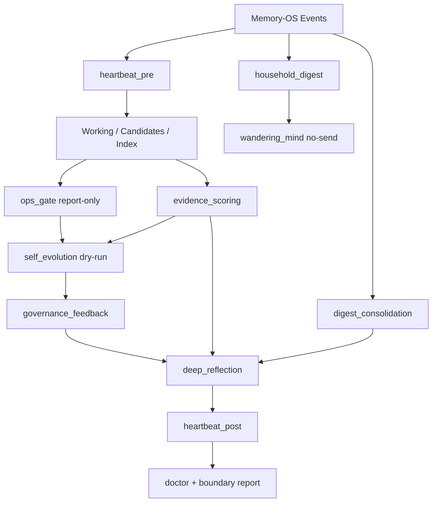

# 23 - RH-27 Test-Host Cognitive Loop Scheduler

Status: implemented and validated on `10.20.3.200`
Target host: `10.20.3.200` test environment only
Date: 2026-05-23

## Goal

The current test-host automation proves that Memory-OS plumbing is healthy:

- provider is active
- heartbeat timer is active
- context router is applied
- shell plugin works
- monitor collects bounded metadata

That is not enough. It does not prove the left/right cognition modules are actually running as a loop.

RH-27 adds a test-host-only no-send cognitive loop scheduler that runs the developed Memory-OS modules on `10.20.3.200` so we can observe real behavior, real module interactions, growth curves, skew, failure modes, and boundary enforcement.

## Non-Goals

- No production enablement.
- No Sannai / `10.20.2.88` changes.
- No message sending.
- No command execution.
- No identity writes.
- No crystallized approval.
- No Hindsight export.
- No raw private body printing in reports.

## Operating Mode

Default interval: every 6 hours.

Reason:

- matches the existing monitor cadence
- produces enough data for a 7-day test window
- avoids hourly audit explosion before we understand growth rates

The interval is test-host configurable, but v0.1 ships with 6h.

## Cycle Order

Each cycle runs the following steps in order. Every step writes a bounded cycle report entry with status, counts, duration, and boundary booleans.

1. `heartbeat_pre`
   - Run provider heartbeat/index catch-up.
   - Reads canonical events.
   - Writes working/candidates/index updates according to existing provider policy.

2. `household_digest`
   - Run `household_digest` summary.
   - Reads recent Memory-OS events.
   - Writes household digest artifact.

3. `digest_consolidation`
   - Run daily digest once per profile-local day if missing.
   - Run weekly consolidation once per ISO week if missing.
   - Reads Memory-OS summaries/events, not raw transcripts.
   - Writes digest artifacts and audit.

4. `wandering_mind`
   - Run no-send wandering pass.
   - Reads household digest and safe recent state.
   - Writes wandering artifact / would-send artifact only.
   - `actual_send=false`.

5. `ops_gate`
   - Run report-only ops gate.
   - Reads proposed actions when available.
   - Writes gate report.
   - `actual_execute=false`.

6. `evidence_scoring`
   - Score proposal/evidence candidates.
   - Writes score artifacts and audit.
   - Does not approve crystallized memory.

7. `self_evolution`
   - Run dry-run/no-execute self-evolution governor.
   - Reads ops gate, proposal queue, evidence scores.
   - May create proposal queue candidate only.
   - `direct_self_modify=false`, `actual_execute=false`.

8. `governance_feedback`
   - Run feedback bridge in test-host apply mode.
   - Writes bounded governance feedback events/summaries.
   - Does not send, execute, approve, or write identity.

9. `deep_reflection`
   - Run DeepReflection in test-host apply mode.
   - Reads working memory, digest/consolidation, evidence scores, proposal backlog, governance feedback.
   - Writes internal analysis artifact, injection cards, optional proposal/wandering seed.
   - `working_updates_enabled` remains false for v0.1.

10. `heartbeat_post`
    - Run provider heartbeat/index catch-up again.
    - Lets newly written governance/reflection events become visible to index/status.

11. `doctor_boundary_report`
    - Run doctor/status/contract checks.
    - Assert hard boundaries:
      - `actual_send=false`
      - `actual_execute=false`
      - `actual_identity_write=false`
      - `actual_crystallized_approval=false`
      - `hindsight_exported=false`

## Failure Isolation

The scheduler must not die because one module fails.

v0.1 policy:

- Run each step independently under a cycle lock.
- A step failure is recorded as `status=error` with a bounded error string.
- The scheduler continues to the next safe step.
- Dependency-sensitive steps may be skipped with `status=skipped_dependency_failed`.
- The final cycle status is:
  - `ok` when all steps passed
  - `warning` when non-critical steps failed/skipped but hard boundaries held
  - `error` when doctor fails or any hard boundary is violated

No automatic recovery is allowed. Recovery remains manual and owner-approved.

## Data Flow Summary



## Implementation Shape

### New Runtime Entry

Add:

```text
plugins/memory/memory_os/cognitive_loop.py
```

Responsibilities:

- define the test-host cycle runner
- acquire a cycle lock
- run the ordered steps
- collect per-step metadata
- write cycle reports under Memory-OS artifacts
- expose a typed result for CLI/tests

### CLI

Add:

```text
python3 -m plugins.memory.memory_os cognitive-loop status
python3 -m plugins.memory.memory_os cognitive-loop run-once --test-host --apply
python3 -m plugins.memory.memory_os cognitive-loop history --limit N
python3 -m plugins.memory.memory_os cognitive-loop doctor
```

Rules:

- `run-once` without `--test-host` must fail closed.
- `--apply` is allowed only with `--test-host`.
- dry-run mode may be used locally, but the 10.20.3.200 scheduler uses `--test-host --apply`.
- The installed Hermes runtime on `10.20.3.200` does not expose
  `hermes memory_os` as a top-level command when `memory_os` is active only as
  a memory provider and not enabled as a general plugin. The scheduler therefore
  uses the standalone module entrypoint with `PYTHONPATH` pointed at the
  Memory-OS runtime package.

### Systemd Timer

Add test-host timer/unit:

```text
hermes-memory-os-cognitive-loop.service
hermes-memory-os-cognitive-loop.timer
```

Service command:

```text
PYTHONPATH="$HERMES_HOME/memory-os/runtime/python:$HERMES_HOME/plugins:$PYTHONPATH" \
python3 -m plugins.memory.memory_os cognitive-loop run-once --test-host --apply
```

Timer:

```text
OnUnitActiveSec=6h
Persistent=true
```

The installer must only enable this timer when the test-host preset or explicit cognitive-loop flag is selected.

### Monitor Integration

Extend `scripts/memory_os_3_200_monitor.py` to collect:

- cognitive loop timer active/enabled state
- last cycle timestamp/status
- per-step status summary
- step failure count
- cycle duration
- boundary booleans
- deltas since previous snapshot:
  - events
  - working items
  - candidates
  - evidence scores
  - proposal queue states
  - digest artifact counts
  - DeepReflection analysis/injection counts
  - wandering artifacts
  - governance feedback events

Reports must stay bounded and must not print private bodies.

## Acceptance Criteria

Local:

- unit tests cover cycle runner success, step failure isolation, and hard-boundary failure
- CLI tests cover fail-closed behavior without `--test-host`
- installer tests cover timer not enabled by default and enabled only by explicit test-host config
- `python -m pytest -q` passes
- `git diff --check` passes

Remote `10.20.3.200`:

- installer deploys provider, shell, heartbeat timer, cognitive-loop timer
- `python3 -m plugins.memory.memory_os cognitive-loop run-once --test-host --apply`
  exits 0
- cycle report shows all 11 steps attempted or intentionally skipped
- no hard boundary violation
- `python3 -m plugins.memory.memory_os doctor` remains ok
- gateway remains active
- heartbeat timer remains active
- cognitive-loop timer active/enabled
- monitor reports cognitive-loop deltas after one manual run and one scheduled run

## Initial 7-Day Observation Targets

After deployment, observe for 7 days:

- audit growth per cycle
- events per cycle
- working item growth and cap behavior
- candidate growth and proposal queue states
- evidence score growth
- digest daily/weekly artifact creation
- wandering artifact creation
- self-evolution proposal creation rate
- governance feedback event creation
- DeepReflection source-class distribution
- context router heading anomalies
- doctor warnings
- boundary booleans

Expected early warnings:

- DeepReflection may remain working-source skewed until digest/governance/wandering artifacts accumulate.
- audit growth will increase because the full loop is finally running.
- casual route may still select empty context until non-mechanism content exists.

These are warning signals to track, not immediate failures.

## Stop Conditions

Immediately disable the cognitive-loop timer if any of the following happens:

- `actual_send=true`
- `actual_execute=true`
- `actual_identity_write=true`
- `actual_crystallized_approval=true`
- `crystallized_records` increases without explicit owner approval
- doctor returns error
- gateway becomes unstable after loop runs
- audit growth becomes unbounded relative to events

Rollback must be config/systemd only. Do not delete canonical Memory-OS data as part of rollback.

## Implementation And Remote Validation

Implementation completed on 2026-05-23.

Local verification:

- cognitive loop unit tests passed
- installer tests passed
- monitor tests passed
- full test suite passed with `356 passed`
- `git diff --check` passed

Remote validation on `10.20.3.200`:

- installer deployed provider, shell plugin, heartbeat timer, and cognitive-loop
  timer
- `hermes-memory-os-cognitive-loop.timer` was loaded, active, waiting, and
  enabled
- one manual cognitive-loop run completed successfully with cycle id
  `cloop_20260523T050110276460Z_0f0c02cb09`
- all 11 cycle steps returned `ok`
- cycle duration was `527ms`
- no hard-boundary boolean was true

Step highlights from the first manual run:

- `household_digest` processed 50 events and wrote a digest artifact
- `digest_consolidation` wrote daily artifact `2026-05-23` and weekly artifact
  `2026-W21`
- `wandering_mind` produced would-send output while keeping
  `actual_send=false`
- `ops_gate` stayed report-only with `actual_execute=false`
- `evidence_scoring` reported 269 evidence scores
- `self_evolution` created proposal
  `prop_20260523T050110584207Z_3073ae8ff0` with
  `direct_self_modify=false`
- `governance_feedback` wrote six bounded governance events
- `deep_reflection` selected two injection cards from `governance`, which broke
  the previous working-only source-class observation
- `heartbeat_post` processed six governance events and policy-skipped all six
  from working-memory promotion, preserving the RH-12 boundary

Post-run monitor result:

- status was `WARN` with no `FAIL`
- gateway was active with PID `451894`
- heartbeat timer was active/enabled
- cognitive-loop timer was active/enabled
- provider index was healthy
- doctor was `ok` with only expected `hindsight_adapter_disabled`
- `crystallized_records=0`
- context router remained in apply mode with LLM judge disabled
- DeepReflection latest source-class distribution was
  `selected_by_source_class={"governance": 2}` and
  `dropped_by_source_class={"governance": 2}`
- rolling DeepReflection distribution became
  `selected_by_source_class={"governance": 2, "working": 14}` and
  `dropped_by_source_class={"governance": 2, "working": 7}`
- disk usage for `/root/.hermes/memory-os` was `8.3M`

The only expected warning after this gate was RH-26 casual empty context. The
previous DeepReflection working-only skew warning is now partially resolved by
running the left/right cognition loop rather than only the provider plumbing.

Follow-up validation after adding hard-boundary aggregation:

- local full test suite passed with `356 passed`
- `git diff --check` passed
- test-host installer redeployed the updated runtime package
- manual cycle `cloop_20260523T050811038295Z_4d300f67cf` completed with
  `status=ok`
- all hard-boundary booleans remained false
- post-run monitor stayed `WARN` with no `FAIL`
- rolling DeepReflection source distribution became
  `selected_by_source_class={"governance": 4, "working": 14}` and
  `dropped_by_source_class={"governance": 4, "working": 7}`
