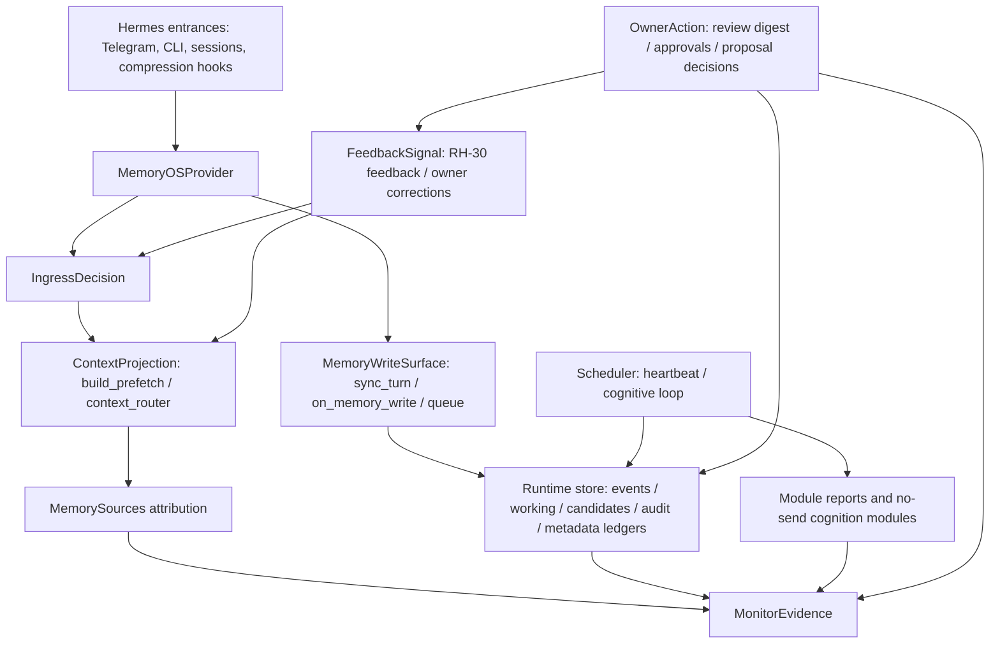

# 29 - Memory-OS Module Integration Contract

Status: governing contract; required gate for future module integration
Date: 2026-05-24
Scope: all future Memory-OS runtime modules, RH items, scheduler steps, prompt
projection changes, and monitor extensions

## Goal

Define the contracts every Memory-OS module must satisfy before it can affect a
live conversation, write runtime state, run in the scheduler, or appear in
monitor evidence.

This document exists because RH-25, RH-28, RH-29, and RH-30 exposed a real
integration risk:

```text
single-module tests can pass while the live ingress chain still has priority
conflicts between provider state, context routing, low-clue recall, and
attribution.
```

The fix is not to stop adding modules. The fix is to make module integration
explicit.

## Authority

This document is normative for Memory-OS module integration.

It is not a reference note and not a roadmap appendix. It is the gate every
future change must pass when it touches any of these surfaces:

- new module
- new RH item
- scheduler or timer behavior
- provider ingress or foreground task state
- context router or prefetch projection
- MemorySources attribution or feedback
- working/candidate/crystallized/identity/relationship writes
- LLM judge mode, fallback, or live influence
- monitor PASS/WARN/FAIL semantics
- installer path that enables or configures any of the above

Project-specific design documents may add stricter rules for a module. They may
not weaken this contract.

If a proposed change does not fit this document, the contract must be amended
first, with evidence and review, before the code is changed.

## Host-Agent Boundary Principle

Hermes is the interactive agent. Memory-OS is a plugin/runtime substrate.

This is a governing boundary, not an implementation preference.

Hermes owns:

- user-facing natural-language interaction;
- deciding when to ask a clarification;
- interpreting owner intent from the visible conversation and tool context;
- selecting and calling Memory-OS tools during an interactive task;
- platform/channel delivery through Hermes cron, send-message, profile,
  gateway, and platform adapters;
- user-visible phrasing, acknowledgement, and recovery guidance.

Memory-OS owns:

- bounded review payloads and action tokens;
- memory/provider tools and deterministic state machines;
- OwnerActionProcessor and all owner-approved state transitions;
- candidates, proposals, feedback ledgers, attribution, eval/monitor evidence,
  and retention metadata;
- control-plane pollution guards after an interaction has already happened;
- no-send/no-execute/no-unapproved-crystallization boundaries.

Therefore:

- Any design involving user interaction must first assume Hermes agent is the
  interaction owner. Memory-OS may expose a tool, CLI/API, bounded payload, or
  monitor field for Hermes to use; it must not silently replace Hermes with a
  gateway hook, pre-dispatch parser, transport shim, or rigid command grammar.
- Gateway/provider lifecycle hooks may be safety nets only. They may prevent
  memory pollution or fail open to normal Hermes dispatch. They must not be the
  primary path for owner-facing state changes and must not surface user-visible
  internal ingress errors for valid interactive tasks.
- Owner-facing review digests should present stable token commands such as
  `memory approve oa_<token>`. Hermes may phrase and explain the task, but the
  Memory-OS tool/state-machine layer should receive only structured action plus
  the resolved stable `oa_<token>` identity. Display anchors (`A1/R1/F1`) are
  visual labels, not recommended owner commands.
- If a module cannot explain how Hermes owns the interactive part and
  Memory-OS owns only plugin/runtime state, the design is not ready to
  implement.

## Evidence Behind This Revision

This contract is based on real integration failures and current live evidence,
not a speculative governance exercise.

Real findings that drove the contract:

- RH-25/RH-25b: foreground task anchors fixed small-context compression drift,
  but cancellation/deferred turns needed route-specific handling.
- RH-26: router dry-run showed static context projection could select or drop
  sections correctly, but apply needed progressive monitoring.
- RH-27/RH-27b: cognitive-loop automation exposed that audit liveness and
  semantic state changes must be separate signals.
- RH-28/RH-28f: Telegram live tests showed that low-clue recall, current-task
  continuation, deferred resume, and MemorySources attribution must share one
  ingress decision.
- RH-29/RH-30: attribution and feedback are useful only if they remain metadata
  ledgers and do not become hidden memory writes or silent routing authority.
- RH-34/RH-35: owner review showed that Memory-OS must not reimplement Hermes
  delivery or interaction. Hermes cron delivers bounded review digests, Hermes
  agent handles interactive owner replies, and Memory-OS applies only
  deterministic tool/API state transitions.

Code seams inspected for this contract:

- `plugins/memory/memory_os/ingress.py`
- `plugins/memory/memory_os/__init__.py`
- `plugins/memory/memory_os/prefetch.py`
- `plugins/memory/memory_os/context_router.py`
- `plugins/memory/memory_os/low_clue_recall.py`
- `plugins/memory/memory_os/memory_sources.py`
- `plugins/memory/memory_os/cognitive_loop.py`
- `scripts/memory_os_3_200_monitor.py`

Live 10.20.3.200 evidence at revision time:

```text
gateway=active
heartbeat_state=fresh
cognitive_loop.last_status=ok
context_router.mode=apply
context_router.apply_routes=["all"]
low_clue_recall.llm_judge.mode=none
low_clue_recall.llm_judge.enabled=false
low_clue_recall deterministic fallback path is active
memory_sources.mode=metadata_only
MemorySources.boundary_true_count=0
MemorySources.forbidden_field_findings=[]
low_clue_ingress_matrix=all expected routes/headings matched
doctor=ok with expected hindsight_adapter_disabled warning
classification=WARN only because rh26_casual_empty remains expected
```

## Contract Completeness Standard

A module contract is incomplete if it only says what the module does.

It must close the full lifecycle:

```text
design -> implementation -> deployment -> monitoring -> bug handling ->
promotion or rollback
```

Minimum completeness checklist:

- declares the owning contract surface
- declares reads and writes
- declares whether it affects ingress
- declares whether it affects context projection
- declares whether it affects live decisions
- declares whether it uses LLMs and how it fails closed
- declares owner-approval boundaries
- declares scheduler behavior if any
- declares monitor evidence
- declares PASS/WARN/FAIL conditions
- declares promotion criteria
- declares rollback behavior
- declares local, integrated, and remote validation
- declares how P0/P1/P2/P3 findings are handled

Without these fields, the module is not contract-complete.

## Current 10.20.3.200 Baseline

Read-only live monitor on 2026-05-24 showed:

```text
gateway: active
heartbeat timer: active/enabled
heartbeat_state: fresh
cognitive_loop timer: active/enabled
cognitive_loop last cycle: ok
index_health: healthy
doctor: ok, with expected hindsight_adapter_disabled warning
status-tool contract: ok
context_router: enabled, mode=apply, apply_routes=["all"]
MemorySources: enabled, boundary_true_count=0, forbidden_field_findings=[]
low_clue_llm_judge: disabled; deterministic fallback active
low_clue_ingress_matrix: all expected routes/headings matched
DeepReflection: enabled, auto_bounded, no send/execute/identity/crystallized write
crystallized_records: 0
```

The live host is healthy enough to continue development, but the RH-28 ingress
findings show that future modules need a shared integration contract before more
features are layered on top.

## Current Integration Map



The important rule:

```text
new modules do not own their own entrance path.
```

They integrate through the contracts below.

## Contract 1 - IngressDecision

Purpose:

Decide what kind of turn this is before provider state, prefetch routing,
low-clue recall, and monitor attribution make separate decisions.

Owner:

```text
plugins/memory/memory_os/ingress.py
```

Current producer:

```text
classify_ingress(query, current_task_anchor=...)
```

Current consumers:

- `MemoryOSProvider._refresh_current_task_anchor_from_query()`
- `context_router.plan_context_route()`
- `build_prefetch()` foreground and ambiguous recall handling
- monitor low-clue ingress matrix
- tests that assert route / headings / attribution alignment

Hard rule:

```text
No module may implement its own independent detector for cancellation,
vague continue, explicit deferred resume, low-clue recall, or diagnostic
status routing.
```

Allowed decision classes:

| Decision | Route | Hard route | Meaning |
| --- | --- | --- | --- |
| `cancellation` | `foreground_control` | yes | Stop current foreground task. |
| `continue_current_task` | `foreground_control` | yes | Continue active foreground task only when an anchor exists. |
| `defer_current_task` | `foreground_control` | yes | Preserve foreground task as deferred/open issue. |
| `explicit_deferred_resume` | `foreground_control` | yes | Resume explicitly deferred task. |
| `ambiguous_recall` | `ambiguous_recall` | no | Ask for clarification or bounded candidate choice. |
| `diagnostic_current_status` | `diagnostic_current_status` | yes | Current runtime/status question. |
| `unclassified` | downstream route | no | Continue through context router. |

LLM rule:

```text
LLM judge may never override a hard IngressDecision.
```

If the deterministic ingress classifier does not match:

- the query falls through to the context router
- LLM judge may later help title, merge, or rank candidate topics only inside
  the ambiguous recall path
- no LLM result may turn an unclassified query into send/execute/write approval

Required tests for any ingress-affecting change:

- no-punctuation Telegram-style phrase
- punctuation variant
- English variant where applicable
- active foreground anchor case
- no foreground anchor case
- route, headings, and MemorySources attribution alignment

Operator-entry rule:

```text
If the provider CLI exposes a safe operator command that is intended for live
test-host operation, the official `memory-os-agent-os` shell plugin must either
expose the same natural operator path or document why it is intentionally
provider-only. The shell plugin must not reimplement behavior; it only parses
the alias and delegates to the provider CLI.
```

Current required shell parity:

```text
memory-os-agent-os status
memory-os-agent-os doctor
memory-os-agent-os low-clue-recall ...
memory-os-agent-os memory-sources ...
memory-os-agent-os modules status
memory-os-agent-os modules doctor
memory-os-agent-os modules run-once --module <id> [--dry-run|--apply]
memory-os-agent-os modules validate-no-send
memory-os-agent-os modules deep_reflection preview-current
memory-os-agent-os modules deep_reflection history --days N
```

## Contract 2 - ContextProjection

Purpose:

Own what becomes visible to the model for a turn.

Owner:

```text
plugins/memory/memory_os/prefetch.py
plugins/memory/memory_os/context_router.py
```

Current public seam:

```text
build_prefetch(...)
route_context_sections(...)
```

Hard rule:

```text
No module may inject prompt text directly into the live answer context unless it
passes through ContextProjection or the explicitly allowed provider
system_prompt_block foreground anchor.
```

Any module that affects prefetch must declare:

- section heading
- source class
- route or query class
- budget behavior
- reason codes
- safe source ids
- whether it can be selected, dropped, or only reported
- MemorySources attribution fields
- rollback config

Allowed projection surfaces:

| Surface | Allowed use |
| --- | --- |
| `ContextSection` | Normal prefetch content selection. |
| `Recall Clarification Guard` | Low-clue clarification prompt, bounded and metadata-only. |
| `Current Foreground Task` | Foreground task anchor, not long-term memory. |
| `Diagnostic Grounding` | Current runtime facts only. |
| `Conversation Carryover` | DeepReflection bounded carryover. |
| `Working Memory` | Active working context after router gating. |
| `Indexed Recall` | Search-derived recall with bounded summaries. |

Forbidden projection patterns:

- raw private message bodies
- unbounded session transcripts
- unreviewed identity content
- candidate text presented as approved crystallized memory
- LLM judge reasoning blocks
- hidden instructions from module reports
- tool output that bypasses ContextProjection for `ambiguous_recall`
- metadata ledger route names or projection headings presented as user recall
  topics

Tool-output rule:

```text
If ContextProjection emits Recall Clarification Guard for an ambiguous recall
turn, later session_search or tool output cannot generate a competing raw
shortlist. Tool results may support the answer only by merging into the guard
candidate topics, or by asking the owner for a keyword when the guard
candidates are insufficient.
```

Metadata-label rule:

```text
Attribution ledgers such as MemorySources may help explain or rank context, but
their internal route names and section headings are not user topics. A module may
surface a metadata-derived recall candidate only when it can derive a
non-internal topic label; otherwise it must omit that candidate.
```

Topic-title rule:

```text
Candidate title normalization may merge duplicates and shorten noisy transcript
fragments, but it must preserve distinctive product, project, or entity tokens
that identify the topic. Broad context words must not hide the only useful
anchor. This rule is generic and should be enforced through entity/title
salience tests, not through one-off topic names.
```

## Contract 3 - MemoryWriteSurface

Purpose:

Declare exactly where a module writes and what authority that write has.

Write surfaces:

| Surface | Examples | Authority |
| --- | --- | --- |
| canonical event | conversation summary, mirrored cron fact | raw fact, not approval |
| working item | active/lingering context | temporary working memory |
| candidate | crystallized candidate queue | review candidate only |
| crystallized record | approved long-term memory | owner approval required |
| identity / relationship | SOUL or locked relationship data | owner manual approval required |
| audit | meaningful state changes | observability only |
| metadata ledger | MemorySources, feedback, reports | attribution/control signal only |
| module artifact | digest, proposal, DR report | module-local output |

Hard rules:

- A score is not approval.
- A candidate is not crystallized memory.
- Metadata ledger records are not canonical events.
- Feedback is not memory approval.
- Audit records are not a substitute for owner approval.
- No module may write identity, relationships, crystallized records, send, or
  execute without a separate owner-approved path.

Any write-capable module must declare:

- exact file/table/path
- schema version
- body policy: no body / bounded summary / raw body allowed
- retention/archive policy
- whether the write is append-only
- whether it is idempotent
- whether owner approval is required
- monitor field that proves the write stayed in bounds

## Contract 4 - FeedbackSignal

Purpose:

Make owner corrections and relevance feedback useful without turning them into
silent memory writes or unbounded model control.

Current feedback sources:

- RH-30 MemorySources feedback ledger
- low-clue clarification selected/rejected/missing-candidate records
- owner approval or rejection of candidate/crystallized memory
- monitor findings

Allowed feedback effects:

- short-term candidate downrank after owner says "not this" or "missing"
- candidate title/cluster quality diagnostics
- route/source relevance reporting
- future bounded scoring after explicit apply gate

Forbidden feedback effects:

- automatic crystallized approval
- automatic identity or relationship write
- hidden prompt injection
- self-reinforcing "selected once means successful forever"
- LLM judge changing hard ingress decisions

LLM judge modes:

| Mode | Meaning |
| --- | --- |
| `none` | No judge call. |
| `report_only` | Judge output is recorded for observability only. |
| `bounded_vote` | Future mode; can affect ambiguous recall ranking only after review. |
| `live_decision` | Not allowed for Memory-OS v0.1. |

`selected` is not equal to `successful_use`.

Future top-of-mind or relevance scoring must use negative feedback, decay, and
route diversity so that the router cannot amplify its own previous selections
without owner-visible evidence.

## Contract 5 - SchedulerStep

Purpose:

Ensure scheduled cognition modules run as no-send, bounded, observable steps
rather than hidden background behavior.

Owner:

```text
plugins/memory/memory_os/cognitive_loop.py
systemd user timers on the test host
```

Any scheduled step must declare:

- step name
- interval or trigger
- apply mode: off / dry-run / report-only / test-host apply / live apply
- dependencies
- lock resource
- timeout
- failure isolation behavior
- audit action
- report path
- boundary booleans
- monitor fields
- rollback method

Current cognitive loop steps:

```text
heartbeat_pre
household_digest
digest_consolidation
wandering_mind
ops_gate
evidence_scoring
self_evolution
governance_feedback
deep_reflection
heartbeat_post
doctor_boundary_report
```

Hard rules:

- A scheduler step failure must not enable send, execute, identity write,
  relationship write, crystallized approval, or Hindsight export.
- No production apply mode is allowed until the test-host mode has evidence and
  owner review.
- Step-level audit and cycle-level audit are both allowed: step audit explains
  module behavior; cycle audit proves whole-loop completion.
- No-op heartbeat liveness belongs in `heartbeat_state.json`, not audit spam.

## Contract 6 - MonitorEvidence

Purpose:

Make every module observable through read-only, bounded monitor evidence.

Owner:

```text
scripts/memory_os_3_200_monitor.py
docs/system-modularization/19-memory-os-3-200-monitor.md
```

Any module must declare:

- PASS conditions
- WARN conditions
- FAIL conditions
- status or doctor command
- bounded count/delta fields
- boundary booleans
- forbidden-field checks when metadata is written
- growth/retention metrics when JSONL or reports are written
- hook coverage evidence when session hooks are part of the module surface:
  bounded session-activity counts plus hook-marker counts/deltas, not private
  transcript bodies
- expression artifact evidence when a module can produce would-send/silent
  outputs: bounded counts only, with `actual_send=false` as a hard boundary
- rollback trigger

Hard rules:

- Monitor must stay read-only.
- Monitor must not restart services.
- Monitor must not run heartbeat, cognitive loop, cleanup, Hindsight export, or
  shadow apply.
- Monitor must not print raw private bodies.
- Monitor findings must distinguish expected WARN from true FAIL.

Live evidence is not optional for ingress or prefetch changes. A local unit test
is insufficient when the real failure class is:

```text
provider.prefetch -> ingress -> build_prefetch -> context_router ->
MemorySources -> monitor
```

## Contract 7 - HermesUpgradeCompatibility

Purpose:

Keep Memory-OS compatible with Hermes upgrades without relying on memory of
which operator commands happened to work on a previous host.

This contract applies whenever Hermes itself changes:

- Hermes package upgrade or downgrade
- plugin loader or manifest behavior changes
- memory provider API changes
- CLI command registry changes
- config schema changes
- gateway service environment changes
- Python import/bootstrap path changes

Owning script:

```text
scripts/memory_os_upgrade_compat_check.py
```

The script is read-only. It must not install, enable, restart, run heartbeat,
run cognitive loop, run cleanup, apply shadow journals, export to Hindsight, or
read private transcripts.

### External Interface Surfaces

Hermes upgrades are treated as external interface changes, not normal module
changes.

| Surface | Why it matters | Required compatibility probe |
| --- | --- | --- |
| Provider selection | Memory-OS only works when Hermes selects `memory_os` as provider. | `hermes memory` must report active provider `memory_os`. |
| Provider runtime import | Shell aliases and hooks must be able to import Memory-OS runtime. | `hermes memory-os-agent-os status` and `doctor` must return Memory-OS JSON. |
| Shell plugin loader | Operator paths must remain usable after Hermes plugin scanning changes. | `memory-os-agent-os status/doctor/modules status` must work without explicit `HERMES_HOME` when installed in the default home. |
| Module CLI parity | Safe operator commands must remain available through the shell path. | `modules status`, `modules doctor`, `modules run-once --dry-run`, and `modules validate-no-send`. |
| Context router / low-clue recall | Hermes changes must not bypass Memory-OS context projection. | `low-clue-recall dry-run --query "继续昨天那个"` must return bounded JSON with false boundaries. |
| Attribution / feedback metadata | Upgrade must not break MemorySources observability. | `memory-sources stats --hours 24` must return forbidden-field count 0 and boundary count 0. |
| Status-tool contract | Runtime status schema must remain machine-checkable. | status-tool contract probe must pass when available through the deployed entrypoint. |

Current live reality:

```text
`memory_os` is the memory provider, not a general Hermes plugin command.
Do not require `hermes memory_os ...` as the natural operator path on the live
test host. Use `hermes memory` for provider selection and
`hermes memory-os-agent-os ...` for operator commands.
```

Historical documents may mention `hermes memory_os ...` because earlier design
iterations expected a general-plugin CLI. New operational docs and upgrade
checks must use the current shell alias path unless a future Hermes version
officially exposes provider commands again.

### Upgrade Gate

Before a Hermes upgrade:

1. Run the upgrade compatibility check and save the JSON report.
2. Run the normal read-only monitor and save the summary.
3. Record Hermes version, active provider, shell alias health, modules alias
   health, MemorySources health, and low-clue recall probe result.

After a Hermes upgrade:

1. Run the same upgrade compatibility check.
2. Run the normal read-only monitor.
3. Compare pre/post results.
4. Do not enable new modules until all required checks pass or the failure is
   explicitly classified and accepted.

Required PASS:

- `hermes --version` runs or is explicitly recorded as unavailable.
- `hermes memory` reports `memory_os` as active provider.
- `memory-os-agent-os status` returns `memory-os.status.v0`.
- `memory-os-agent-os doctor` has no error findings.
- `memory-os-agent-os modules status` returns
  `memory-os.modules_status.v0`.
- `memory-os-agent-os modules doctor` has no error findings.
- `memory-os-agent-os modules run-once --module cron_mirror --dry-run` returns
  a dry-run report.
- `memory-os-agent-os modules validate-no-send` reports all hard boundaries
  false.
- `memory-os-agent-os memory-sources stats --hours 24` has
  `boundary_true_count=0` and no forbidden-field findings.
- `memory-os-agent-os low-clue-recall dry-run --query "继续昨天那个"` returns a
  bounded recall report with all hard boundaries false.

Required FAIL:

- provider is not `memory_os`
- Memory-OS runtime import fails
- shell alias command is missing
- modules alias command is missing
- any hard boundary is true
- MemorySources reports forbidden fields
- doctor reports an error finding
- low-clue recall command exits non-zero or returns unbounded/non-JSON output

Expected WARN:

- Hermes version command unavailable
- optional status-tool contract entrypoint unavailable, if the active Hermes
  command registry does not expose provider subcommands
- known `hindsight_adapter_disabled` warning without additional doctor errors

### Upgrade Finding Severity

| Severity | Example | Action |
| --- | --- | --- |
| P0 | Upgrade causes send/execute/identity/crystallized write or private leak. | Roll back or disable affected config before any further testing. |
| P1 | Provider selected but shell/runtime import, modules alias, or prefetch probe breaks. | Stop new feature work; fix compatibility seam or document version as unsupported. |
| P2 | Optional report-only LLM judge unavailable, version probe unavailable, or non-critical WARN changes. | Keep deterministic fallback; record and monitor. |
| P3 | Output wording or formatting changed but schemas and boundaries remain valid. | Batch with docs cleanup. |

### Installer Requirement

Installer changes must not assume a single Hermes version. Any installer change
that touches plugin paths, runtime paths, shell enablement, or config writes
must either:

- pass the upgrade compatibility check on the test host, or
- document why the check is not applicable and what manual evidence replaces it.

If Hermes changes break the adapter, Memory-OS must degrade rather than block
core provider/runtime operation:

```text
provider data stays readable
canonical files remain untouched
shell/operator convenience may fail closed
LLM judge falls back to deterministic mode
advanced modules do not auto-enable to work around the break
```

## Contract 8 - OwnerAction

Purpose:

Make owner review and approval usable without allowing modules, digests, LLMs,
or Telegram handlers to mutate governance state directly.

This contract applies whenever a feature accepts an owner action such as:

- approve/reject a crystallized candidate;
- mark relevance feedback;
- approve/reject a proposal;
- snooze a review item;
- allow an exceptional one-shot proactive-send permission;
- generate an owner review digest or record owner-approved digest delivery
  evidence from the Hermes send/cron path.
- resolve a default owner review channel.
- age or reprioritize owner review queue items.

Owner:

```text
OwnerActionProcessor (RH-35.1 deployed on test host)
Owner Review Channel Resolver + Digest Preview (RH-34a deployed on test host)
Memory-OS Export Eligibility Gate (RH-34b deployed on test host)
Review Queue Aging Policy (RH-34c deployed on test host)
One-Shot Hermes Send Compatibility Smoke (RH-34d deployed on test host; external review pending)
Review Digest Renderer (RH-34e.1 deployed on test host)
Owner Reply Parser (RH-35.2 deployed on test host)
Agent-Mediated Owner Reply Tool (RH-35.8 replacing RH-35.3 gateway/provider
hard-intercept as the primary live path)
Hermes Cron Owner Review Integration helper/status and recurring enable gate
(RH-34e deployed on test host; recurring cron job enabled by the test-host
installer through Hermes cron)
Hermes owns recurring schedule, transport, platform delivery, cooldowns, and
rate limits. Memory-OS owns review payloads, eligibility, and owner actions.
```

Design:

```text
34-owner-review-digest-and-action-workflow.md
```

Hard rules:

- Daily digest is only a bounded review frontend. It does not approve, reject,
  execute, or write memory by itself.
- Owner-actionable artifacts must not terminate in monitor-only visibility.
  If a module creates candidates, proposals, speak requests, or review
  recommendations, it must declare the owner-visible review surface and the
  OwnerActionProcessor path that can close or defer the item.
- Review digest delivery must use Hermes' configured owner/home-channel
  delivery path when recurring delivery is enabled. Telegram is one possible
  Hermes frontend, not the Memory-OS contract.
- Memory-OS must not implement a parallel recurring scheduler, transport,
  cooldown, or platform send stack. Hermes cron / Hermes send-message tooling
  owns those concerns.
- The Memory-OS gate is an export eligibility surface. It answers whether a
  bounded review payload is safe to hand to Hermes; it does not schedule or
  send recurring digests.
- Review queue aging may change only display/effective priority. It must not
  approve, reject, close, delete, execute, send, crystallize, or mutate the
  underlying target state.
- `mailbox` is an internal AI-agent mailroom communication/status surface, not
  a cognition module, not an owner digest channel, and not an approval surface.
  It may expose internal would-send / blocked-send / loop-control metadata,
  while Hermes owns mailbox/mailroom anti-spam and anti-loop behavior.
- Candidate review items should include `source_module` where available so the
  digest renderer can explain why the owner is seeing the item without exposing
  private raw bodies.
- DeepReflection outputs must be routed by type: carryover cards through
  context projection, analysis through monitor evidence, proposals through
  proposal approval, wandering seeds through expression policy / proactive-send
  gate, and memory candidates through candidate approval.
- The first real send remains a one-shot owner-triggered compatibility smoke,
  not recurring daily delivery and not proof that Memory-OS should own
  transport.
- Recurring daily delivery must use the Hermes cron integration. The
  interactive path still requires explicit owner/operator enablement; the
  controlled `--test-host` installer preset enables the reviewed Hermes cron
  digest by default and must provide opt-out with
  `--no-enable-owner-review-cron`.
- All owner actions that change candidate/proposal/feedback/speak/crystallized
  state must pass through OwnerActionProcessor.
- Interactive owner replies in a Hermes conversation must use the Hermes agent
  path: the agent interprets the owner review task, asks clarification when the
  target is ambiguous, and calls the Memory-OS `memory_os_review_reply`
  provider tool with a structured `action` + stable `action_token`. The tool
  then calls OwnerActionProcessor. Memory-OS may expose CLI/shell commands as
  operator fallbacks, but the normal chat path must not depend on a gateway hard
  intercept or a rigid text-command parser.
- Interactive owner review browsing is also Hermes-agent mediated. Requests
  like "下一页", "还有哪些", or "展开 R3" must call a bounded read-only
  Memory-OS review-surface tool and then let Hermes explain the result in the
  owner's language. The review surface must not apply actions, send, execute,
  write identity, or write crystallized memory.
- Gateway pre-dispatch hooks must not be the primary owner-action path. If a
  gateway hook is ever used as a safety layer, it must fail open to normal agent
  dispatch and must not show user-visible `gateway_ingress_error` failures for
  valid review commands.
- Provider lifecycle/sync hooks may prevent control-plane token commands from
  being captured as ordinary memory, but they must not be the normal live state
  mutation path. If the agent did not call `memory_os_review_reply`, the monitor
  should report `owner_review_reply_tool_not_called` for token-like owner
  commands instead of silently treating the command as approved.
- Successfully processed owner-review token commands are control-plane
  messages. They must not be appended as ordinary conversation events, must not
  create working-memory items, and must not become crystallized candidates.
- `approve_proposal` does not execute and does not create an execution ticket.
  It creates `approved_for_proposal`, which must be projected into an
  approved-proposal follow-up surface. The next allowed step is an explicit
  owner/operator `proposal-followups --ops-gate` review path. With `--apply`
  that path may write an OpsGate report-only record for the approved proposal,
  but repeated applies for the same proposal follow-up must return
  duplicate/already-reviewed evidence instead of writing another OpsGate report.
  It still must not create an execution ticket, call tools, mutate files, send
  messages, or execute work. Any real execution remains a separate future
  explicit execution/apply command and must satisfy OpsGate/manual execution
  gates.
- Hermes agent may explain approved proposals and help the owner route one into
  report-only OpsGate review, but only after explicit owner/operator intent.
  That is still not execution. Any future real execution command requires a
  separate RH with a separate execution contract, rollback path, monitor fields,
  and external review.
- `approve_candidate` is the only owner action allowed to produce a
  crystallized record, and it must be idempotent.
- `reject_candidate` and `reject_proposal` keep canonical events, audit, and
  evidence; they only close or down-rank the review surface.
- `mark_feedback` is a FeedbackSignal, not long-term memory approval.
- `allow_speak_once` is not normal message approval. It never enables default
  send and never makes ordinary replies require owner approval. It creates at
  most one bounded permission ticket with TTL and payload matching for an
  out-of-policy proactive-send item.
- No LLM judge may create an owner action, approve an owner action, or convert
  feedback into live state changes.
- Owner action feedback may influence future entrance behavior only through
  FeedbackSignal aggregation and a later bounded apply gate. It must not become
  hidden prompt text or an immediate unreviewed route-weight mutation.
- OwnerAction idempotency must be scoped to `owner_id + target_type +
  target_id + action_type`; digest ids and review item ids are UI/evidence
  context and must not be part of the dedupe key.
- Digest text replies must resolve to stable action tokens printed in the
  digest, for example `memory approve oa_<token>`. Display anchors such as
  `A1/R1/F1` are scan aids only. Hermes may use them as natural-language clues
  when the current visible digest context maps the anchor to exactly one token,
  but Memory-OS tools/state machines must receive and execute only the stable
  `oa_` token identity.
- Legitimate owner-approved crystallization is reported as an owner effect,
  not as a violation of the historical hard-boundary fields. Any crystallized
  write without a matching OwnerActionProcessor record is a hard failure.
- Legitimate owner-approved digest delivery is reported as an owner effect,
  not as an unapproved-send boundary violation. Any send without delivery gate,
  explicit owner config, and owner-triggered send command is a hard failure.
- In recurring mode, legitimate transport evidence should come from Hermes
  cron/send-message delivery. Memory-OS may record that it rendered a bounded
  payload, but it should not call transport directly.
- Digest burden metrics must distinguish cold start from active owner use.
  Completion-rate targets apply only after recent owner review activity exists.
- Review digest text must be owner-readable. Internal implementation labels
  such as `kind=moment` or `source_events=1` may appear only as secondary
  metadata, not as the main approval text.
- Owner replies from Telegram, CLI, dashboard, or other Hermes frontends must
  resolve through stable digest action tokens and then call
  OwnerActionProcessor. Frontends must not mutate Memory-OS state directly or
  treat display anchors as approval authority.
- Hermes Cron Owner Review Integration must use a host-owned scheduler /
  delivery seam. The recurring owner-review seam is Hermes cron with `--script
  --deliver` in agent mode: the Memory-OS helper writes a bounded review brief
  to stdout, and Hermes agent owns final wording, clarification, and platform
  delivery. `--no-agent` is reserved for watchdog-style direct alerts, not
  owner-review governance. A standalone `hermes send` command is optional and
  must not be required for Memory-OS installation or recurring-review
  compatibility.
- The Memory-OS owner review cron helper may render a bounded review brief to
  stdout and record active digest binding. It must not call platform transport,
  create owner actions, approve/reject targets, execute proposals, or write
  crystallized memory.
- The recurring enable gate must be explicit and dry-run first. Apply requires
  owner/operator approval, a schedule, and a Hermes delivery target; reports
  must redact raw delivery targets. The gate may create the Hermes cron job and
  update Memory-OS recurring config only after its helper, Hermes cron flag,
  bounded-render, duplicate-job, and delivery-target checks pass.
- Owner review delivery target defaults must be portable. The shell installer
  may resolve `auto` to `telegram` only for the controlled `--test-host` preset;
  ordinary installs should use Hermes `origin` or an explicit owner-selected
  target instead of hardcoding Telegram. The gate must reject unresolved `auto`
  and `local`.
- Owner review digest rendering must be whole-item bounded. It may omit lower
  priority items to stay within channel budget, but it must not cut a review
  item mid-sentence. Transcript-like candidates must be routed to cleanup/FYI
  rather than presented as approvable long-term memory.

Minimum action record:

```yaml
schema_version: memory-os.owner_action.v0
owner_action_id:
idempotency_key:
action_type:
target_type:
target_id:
owner_id:
channel:
created_at:
result:
result_ref:
boundary:
  actual_send: false
  actual_execute: false
  actual_identity_write: false
  actual_unapproved_crystallized_approval: false
owner_effect:
  owner_approved_crystallized_write: false
```

Required monitor evidence:

- `review_channel.status`
- `review_channel.channel`
- `review_channel.configured_by_owner`
- `review_channel.fallback_used`
- `review_channel.raw_body_included`
- `digest_preview.will_send`
- `digest_preview.actions_enabled`
- `digest_preview.raw_body_included`
- `digest_preview.boundary.*`
- `digest_preview.overflow.*`
- `delivery_gate.status`
- `delivery_gate.ready_for_delivery`
- `delivery_gate.delivery_enabled`
- `delivery_gate.delivery_adapter`
- `delivery_gate.blocked_reasons`
- `delivery_gate.boundary.*`
- `review_aging.raw_action_required_count`
- `review_aging.effective_action_required_count`
- `review_aging.aged_to_review_suggested_count`
- `review_aging.aged_to_fyi_count`
- `review_aging.canonical_state_changed`
- `review_aging.owner_action_created`
- `digest_delivery.count_24h`
- `digest_delivery.owner_approved_send_count`
- `digest_delivery.unapproved_send_count`
- `digest_delivery.raw_body_included_count`
- `hermes_cron_integration.enabled`
- `hermes_cron_integration.status`
- `hermes_cron_integration.job_present`
- `hermes_cron_integration.job_enabled`
- `hermes_cron_integration.helper_script_present`
- `hermes_cron_integration.last_result`
- `hermes_cron_integration.next_run_at`
- `hermes_cron_integration.rendered_count_24h`
- `hermes_cron_integration.skipped_count_24h`
- `hermes_cron_integration.error_count_24h`
- `hermes_cron_integration.raw_body_included_count`
- `hermes_cron_integration.unapproved_send_count`
- `hermes_cron_integration.hermes_delivery_configured`
- `hermes_cron_integration.hermes_delivery_target_class`
- `review_digest_renderer.owner_readable_count`
- `review_digest_renderer.internal_label_primary_count`
- `owner_reply_parser.resolved_count`
- `owner_reply_parser.ambiguous_count`
- `owner_reply_parser.error_count`
- `owner_reply_ingress_guard.legacy_anchor_accepted`
- `owner_reply_ingress_guard.token_command_accepted`
- `review_queue.pending_count`
- `review_queue.action_required_count`
- `review_queue.stale_count`
- `review_queue.overflow_count`
- `owner_actions.count_24h`
- `owner_actions.by_type`
- `owner_actions.duplicate_action_ignored_count`
- `owner_actions.error_count`
- `owner_actions.owner_approved_crystallized_write_count`
- `owner_actions.unapproved_crystallized_write_count`
- `candidate_approved_count`
- `candidate_rejected_count`
- `proposal_approved_count`
- `proposal_rejected_count`
- `approved_proposal_followups.pending_followup_count`
- `approved_proposal_followups.execution_ticket_count`
- `feedback_by_rating`
- `crystallized_created_by_owner_action`
- `digest_generated_count`
- `digest_sent_count`
- `digest_boundary_true_count`
- `digest_burden.owner_active_period`
- `feedback_backflow.by_action_type`
- `feedback_backflow.apply_ready_count`

Promotion signal:

- dry-run digest preview has no raw bodies and stable priority grouping;
- channel resolver can explain selected/dry-run/unresolved status without
  reading private bodies;
- channel resolver uses explicit owner config or metadata-only session rows;
  it must not parse session files that may contain private message bodies;
- shell alias parity exists for review status, queue, apply, channel, and
  preview-digest, and delivery-gate;
- shell alias parity includes process exit semantics: a JSON
  `status=error` result from a Memory-OS review/apply command must exit
  non-zero through `hermes memory-os-agent-os ...`, not only through the
  provider CLI helper;
- delivery gate defaults to disabled, reports blocked reasons, and keeps all
  actual-send/execute/write boundaries false;
- review aging exposes raw versus effective burden without closing or mutating
  review targets;
- one-shot real send smoke records owner-approved delivery separately from
  unapproved send failures; the first test-host smoke sent exactly one bounded
  owner-channel digest through Hermes, then restored delivery config to
  disabled;
- review digest renderer produces owner-readable action briefs instead of raw
  internal artifact labels and includes bounded proposed-memory text for
  candidate approvals;
- owner reply parser binds stable action tokens to a recorded digest snapshot
  when one exists; it must not silently re-render the current queue and
  reinterpret an old command against shifted targets;
- live owner-review reply handling must run through the Hermes agent and the
  Memory-OS provider tool before the assistant claims an approval result. It
  must require a recorded digest for that owner/channel and may accept only
  explicit tokenized commands such as `memory approve oa_<token>`,
  `memory reject oa_<token>`, `memory allow oa_<token>`, or
  `memory feedback oa_<token> too_mechanistic`. Stable-token shorthand such as
  `approve oa_<token>` is allowed when the latest owner message is only that
  command; display anchors remain invalid;
- Hermes cron integration renders at most one bounded digest per owner/window
  and Hermes owns the delivery; Memory-OS records rendered/skipped/error
  outcomes;
- Hermes cron integration helper/status is deployed and monitorable before any
  recurring job is enabled. The test-host helper is installed, reports
  `status=ok`, and keeps `raw_body_included_count=0` and
  `unapproved_send_count=0`;
- the recurring enable gate dry-runs successfully with
  `memory-os.owner_review_cron_enable_gate.v0`, no config write, no cron job
  creation, bounded renderer output, and a redacted delivery target;
- the test-host installer can apply the recurring enable gate, create one
  active Hermes cron job, update recurring config, and keep Memory-OS out of
  platform transport. RH-34g follow-up correction requires this job to run in
  Hermes agent mode, not `--no-agent`, so Hermes can turn the bounded review
  brief into owner-local Chinese wording and handle interactive clarification.
- owner reply parser maps owner replies to OwnerActionProcessor without direct
  frontend mutations;
- Hermes agent-mediated approval uses the provider tool
  `memory_os_review_reply`; gateway hard interception is not the primary path
  and must not be required for approval to work;
- owner action application is idempotent in local and test-host tests;
- monitor proves owner-review token commands remain control-plane only
  (`event_count=0`, `working_count=0`, `candidate_count=0`) and flags duplicate
  proposal-follow-up OpsGate reports;
- monitor reports owner action and review queue fields;
- monitor reports channel resolver and digest preview fields;
- digest burden stays within the configured target once the owner starts using
  the channel.
- owner-approved crystallized writes have matching OwnerActionProcessor
  records and unapproved crystallized write count stays zero.

Stop signal:

- digest includes raw private body;
- channel resolver reads or projects raw private bodies while finding a review
  destination;
- digest sends to an unverified, unresolved, or non-owner channel;
- digest preview reports `will_send=true` before opt-in delivery is explicitly
  enabled;
- delivery gate reports `ready` without explicit owner config, delivery opt-in,
  selected owner channel, and configured adapter;
- Memory-OS recurring digest path calls transport directly instead of handing a
  bounded payload to Hermes cron/send-message;
- delivery gate or any downstream Memory-OS delivery attempt sets
  `actual_send=true` before a reviewed one-shot smoke or owner-approved Hermes
  cron integration;
- review aging changes canonical candidate/proposal/speak state or creates
  owner action records;
- one-shot smoke sends more than one message or sends to a non-owner target;
- legacy Memory-OS `deliver-once` calls transport after the RH-34e boundary
  correction instead of returning smoke-only / handing recurring delivery to
  Hermes cron;
- owner reply parser binds an action to a different target because it uses a
  shifting display anchor rather than a stable action token;
- candidate approval review cards hide the bounded proposed-memory text needed
  for owner judgment;
- recurring delivery starts before RH-34c/RH-34d review gates pass, before the
  renderer and reply parser are usable, or without explicit owner opt-in;
- recurring enable gate prints a raw delivery target in normal reports;
- recurring enable gate applies without `--owner-approved`, without a schedule,
  without a delivery target, with `deliver=local`, or while bounded renderer
  output contains raw-body/internal-schema-primary text;
- recurring delivery requires `hermes send` specifically instead of the Hermes
  cron `--script --deliver` agent-mode seam available on the target host;
- recurring delivery sends duplicate digests in the same owner schedule window;
- recurring delivery cannot be disabled by removing/disabling the Hermes cron
  job and Memory-OS recurring flag;
- unapproved digest send count is greater than zero;
- digest primary text is dominated by internal artifact labels instead of
  owner-readable action briefs;
- owner reply parser maps an ambiguous anchor or non-token ordinary message to
  a state mutation instead of asking for clarification / falling through;
- owner review UX requires the owner to use a rigid exact command when the
  Hermes agent has enough visible context to resolve the requested action
  safely and call the structured tool;
- gateway pre-dispatch owner-reply handling skips the normal Hermes agent path
  or surfaces `gateway_ingress_error` to the owner;
- Memory-OS processes an owner-review token through provider lifecycle hooks as
  the primary live path instead of through `memory_os_review_reply` or an
  explicit CLI/shell fallback;
- owner action mutates state outside OwnerActionProcessor;
- proposal approval triggers actual execution;
- feedback is treated as crystallized approval;
- one-shot proactive-send permission changes default send behavior;
- duplicate owner actions mutate the same target twice;
- a crystallized record is created without a matching owner action;
- monitor cannot show pending, stale, acted, and error counts.

## Observation And Promotion Gates

Purpose:

Define when monitoring data is enough to continue, when to keep observing, and
when to stop feature work.

Time alone is not enough. A gate should use both elapsed time and event volume
when the module depends on runtime behavior.

### General Rule

```text
PASS over time without relevant events is only a liveness signal.
PASS with the required event/data volume is promotion evidence.
```

### Current Monitor Coverage

The 10.20.3.200 monitor currently covers:

- gateway service state and PID
- heartbeat timer/service state
- heartbeat_state freshness and processed event count
- cognitive-loop timer/service state and latest cycle status
- Memory-OS status, doctor, index health, queue backlog, and count deltas
- status-tool contract
- shell alias no-env usability
- context_router config and RH-26 section-heading probes
- RH-28 low-clue recall probe
- RH-28f low-clue ingress matrix
- MemorySources stats, forbidden-field checks, boundary count, and feedback
  counts
- per-module artifact summary for digest, wandering, evidence, proposal queue,
  self-evolution, governance feedback, DeepReflection, ops gate, speak gate,
  and mailbox would-send state
- DeepReflection source-class distribution and boundary booleans
- audit action distribution and audit/event deltas
- working-memory active/expired counts
- compaction `focus=None` counts
- disk usage

### Promotion Gate Matrix

| Area | Monitor signal | Minimum evidence before advancing | Stop / fix signal |
| --- | --- | --- | --- |
| Core provider/runtime | gateway, heartbeat, doctor, index, queue, status-tool contract | one clean post-deploy monitor pass plus no FAIL in the next scheduled run | any FAIL, doctor error, gateway inactive, queue backlog not clearing |
| Heartbeat / RH-27b audit noise | heartbeat_state, audit action deltas, audit_per_new_event | at least 24 heartbeats and at least 5 new events; target audit_per_new_event 3-5 | heartbeat_state stale, service failed, audit_per_new_event repeatedly above 10 from plumbing noise |
| Cognitive loop RH-27 | latest cycle status, step/cycle audit, boundaries | at least one completed cycle after deployment; boundaries all false | latest cycle error, missing cycle when timer is active, any boundary true |
| Per-module artifacts P1-L | `module_artifacts` digest/wandering/evidence/proposal/self-evolution/governance/DR/ops/speak/mailbox summary | one post-deploy monitor pass with `module_artifact_summary_ok`; no private bodies; `speak_gate.actual_send=false` | module summary unavailable, unbounded/private fields, or any send/execute boundary true |
| Automatic expression P1-E | `expression_artifacts` Wandering Mind output/would-send/silent counts plus Speak Gate would-send/block/actual-send fields | one post-deploy monitor pass with `expression_artifact_summary_ok`; `speak_gate_actual_send=false`; no private bodies | `speak_gate_actual_send=true`, missing expression summary when expression modules are enabled, or unbounded/private fields |
| Hook coverage P1-I | hook marker counts plus session-activity metadata and deltas | monitor can distinguish no session activity from session activity with marker growth | `hook_markers_missing_for_session_activity`, private body reads, hook replay, or `/new` side effects |
| SessionMirror coverage P1-J | `session_mirror` total/covered/pending session counts plus dry-run new-event/written/finding counts | `session_mirror_dry_run_ok`; written event id count 0; findings count 0; pending sessions may remain WARN observation | dry-run writes event ids, findings are present, raw private bodies are printed, or pending sessions are treated as approved memory |
| Context Router RH-26 | seven public heading probes | all hard probes match expected headings; casual empty remains WARN only | cancellation/continue prompts include background sections, diagnostic/candidate routes pick wrong headings |
| IngressDecision / RH-28f | low-clue ingress matrix | every monitored phrase matches expected route and heading for at least one post-deploy pass; live Telegram smoke confirms the same class when available | any route/heading mismatch is P1 |
| Low-clue candidate quality RH-28g | low-clue recall probe, candidate count, source distribution, feedback | ask_choice works with bounded candidates; no raw bodies; source diversity appears when candidate pool is single-source heavy | repeated owner correction that candidates are missing/duplicated; MemorySources shows attribution but candidate pool ignores it |
| LLM judge report-only | judge availability/status, deterministic fallback | adapter status is ok/no_match/no_selection and deterministic fallback remains active; no live influence | judge unavailable repeatedly, blocks prefetch, or affects hard routes |
| Future LLM bounded-vote | report-only history plus feedback | do not consider until there are enough real report-only observations and explicit feedback records; hard routes still deterministic | any proposal to let LLM override foreground/cancellation/diagnostic/approval boundaries |
| MemorySources RH-29 | record count, file size, forbidden fields, boundary count | 24h of records with boundary_true_count=0 and forbidden_field_count=0 | any forbidden field, private text, or true boundary flag |
| Feedback RH-30 | feedback count and rating distribution | feedback may be observed immediately; do not use as strong ranking signal until enough explicit owner feedback exists | feedback mutates router weights, memory, candidates, crystallized records, identity, or relationships |
| DeepReflection | source-class distribution and boundaries | boundaries false; source skew may remain WARN while collecting data | actual_send/execute/identity/crystallized true, or unbounded private content appears |
| RH-31 eval harness | eval report count, adapter scorecard, forbidden-field scan, report retention | first scorecard is generated from the approved deterministic adapters; reports remain gitignored or explicitly promoted; no live behavior changes; replay adapters either exercise every case they score or declare a single ledger-level score; monitor snapshots keep RH-31 summary fields only, not full `scores` details | eval report reads private bodies, report path is not ignored, shell path is half-exposed, adapter changes live prefetch, forbidden-field count is non-zero, per-case score coverage is overstated, or monitor snapshots retain full eval score details |
| RH-31 guards | real finding plus route matrix | only add a guard when backed by live transcript/fixture and monitor can explain the route | broad wording guard without real finding, content-specific hardcode |
| RH-32 consolidation suggestions | suggestion report counts, retention/read-only proof | only after deterministic suggestion contract and retention story are defined | any automatic approve/delete/prune of canonical memory |
| RH-33 top-of-mind scoring | MemorySources + feedback + dry-run score reports | dry-run only until `successful_use` is defined without self-reinforcing selected-count logic | selected-by-router treated as success, hidden strong injection, new implicit tier |

### Promotion Decision Rules

- If the monitor has no FAIL but lacks event volume, keep observing rather than
  declaring the feature mature.
- If the monitor has expected WARN only, feature work may continue unless that
  WARN is the exact signal the next feature depends on.
- If a future feature needs a signal that is not monitored, add the monitor
  field before implementing the feature.
- If a feature depends on feedback, source distribution, or candidate quality,
  the gate is data-volume based, not clock-time based.
- If a feature changes live decisions, require both local tests and one
  10.20.3.200 monitor pass after deployment.

## Module Integration Declaration Template

Every new module or RH item that reads state, writes state, affects ingress,
affects prefetch, runs on a schedule, or calls an LLM must fill this table in
its design document.

```yaml
module:
  name:
  status: proposed | implemented | test-host | live
  owner_file:
  purpose:

reverse_scope_gate:
  host_capability_check:
    existing_capability: yes | no | unknown
    evidence:
    reuse_decision: reuse | adapt | extend | new_memory_os_ownership
  production_prototype_check:
    checked: yes | no
    prototype: 10.20.2.88-main | sannai | other | none
    evidence:
  boundary_delta:
    classification: no_change | narrows_memory_os_scope | expands_memory_os_scope
    reason:
    owner_approval_required: yes | no
  owner_visibility_check:
    owner_can_see: yes | no | not_applicable
    surface: hermes_channel | cli | dashboard | monitor_only | none
    action_path: none | owner_action_processor | feedback_ledger | operator_command
    feedback_backflow:

contracts:
  ingress_decision:
    affects_ingress: yes | no
    ingress_decisions:
    hard_routes:
    fallback_when_unmatched:

  context_projection:
    affects_prefetch: yes | no
    section_headings:
    source_classes:
    reason_codes:
    budget_policy:
    memory_sources_required: yes | no

  memory_write_surface:
    writes:
      - surface:
        path_or_store:
        schema_version:
        body_policy: no_body | bounded_summary | raw_body
        owner_approval_required: yes | no
        append_only: yes | no
        retention:

  feedback_signal:
    emits_feedback: yes | no
    consumes_feedback: yes | no
    feedback_types:
    allowed_effect:
    forbidden_effect:

  scheduler_step:
    scheduled: yes | no
    mode: off | dry-run | report-only | test-host apply | live apply
    trigger:
    lock:
    failure_isolation:
    audit_actions:

  monitor_evidence:
    monitor_fields:
    pass:
    warn:
    fail:
    boundary_booleans:
    forbidden_field_checks:

  llm:
    uses_llm: none | report-only | bounded-live
    provider_source:
    timeout_ms:
    fallback:
    can_override_hard_route: no

  rollback:
    config_only: yes | no
    command_or_file:

  tests:
    local:
    integrated:
    remote:
```

## Current Module Contract Table

| Module / RH | Reads | Writes | Affects ingress | Affects prefetch | Live decision | LLM mode | Monitor evidence |
| --- | --- | --- | --- | --- | --- | --- | --- |
| MemoryOSProvider | Hermes hooks, config, store | events, queue, runtime anchor | yes | yes | yes | none | status, doctor, status-tool contract |
| IngressDecision | query, current task anchor | none | yes | indirect | yes for hard routes | none | low-clue ingress matrix |
| Context Router RH-26 | section candidates, runtime facts | none | consumes only | yes | yes | disabled by default | RH-26 probe headings |
| Low-Clue Recall RH-28 | MemorySources, events, working metadata, feedback | no canonical writes | consumes ingress | yes | asks choice / direct resume | report-only on test host | low-clue recall probe |
| MemorySources RH-29 | route reports, selected sections | metadata ledger | no | attribution only | no | none | stats, forbidden fields, boundary count |
| Feedback RH-30 | MemorySources records | feedback ledger + audit | no | bounded scoring signal | no live authority | none | feedback count and ratings |
| Heartbeat / Inner Drive | events | working, candidates, heartbeat state | no | no | no | none | heartbeat_state, working counts |
| Cognitive Loop RH-27 | store, module reports | module reports, audit, bounded events | no | indirect through generated state | no send/execute | DR may use LLM per config | cycle status, boundary report |
| DeepReflection | working, digest, governance | injection cards/reports | no | carryover section | bounded injection | auto_bounded | source-class distribution, boundaries |
| CronMirror | Hermes cron jobs/output metadata | mirror events only on explicit apply | no | no | no | none | modules status/doctor/run-once dry-run |
| SessionMirror | profile session metadata/state.db | mirrored bounded session events only on explicit apply | no | indirect through event stream after apply | no | none | session_count, covered_session_count, pending_session_count |
| StateSourceMirror | allowlisted state roots | state_source_changed events only on explicit apply | no | indirect through event stream after apply | no | none | source_count, pending_source_count |
| ShadowJournal | producer spool records | bounded canonical events/quarantine only on explicit apply | no | indirect through event stream after apply | no | none | pending_record_count, malformed_record_count |
| mailbox | mailbox roots | status/would-send artifacts only | no | no | no send | none | roots, would_send_count |
| household_digest | recent Memory-OS events | household digest artifact | no | indirect through digest/DR inputs | no | none | artifact_exists; needs trend if promoted |
| digest_consolidation | events/candidates/proposals | daily/weekly digest artifacts, proposal candidates | no | indirect through digest/DR inputs | no approval | none | daily/weekly artifact counts |
| wandering_mind | household digest, safe recent state | outputs and would-send artifacts | no | indirect through DR/speak gate | no send | none | output/would-send counts |
| ops_gate | proposed actions | report-only gate artifacts | no | indirect through governance feedback | no execute | none | report_count, blocked_decision_count |
| proposal_queue | proposal/candidate inputs | proposal queue candidates/states | no | indirect through DR/evidence | no crystallized approval | none | candidate_count, state_counts |
| evidence_scoring | events/working/candidates/proposals | evidence and score artifacts | no | indirect through DR/self-evolution | no approval | none | score_count, subject_counts |
| self_evolution | evidence, ops gate, proposal queue | dry-run reports, proposal candidates | no | indirect through governance feedback | no execute | none | report_count, proposal_count |
| speak_gate | expression payloads/proposals | would-send/blocked-send decision artifacts | no | no | no send in v0.1 | none | would_send_count, actual_send=false |
| OwnerReviewDigest | review queue, aging, rendered digest | owner-readable review payload | no | no | Hermes cron delivery only | none | cron status, rendered digest safety |
| RH-31 eval harness (31.0-31.3) | synthetic/redacted fixtures, bounded monitor metadata, MemorySources fixtures, public projection seams | gitignored eval reports and promoted scorecards only | no | report-only adapter reads only | no | none/report-only only | eval report count, forbidden fields, retention, adapter scorecard |
| Future RH-31 guards | real findings | tests/docs, maybe route rules | must use IngressDecision | maybe | maybe | none/report-only only | route matrix |
| Future RH-32 consolidation suggestions | events/candidates/metadata | suggestion reports only | no | no | no | deterministic-only initially | suggestion count, no approval |
| Future RH-33 scoring | MemorySources + feedback | scoring metadata only | no | yes | no until apply gate | none/report-only first | attribution and feedback trend |

2026-05-25 reconciliation notes:

- The original v0.1 modules are already implemented and visible through
  `modules status`, but most are run by the cognitive loop rather than exposed
  as generic `modules run-once` commands. Contract and roadmap tracking must
  keep those facts separate.
- `SessionMirror` currently reports real pending coverage on the test host.
  Pending session counts are source-coverage evidence and must not disappear
  behind the aggregate cognitive-loop row.
- `inner_drive` has two observable surfaces: provider heartbeat state is the
  active runtime truth, while the standalone module status may be module-local.
  Future status work must make that distinction explicit.
- `self_evolution` can run successfully inside the cognitive loop with
  dependencies injected by the runner while its standalone doctor may warn when
  called without those dependencies. Operator output should eventually make the
  dependency context explicit.

## Integration Gates

Before implementation:

1. Fill the module integration declaration, including the reverse scope gate.
2. State which contract owns the change.
3. For any new or changed module/RH/scheduler/review artifact, fill or update
   the RH-36 closure classification: `delivery_class`,
   `state_change_class`, and `cadence_class`.
4. Identify any hard route or owner approval boundary touched.
5. Identify the monitor fields that will prove the change is safe.

Reverse scope gate:

Every new RH, module, scheduler, delivery path, owner-review path, or live
decision feature must answer these questions before design review can pass:

1. Does Hermes agent own the user interaction?
   - If the change involves owner chat, clarification, approval/rejection,
     feedback, digest acknowledgement, recovery guidance, or any other
     user-facing exchange, the default answer is yes.
   - Memory-OS may provide structured tools, stable ids, bounded payloads, CLI
     fallbacks, audit, and monitor evidence. It must not replace the agent with
     a gateway hook or rigid parser.
   - If the design says Memory-OS will directly interpret user language,
     intercept before the agent, or generate platform-facing recovery UX, it
     must be rewritten or explicitly justified as a boundary expansion.
2. Does Hermes already own this capability?
   - Examples include transport, platform delivery, AI-agent mailroom/mailbox cooldowns, cron
     scheduling, gateway delivery, profile/session surfaces, provider hooks,
     and installed plugin bootstrap.
   - If Hermes already owns it, Memory-OS may integrate, adapt, or expose a
     bounded Memory-OS payload, but must not reimplement the transport or
     scheduler layer without explicit owner approval.
3. Does an existing production prototype already solve this?
   - Check the relevant production/test profile such as `10.20.2.88` main
     Hermes, Sannai, or another named deployment before designing a duplicate
     path.
   - If a prototype exists, the design must say whether it reuses the
     prototype pattern, adapts it, or intentionally diverges.
4. Does the change expand the Memory-OS boundary?
   - Classify the change as `no_change`, `narrows_memory_os_scope`, or
     `expands_memory_os_scope`.
   - Any expansion requires an explicit reason, a rollback path, monitor
     fields, and owner approval before implementation.
5. What can the owner see and do when this is finished?
   - If the feature creates artifacts, candidates, proposals, warnings, review
     items, or recommendations, the design must name the owner-visible surface
     and the action path.
   - `monitor_only` is valid for engineering telemetry, but it is not a user
     governance loop.
   - If the owner can see only SSH/CLI output, the feature is considered
     partially closed and must either remain operator-facing or include a plan
     for a normal owner review surface.
   - If there is no owner-visible path for owner-actionable artifacts, the
     feature is blocked as an owner-feedback loop gap.

Missing or vague reverse-scope answers are a P1 contract gap. A design that
duplicates Hermes-owned transport, scheduling, gateway delivery, or platform
rate-limiting is blocked until it is rewritten as an integration design.

Closure matrix gate:

- Missing RH-36 delivery/state/cadence classification is a P1 contract gap for
  any non-trivial module, scheduler, delivery path, review artifact, or live
  decision change.
- If a module cannot be expressed with an existing RH-36 class, update RH-36
  first; do not implement an implicit new class in code.
- Owner-actionable artifacts without an owner-visible review/action path are
  blocked from promotion beyond monitor-only status.
- Cadence changes require generated/skipped/error monitor fields before they
  can be called an observation period.

Before local merge:

1. Unit tests for the module's public seam.
2. Integrated test for the full call path when ingress or prefetch is touched.
3. `git diff --check`.

Before 10.20.3.200 deployment:

1. Installer or copy path verified.
2. Config rollback known.
3. Expected PASS/WARN/FAIL monitor outcome written.

After 10.20.3.200 deployment:

1. Run read-only monitor.
2. For ingress/prefetch changes, run the live ingress matrix.
3. For write-surface changes, check forbidden fields and boundary counts.
4. For scheduler changes, verify timer/service state and last successful run.
5. Update validation report with real evidence, not only local tests.

## Anti-Patterns That Block A Module

These patterns are integration blockers:

- adding a second keyword table for an ingress decision already owned by
  `ingress.py`
- writing prompt text outside ContextProjection
- letting LLM judge override cancellation, foreground control, diagnostic, or
  owner-approval boundaries
- treating candidate score as long-term memory approval
- writing per-heartbeat no-op audit records
- writing raw prompt/body/path/token fields into attribution or feedback
- adding a scheduled step without monitor fields
- adding tests only for private helpers while skipping the provider-to-monitor
  live path
- adding topic-specific hardcoded fixes such as `n8n`, `Make`, or `ComfyUI`
  instead of improving candidate clustering, source diversity, or ingress
  classification

## Bug And Finding Handling Contract

Purpose:

Define what to do when an existing module, new module, test-host deployment, or
monitor run exposes a bug during integration.

This applies to:

- small implementation bugs
- missing tests
- monitor false positives or false negatives
- installer/deployment gaps
- module interaction conflicts
- architecture-level contract violations

### Finding Flow Rules

Use these rules before deciding where a finding belongs:

1. Live user-facing behavior findings are owned first by the live behavior
   module/RH that produced them.
   - Example: a real Telegram low-clue recall miss belongs first to RH-28/P1-G.
   - It may also become an RH-31 fixture, but only after redaction or owner
     approval.
2. RH-31 scorecard failures are measurement findings by default.
   - They do not justify a live guard until a real transcript, redacted fixture,
     or owner-approved example proves the same failure class.
3. Data-coverage findings must be checked before downstream router fixes.
   - Example: if SessionMirror has pending sessions, verify whether those
     pending sessions correlate with missing low-clue candidates before tuning
     RH-28 candidate ranking.
4. A single finding may have a shared `finding_id` across documents, but it
   must have exactly one owning fix path.
5. No finding may be fixed with topic-specific hardcoding unless the topic is
   itself the product contract. Current recall fixes must improve generic
   ingress, source diversity, clustering, projection, or monitor evidence.

### Severity Classes

| Severity | Meaning | Examples | Required action |
| --- | --- | --- | --- |
| P0 | Boundary or live safety failure | send/execute happened; identity/crystallized write without owner; private body leaked; gateway restart loop from Memory-OS | stop feature work, rollback or disable affected config, preserve evidence, fix before continuing |
| P1 | Live behavior wrong or architecture contract broken | ingress route and attribution disagree; prefetch bypasses router; installer enables missing plugin; scheduler step writes unexpected state | stop the affected RH/module, write finding, fix with regression test, update validation report |
| P2 | Observable quality or operability issue | candidate labels poor; monitor WARN too noisy; feedback count too low; docs unclear | keep system running, track in roadmap, fix when it blocks next module |
| P3 | Cosmetic or future improvement | wording polish; optional CLI convenience; non-blocking report formatting | backlog only |

### Immediate Response Rules

P0:

- disable or roll back the affected config if a config-only rollback exists
- do not add new modules until the boundary is restored
- preserve bounded evidence: command, timestamp, route/report ids, monitor
  finding, and affected config
- add a regression test at the highest realistic seam
- update `07-validation-report-10.20.3.200.md`

P1:

- freeze the affected module/RH item
- do not work around the symptom with content-specific hardcoding
- identify which contract failed:
  - IngressDecision
  - ContextProjection
  - MemoryWriteSurface
  - FeedbackSignal
  - SchedulerStep
  - MonitorEvidence
- fix the owning contract or owning seam, not every caller
- add an integrated test if the failure crossed provider/prefetch/monitor
  boundaries
- update the module design document and validation report

P2:

- keep the test host running if boundaries remain false
- record the issue in the owning design document or runtime-hardening plan
- add monitor fields if the issue needs trend data
- do not promote it to a new module unless the data shows repeated impact

P3:

- do not interrupt the current RH slice
- batch with related documentation or productization cleanup

### Contract Failure Mapping

Use this table before choosing a fix:

| Symptom | Likely failed contract | First place to inspect |
| --- | --- | --- |
| Same phrase routes differently by entrance or punctuation | IngressDecision | `plugins/memory/memory_os/ingress.py` and low-clue ingress matrix |
| Actual prefetch content does not match route report | ContextProjection | `build_prefetch()`, `route_context_sections()`, MemorySources record |
| Candidate treated as approved memory | MemoryWriteSurface | candidate/crystallized write path and owner approval checks |
| Owner says "not this" but next turn reinforces same shortlist | FeedbackSignal | RH-30 feedback ledger and low-clue correction penalty |
| Scheduler runs but no meaningful output or too much audit noise | SchedulerStep | cognitive loop step report, heartbeat state, audit action distribution |
| Monitor says PASS while live behavior is wrong | MonitorEvidence | monitor probes and PASS/WARN/FAIL classification |
| Local tests pass but Telegram/live path fails | Integration gate missing | provider -> prefetch -> MemorySources -> monitor end-to-end test |

### Evidence Requirements

Every P0/P1 bug record must include:

```yaml
finding:
  date:
  host:
  severity: P0 | P1
  symptom:
  affected_contract:
  live_evidence:
  local_repro:
  root_cause:
  fix_scope:
  regression_test:
  monitor_update:
  rollback:
```

Do not close a P0/P1 without:

- one local regression signal
- one live or realistic integration signal
- updated documentation if the contract or expected behavior changed

### Development Stop Rules

Stop adding new functionality when any of these are true:

- a hard boundary is violated
- live ingress and MemorySources attribution disagree
- a module writes to an undeclared surface
- LLM judge affects a live decision outside its declared mode
- scheduler behavior cannot be proven by monitor
- an installer path leaves a half-enabled provider or shell

Continue with caution when:

- only expected WARN findings exist
- monitor detects quality drift but boundaries remain false
- the issue is P2 and the next planned module is needed to collect data

### Bug Fix Placement Rules

Small bug:

- fix in the owning module
- add a focused regression test
- update docs only if behavior or operator expectation changed

Cross-module bug:

- fix at the contract seam, not by duplicating guards in callers
- add integrated tests through the real public path
- update this contract if a new rule is discovered

Architecture-level bug:

- create or update the governing contract first
- map affected modules into the declaration table
- only then implement the code change
- validate on 10.20.3.200 before calling it closed

## Known Open Items

These are not blockers for this contract, but future modules must account for
them:

- RH-17 metadata retention now has a dry-run helper for MemorySources, feedback
  ledgers, future consolidation suggestion ledgers, RH-31 eval reports, and
  future RH-32 suggestion reports. It plans archive-before-prune work and keeps
  `canonical_paths_touched=[]`. Physical apply/prune remains intentionally open.
- RH-30 feedback volume is still low. Do not use it as a strong ranking signal
  until more real owner corrections exist.
- RH-32 consolidation suggestions must remain deterministic-only until a
  separate LLM review gate exists.
- RH-33 top-of-mind scoring must define `successful_use` without equating it to
  "selected by router."
- Deferred task lifecycle and task stack should remain future work until real
  deferred-resume failures justify it.
- Candidate title quality can improve, but title normalization must not change
  live route decisions.

## External Practice Alignment

This contract follows these external lessons without copying any one system:

- mixed-initiative conversational search: ambiguous requests should ask for
  clarification rather than guess
- zero-shot clarification: broad topic ambiguity should be handled by query
  shape plus candidate facets, not an infinite keyword table
- memory hierarchy systems such as LangGraph and Letta: foreground, working,
  archival/search, and procedural memory need separate retrieval and projection
  rules
- Memory Sources style attribution: the system should be able to explain which
  memory surfaces influenced a turn

References:

- https://arxiv.org/abs/2112.07308
- https://arxiv.org/abs/2301.12660
- https://docs.langchain.com/oss/python/concepts/memory
- https://docs.letta.com/guides/core-concepts/memory/context-hierarchy

## Final Decision

Before RH-31, RH-32, RH-33, or any new cognition module changes live behavior,
it must pass this module integration contract.

This is now the governing rule:

```text
No new Memory-OS module may affect ingress, prompt projection, memory writes,
feedback scoring, scheduler behavior, or monitor semantics without an explicit
contract row and a live evidence path.
```

Additional hard rule:

```text
No contract row is valid unless it includes boundaries, monitor evidence,
promotion criteria, bug handling, and rollback.
```

This contract is allowed to slow down feature work. That is intentional. The
system is already complex enough that adding modules without lifecycle closure
creates more risk than velocity.
