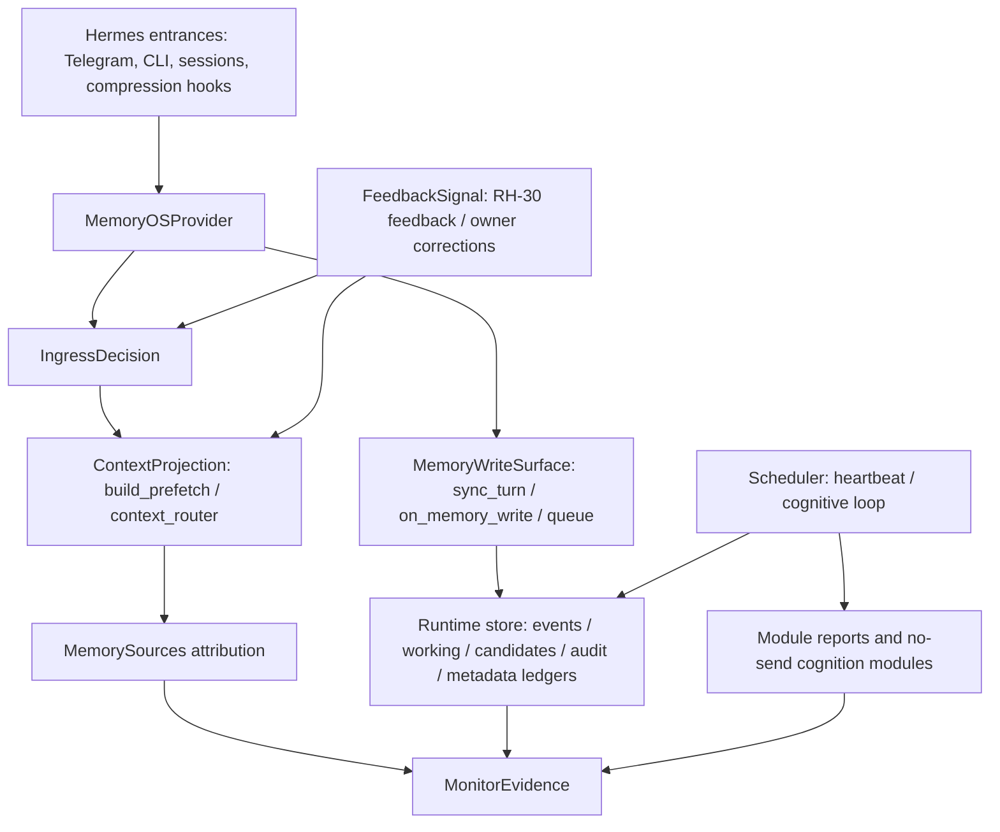

# 29 - Memory-OS Module Integration Contract

Status: governing contract; required gate for future module integration
Date: 2026-05-24
Scope: all future Memory-OS runtime modules, RH items, scheduler steps, prompt
projection changes, and monitor extensions

## Goal

Define the contracts every Memory-OS module must satisfy before it can affect a
live conversation, write runtime state, run in the scheduler, or appear in
monitor evidence.

This document exists because RH-25, RH-28, RH-29, and RH-30 exposed a real
integration risk:

```text
single-module tests can pass while the live ingress chain still has priority
conflicts between provider state, context routing, low-clue recall, and
attribution.
```

The fix is not to stop adding modules. The fix is to make module integration
explicit.

## Authority

This document is normative for Memory-OS module integration.

It is not a reference note and not a roadmap appendix. It is the gate every
future change must pass when it touches any of these surfaces:

- new module
- new RH item
- scheduler or timer behavior
- provider ingress or foreground task state
- context router or prefetch projection
- MemorySources attribution or feedback
- working/candidate/crystallized/identity/relationship writes
- LLM judge mode, fallback, or live influence
- monitor PASS/WARN/FAIL semantics
- installer path that enables or configures any of the above

Project-specific design documents may add stricter rules for a module. They may
not weaken this contract.

If a proposed change does not fit this document, the contract must be amended
first, with evidence and review, before the code is changed.

## Evidence Behind This Revision

This contract is based on real integration failures and current live evidence,
not a speculative governance exercise.

Real findings that drove the contract:

- RH-25/RH-25b: foreground task anchors fixed small-context compression drift,
  but cancellation/deferred turns needed route-specific handling.
- RH-26: router dry-run showed static context projection could select or drop
  sections correctly, but apply needed progressive monitoring.
- RH-27/RH-27b: cognitive-loop automation exposed that audit liveness and
  semantic state changes must be separate signals.
- RH-28/RH-28f: Telegram live tests showed that low-clue recall, current-task
  continuation, deferred resume, and MemorySources attribution must share one
  ingress decision.
- RH-29/RH-30: attribution and feedback are useful only if they remain metadata
  ledgers and do not become hidden memory writes or silent routing authority.

Code seams inspected for this contract:

- `plugins/memory/memory_os/ingress.py`
- `plugins/memory/memory_os/__init__.py`
- `plugins/memory/memory_os/prefetch.py`
- `plugins/memory/memory_os/context_router.py`
- `plugins/memory/memory_os/low_clue_recall.py`
- `plugins/memory/memory_os/memory_sources.py`
- `plugins/memory/memory_os/cognitive_loop.py`
- `scripts/memory_os_3_200_monitor.py`

Live 10.20.3.200 evidence at revision time:

```text
gateway=active
heartbeat_state=fresh
cognitive_loop.last_status=ok
context_router.mode=apply
context_router.apply_routes=["all"]
low_clue_recall.llm_judge.mode=report_only
low_clue_recall.llm_judge.on_error=deterministic_fallback
memory_sources.mode=metadata_only
MemorySources.boundary_true_count=0
MemorySources.forbidden_field_findings=[]
low_clue_ingress_matrix=all expected routes/headings matched
doctor=ok with expected hindsight_adapter_disabled warning
classification=WARN only because rh26_casual_empty remains expected
```

## Contract Completeness Standard

A module contract is incomplete if it only says what the module does.

It must close the full lifecycle:

```text
design -> implementation -> deployment -> monitoring -> bug handling ->
promotion or rollback
```

Minimum completeness checklist:

- declares the owning contract surface
- declares reads and writes
- declares whether it affects ingress
- declares whether it affects context projection
- declares whether it affects live decisions
- declares whether it uses LLMs and how it fails closed
- declares owner-approval boundaries
- declares scheduler behavior if any
- declares monitor evidence
- declares PASS/WARN/FAIL conditions
- declares promotion criteria
- declares rollback behavior
- declares local, integrated, and remote validation
- declares how P0/P1/P2/P3 findings are handled

Without these fields, the module is not contract-complete.

## Current 10.20.3.200 Baseline

Read-only live monitor on 2026-05-24 showed:

```text
gateway: active
heartbeat timer: active/enabled
heartbeat_state: fresh
cognitive_loop timer: active/enabled
cognitive_loop last cycle: ok
index_health: healthy
doctor: ok, with expected hindsight_adapter_disabled warning
status-tool contract: ok
context_router: enabled, mode=apply, apply_routes=["all"]
MemorySources: enabled, boundary_true_count=0, forbidden_field_findings=[]
low_clue_llm_judge: available in report-only probe
low_clue_ingress_matrix: all expected routes/headings matched
DeepReflection: enabled, auto_bounded, no send/execute/identity/crystallized write
crystallized_records: 0
```

The live host is healthy enough to continue development, but the RH-28 ingress
findings show that future modules need a shared integration contract before more
features are layered on top.

## Current Integration Map



The important rule:

```text
new modules do not own their own entrance path.
```

They integrate through the contracts below.

## Contract 1 - IngressDecision

Purpose:

Decide what kind of turn this is before provider state, prefetch routing,
low-clue recall, and monitor attribution make separate decisions.

Owner:

```text
plugins/memory/memory_os/ingress.py
```

Current producer:

```text
classify_ingress(query, current_task_anchor=...)
```

Current consumers:

- `MemoryOSProvider._refresh_current_task_anchor_from_query()`
- `context_router.plan_context_route()`
- `build_prefetch()` foreground and ambiguous recall handling
- monitor low-clue ingress matrix
- tests that assert route / headings / attribution alignment

Hard rule:

```text
No module may implement its own independent detector for cancellation,
vague continue, explicit deferred resume, low-clue recall, or diagnostic
status routing.
```

Allowed decision classes:

| Decision | Route | Hard route | Meaning |
| --- | --- | --- | --- |
| `cancellation` | `foreground_control` | yes | Stop current foreground task. |
| `continue_current_task` | `foreground_control` | yes | Continue active foreground task only when an anchor exists. |
| `defer_current_task` | `foreground_control` | yes | Preserve foreground task as deferred/open issue. |
| `explicit_deferred_resume` | `foreground_control` | yes | Resume explicitly deferred task. |
| `ambiguous_recall` | `ambiguous_recall` | no | Ask for clarification or bounded candidate choice. |
| `diagnostic_current_status` | `diagnostic_current_status` | yes | Current runtime/status question. |
| `unclassified` | downstream route | no | Continue through context router. |

LLM rule:

```text
LLM judge may never override a hard IngressDecision.
```

If the deterministic ingress classifier does not match:

- the query falls through to the context router
- LLM judge may later help title, merge, or rank candidate topics only inside
  the ambiguous recall path
- no LLM result may turn an unclassified query into send/execute/write approval

Required tests for any ingress-affecting change:

- no-punctuation Telegram-style phrase
- punctuation variant
- English variant where applicable
- active foreground anchor case
- no foreground anchor case
- route, headings, and MemorySources attribution alignment

## Contract 2 - ContextProjection

Purpose:

Own what becomes visible to the model for a turn.

Owner:

```text
plugins/memory/memory_os/prefetch.py
plugins/memory/memory_os/context_router.py
```

Current public seam:

```text
build_prefetch(...)
route_context_sections(...)
```

Hard rule:

```text
No module may inject prompt text directly into the live answer context unless it
passes through ContextProjection or the explicitly allowed provider
system_prompt_block foreground anchor.
```

Any module that affects prefetch must declare:

- section heading
- source class
- route or query class
- budget behavior
- reason codes
- safe source ids
- whether it can be selected, dropped, or only reported
- MemorySources attribution fields
- rollback config

Allowed projection surfaces:

| Surface | Allowed use |
| --- | --- |
| `ContextSection` | Normal prefetch content selection. |
| `Recall Clarification Guard` | Low-clue clarification prompt, bounded and metadata-only. |
| `Current Foreground Task` | Foreground task anchor, not long-term memory. |
| `Diagnostic Grounding` | Current runtime facts only. |
| `Conversation Carryover` | DeepReflection bounded carryover. |
| `Working Memory` | Active working context after router gating. |
| `Indexed Recall` | Search-derived recall with bounded summaries. |

Forbidden projection patterns:

- raw private message bodies
- unbounded session transcripts
- unreviewed identity content
- candidate text presented as approved crystallized memory
- LLM judge reasoning blocks
- hidden instructions from module reports

## Contract 3 - MemoryWriteSurface

Purpose:

Declare exactly where a module writes and what authority that write has.

Write surfaces:

| Surface | Examples | Authority |
| --- | --- | --- |
| canonical event | conversation summary, mirrored cron fact | raw fact, not approval |
| working item | active/lingering context | temporary working memory |
| candidate | crystallized candidate queue | review candidate only |
| crystallized record | approved long-term memory | owner approval required |
| identity / relationship | SOUL or locked relationship data | owner manual approval required |
| audit | meaningful state changes | observability only |
| metadata ledger | MemorySources, feedback, reports | attribution/control signal only |
| module artifact | digest, proposal, DR report | module-local output |

Hard rules:

- A score is not approval.
- A candidate is not crystallized memory.
- Metadata ledger records are not canonical events.
- Feedback is not memory approval.
- Audit records are not a substitute for owner approval.
- No module may write identity, relationships, crystallized records, send, or
  execute without a separate owner-approved path.

Any write-capable module must declare:

- exact file/table/path
- schema version
- body policy: no body / bounded summary / raw body allowed
- retention/archive policy
- whether the write is append-only
- whether it is idempotent
- whether owner approval is required
- monitor field that proves the write stayed in bounds

## Contract 4 - FeedbackSignal

Purpose:

Make owner corrections and relevance feedback useful without turning them into
silent memory writes or unbounded model control.

Current feedback sources:

- RH-30 MemorySources feedback ledger
- low-clue clarification selected/rejected/missing-candidate records
- owner approval or rejection of candidate/crystallized memory
- monitor findings

Allowed feedback effects:

- short-term candidate downrank after owner says "not this" or "missing"
- candidate title/cluster quality diagnostics
- route/source relevance reporting
- future bounded scoring after explicit apply gate

Forbidden feedback effects:

- automatic crystallized approval
- automatic identity or relationship write
- hidden prompt injection
- self-reinforcing "selected once means successful forever"
- LLM judge changing hard ingress decisions

LLM judge modes:

| Mode | Meaning |
| --- | --- |
| `none` | No judge call. |
| `report_only` | Judge output is recorded for observability only. |
| `bounded_vote` | Future mode; can affect ambiguous recall ranking only after review. |
| `live_decision` | Not allowed for Memory-OS v0.1. |

`selected` is not equal to `successful_use`.

Future top-of-mind or relevance scoring must use negative feedback, decay, and
route diversity so that the router cannot amplify its own previous selections
without owner-visible evidence.

## Contract 5 - SchedulerStep

Purpose:

Ensure scheduled cognition modules run as no-send, bounded, observable steps
rather than hidden background behavior.

Owner:

```text
plugins/memory/memory_os/cognitive_loop.py
systemd user timers on the test host
```

Any scheduled step must declare:

- step name
- interval or trigger
- apply mode: off / dry-run / report-only / test-host apply / live apply
- dependencies
- lock resource
- timeout
- failure isolation behavior
- audit action
- report path
- boundary booleans
- monitor fields
- rollback method

Current cognitive loop steps:

```text
heartbeat_pre
household_digest
digest_consolidation
wandering_mind
ops_gate
evidence_scoring
self_evolution
governance_feedback
deep_reflection
heartbeat_post
doctor_boundary_report
```

Hard rules:

- A scheduler step failure must not enable send, execute, identity write,
  relationship write, crystallized approval, or Hindsight export.
- No production apply mode is allowed until the test-host mode has evidence and
  owner review.
- Step-level audit and cycle-level audit are both allowed: step audit explains
  module behavior; cycle audit proves whole-loop completion.
- No-op heartbeat liveness belongs in `heartbeat_state.json`, not audit spam.

## Contract 6 - MonitorEvidence

Purpose:

Make every module observable through read-only, bounded monitor evidence.

Owner:

```text
scripts/memory_os_3_200_monitor.py
docs/system-modularization/19-memory-os-3-200-monitor.md
```

Any module must declare:

- PASS conditions
- WARN conditions
- FAIL conditions
- status or doctor command
- bounded count/delta fields
- boundary booleans
- forbidden-field checks when metadata is written
- growth/retention metrics when JSONL or reports are written
- rollback trigger

Hard rules:

- Monitor must stay read-only.
- Monitor must not restart services.
- Monitor must not run heartbeat, cognitive loop, cleanup, Hindsight export, or
  shadow apply.
- Monitor must not print raw private bodies.
- Monitor findings must distinguish expected WARN from true FAIL.

Live evidence is not optional for ingress or prefetch changes. A local unit test
is insufficient when the real failure class is:

```text
provider.prefetch -> ingress -> build_prefetch -> context_router ->
MemorySources -> monitor
```

## Observation And Promotion Gates

Purpose:

Define when monitoring data is enough to continue, when to keep observing, and
when to stop feature work.

Time alone is not enough. A gate should use both elapsed time and event volume
when the module depends on runtime behavior.

### General Rule

```text
PASS over time without relevant events is only a liveness signal.
PASS with the required event/data volume is promotion evidence.
```

### Current Monitor Coverage

The 10.20.3.200 monitor currently covers:

- gateway service state and PID
- heartbeat timer/service state
- heartbeat_state freshness and processed event count
- cognitive-loop timer/service state and latest cycle status
- Memory-OS status, doctor, index health, queue backlog, and count deltas
- status-tool contract
- shell alias no-env usability
- context_router config and RH-26 section-heading probes
- RH-28 low-clue recall probe
- RH-28f low-clue ingress matrix
- MemorySources stats, forbidden-field checks, boundary count, and feedback
  counts
- DeepReflection source-class distribution and boundary booleans
- audit action distribution and audit/event deltas
- working-memory active/expired counts
- compaction `focus=None` counts
- disk usage

### Promotion Gate Matrix

| Area | Monitor signal | Minimum evidence before advancing | Stop / fix signal |
| --- | --- | --- | --- |
| Core provider/runtime | gateway, heartbeat, doctor, index, queue, status-tool contract | one clean post-deploy monitor pass plus no FAIL in the next scheduled run | any FAIL, doctor error, gateway inactive, queue backlog not clearing |
| Heartbeat / RH-27b audit noise | heartbeat_state, audit action deltas, audit_per_new_event | at least 24 heartbeats and at least 5 new events; target audit_per_new_event 3-5 | heartbeat_state stale, service failed, audit_per_new_event repeatedly above 10 from plumbing noise |
| Cognitive loop RH-27 | latest cycle status, step/cycle audit, boundaries | at least one completed cycle after deployment; boundaries all false | latest cycle error, missing cycle when timer is active, any boundary true |
| Context Router RH-26 | seven public heading probes | all hard probes match expected headings; casual empty remains WARN only | cancellation/continue prompts include background sections, diagnostic/candidate routes pick wrong headings |
| IngressDecision / RH-28f | low-clue ingress matrix | every monitored phrase matches expected route and heading for at least one post-deploy pass; live Telegram smoke confirms the same class when available | any route/heading mismatch is P1 |
| Low-clue candidate quality RH-28g | low-clue recall probe, candidate count, source distribution, feedback | ask_choice works with bounded candidates; no raw bodies; source diversity appears when candidate pool is single-source heavy | repeated owner correction that candidates are missing/duplicated; MemorySources shows attribution but candidate pool ignores it |
| LLM judge report-only | judge availability/status, deterministic fallback | adapter status is ok/no_match/no_selection and deterministic fallback remains active; no live influence | judge unavailable repeatedly, blocks prefetch, or affects hard routes |
| Future LLM bounded-vote | report-only history plus feedback | do not consider until there are enough real report-only observations and explicit feedback records; hard routes still deterministic | any proposal to let LLM override foreground/cancellation/diagnostic/approval boundaries |
| MemorySources RH-29 | record count, file size, forbidden fields, boundary count | 24h of records with boundary_true_count=0 and forbidden_field_count=0 | any forbidden field, private text, or true boundary flag |
| Feedback RH-30 | feedback count and rating distribution | feedback may be observed immediately; do not use as strong ranking signal until enough explicit owner feedback exists | feedback mutates router weights, memory, candidates, crystallized records, identity, or relationships |
| DeepReflection | source-class distribution and boundaries | boundaries false; source skew may remain WARN while collecting data | actual_send/execute/identity/crystallized true, or unbounded private content appears |
| RH-31 guards | real finding plus route matrix | only add a guard when backed by live transcript/fixture and monitor can explain the route | broad wording guard without real finding, content-specific hardcode |
| RH-32 consolidation suggestions | suggestion report counts, retention/read-only proof | only after deterministic suggestion contract and retention story are defined | any automatic approve/delete/prune of canonical memory |
| RH-33 top-of-mind scoring | MemorySources + feedback + dry-run score reports | dry-run only until `successful_use` is defined without self-reinforcing selected-count logic | selected-by-router treated as success, hidden strong injection, new implicit tier |

### Promotion Decision Rules

- If the monitor has no FAIL but lacks event volume, keep observing rather than
  declaring the feature mature.
- If the monitor has expected WARN only, feature work may continue unless that
  WARN is the exact signal the next feature depends on.
- If a future feature needs a signal that is not monitored, add the monitor
  field before implementing the feature.
- If a feature depends on feedback, source distribution, or candidate quality,
  the gate is data-volume based, not clock-time based.
- If a feature changes live decisions, require both local tests and one
  10.20.3.200 monitor pass after deployment.

## Module Integration Declaration Template

Every new module or RH item that reads state, writes state, affects ingress,
affects prefetch, runs on a schedule, or calls an LLM must fill this table in
its design document.

```yaml
module:
  name:
  status: proposed | implemented | test-host | live
  owner_file:
  purpose:

contracts:
  ingress_decision:
    affects_ingress: yes | no
    ingress_decisions:
    hard_routes:
    fallback_when_unmatched:

  context_projection:
    affects_prefetch: yes | no
    section_headings:
    source_classes:
    reason_codes:
    budget_policy:
    memory_sources_required: yes | no

  memory_write_surface:
    writes:
      - surface:
        path_or_store:
        schema_version:
        body_policy: no_body | bounded_summary | raw_body
        owner_approval_required: yes | no
        append_only: yes | no
        retention:

  feedback_signal:
    emits_feedback: yes | no
    consumes_feedback: yes | no
    feedback_types:
    allowed_effect:
    forbidden_effect:

  scheduler_step:
    scheduled: yes | no
    mode: off | dry-run | report-only | test-host apply | live apply
    trigger:
    lock:
    failure_isolation:
    audit_actions:

  monitor_evidence:
    monitor_fields:
    pass:
    warn:
    fail:
    boundary_booleans:
    forbidden_field_checks:

  llm:
    uses_llm: none | report-only | bounded-live
    provider_source:
    timeout_ms:
    fallback:
    can_override_hard_route: no

  rollback:
    config_only: yes | no
    command_or_file:

  tests:
    local:
    integrated:
    remote:
```

## Current Module Contract Table

| Module / RH | Reads | Writes | Affects ingress | Affects prefetch | Live decision | LLM mode | Monitor evidence |
| --- | --- | --- | --- | --- | --- | --- | --- |
| MemoryOSProvider | Hermes hooks, config, store | events, queue, runtime anchor | yes | yes | yes | none | status, doctor, status-tool contract |
| IngressDecision | query, current task anchor | none | yes | indirect | yes for hard routes | none | low-clue ingress matrix |
| Context Router RH-26 | section candidates, runtime facts | none | consumes only | yes | yes | disabled by default | RH-26 probe headings |
| Low-Clue Recall RH-28 | MemorySources, events, working metadata, feedback | no canonical writes | consumes ingress | yes | asks choice / direct resume | report-only on test host | low-clue recall probe |
| MemorySources RH-29 | route reports, selected sections | metadata ledger | no | attribution only | no | none | stats, forbidden fields, boundary count |
| Feedback RH-30 | MemorySources records | feedback ledger + audit | no | bounded scoring signal | no live authority | none | feedback count and ratings |
| Heartbeat / Inner Drive | events | working, candidates, heartbeat state | no | no | no | none | heartbeat_state, working counts |
| Cognitive Loop RH-27 | store, module reports | module reports, audit, bounded events | no | indirect through generated state | no send/execute | DR may use LLM per config | cycle status, boundary report |
| DeepReflection | working, digest, governance | injection cards/reports | no | carryover section | bounded injection | auto_bounded | source-class distribution, boundaries |
| Future RH-31 guards | real findings | tests/docs, maybe route rules | must use IngressDecision | maybe | maybe | none/report-only only | route matrix |
| Future RH-32 consolidation suggestions | events/candidates/metadata | suggestion reports only | no | no | no | deterministic-only initially | suggestion count, no approval |
| Future RH-33 scoring | MemorySources + feedback | scoring metadata only | no | yes | no until apply gate | none/report-only first | attribution and feedback trend |

## Integration Gates

Before implementation:

1. Fill the module integration declaration.
2. State which contract owns the change.
3. Identify any hard route or owner approval boundary touched.
4. Identify the monitor fields that will prove the change is safe.

Before local merge:

1. Unit tests for the module's public seam.
2. Integrated test for the full call path when ingress or prefetch is touched.
3. `git diff --check`.

Before 10.20.3.200 deployment:

1. Installer or copy path verified.
2. Config rollback known.
3. Expected PASS/WARN/FAIL monitor outcome written.

After 10.20.3.200 deployment:

1. Run read-only monitor.
2. For ingress/prefetch changes, run the live ingress matrix.
3. For write-surface changes, check forbidden fields and boundary counts.
4. For scheduler changes, verify timer/service state and last successful run.
5. Update validation report with real evidence, not only local tests.

## Anti-Patterns That Block A Module

These patterns are integration blockers:

- adding a second keyword table for an ingress decision already owned by
  `ingress.py`
- writing prompt text outside ContextProjection
- letting LLM judge override cancellation, foreground control, diagnostic, or
  owner-approval boundaries
- treating candidate score as long-term memory approval
- writing per-heartbeat no-op audit records
- writing raw prompt/body/path/token fields into attribution or feedback
- adding a scheduled step without monitor fields
- adding tests only for private helpers while skipping the provider-to-monitor
  live path
- adding topic-specific hardcoded fixes such as `n8n`, `Make`, or `ComfyUI`
  instead of improving candidate clustering, source diversity, or ingress
  classification

## Bug And Finding Handling Contract

Purpose:

Define what to do when an existing module, new module, test-host deployment, or
monitor run exposes a bug during integration.

This applies to:

- small implementation bugs
- missing tests
- monitor false positives or false negatives
- installer/deployment gaps
- module interaction conflicts
- architecture-level contract violations

### Severity Classes

| Severity | Meaning | Examples | Required action |
| --- | --- | --- | --- |
| P0 | Boundary or live safety failure | send/execute happened; identity/crystallized write without owner; private body leaked; gateway restart loop from Memory-OS | stop feature work, rollback or disable affected config, preserve evidence, fix before continuing |
| P1 | Live behavior wrong or architecture contract broken | ingress route and attribution disagree; prefetch bypasses router; installer enables missing plugin; scheduler step writes unexpected state | stop the affected RH/module, write finding, fix with regression test, update validation report |
| P2 | Observable quality or operability issue | candidate labels poor; monitor WARN too noisy; feedback count too low; docs unclear | keep system running, track in roadmap, fix when it blocks next module |
| P3 | Cosmetic or future improvement | wording polish; optional CLI convenience; non-blocking report formatting | backlog only |

### Immediate Response Rules

P0:

- disable or roll back the affected config if a config-only rollback exists
- do not add new modules until the boundary is restored
- preserve bounded evidence: command, timestamp, route/report ids, monitor
  finding, and affected config
- add a regression test at the highest realistic seam
- update `07-validation-report-10.20.3.200.md`

P1:

- freeze the affected module/RH item
- do not work around the symptom with content-specific hardcoding
- identify which contract failed:
  - IngressDecision
  - ContextProjection
  - MemoryWriteSurface
  - FeedbackSignal
  - SchedulerStep
  - MonitorEvidence
- fix the owning contract or owning seam, not every caller
- add an integrated test if the failure crossed provider/prefetch/monitor
  boundaries
- update the module design document and validation report

P2:

- keep the test host running if boundaries remain false
- record the issue in the owning design document or runtime-hardening plan
- add monitor fields if the issue needs trend data
- do not promote it to a new module unless the data shows repeated impact

P3:

- do not interrupt the current RH slice
- batch with related documentation or productization cleanup

### Contract Failure Mapping

Use this table before choosing a fix:

| Symptom | Likely failed contract | First place to inspect |
| --- | --- | --- |
| Same phrase routes differently by entrance or punctuation | IngressDecision | `plugins/memory/memory_os/ingress.py` and low-clue ingress matrix |
| Actual prefetch content does not match route report | ContextProjection | `build_prefetch()`, `route_context_sections()`, MemorySources record |
| Candidate treated as approved memory | MemoryWriteSurface | candidate/crystallized write path and owner approval checks |
| Owner says "not this" but next turn reinforces same shortlist | FeedbackSignal | RH-30 feedback ledger and low-clue correction penalty |
| Scheduler runs but no meaningful output or too much audit noise | SchedulerStep | cognitive loop step report, heartbeat state, audit action distribution |
| Monitor says PASS while live behavior is wrong | MonitorEvidence | monitor probes and PASS/WARN/FAIL classification |
| Local tests pass but Telegram/live path fails | Integration gate missing | provider -> prefetch -> MemorySources -> monitor end-to-end test |

### Evidence Requirements

Every P0/P1 bug record must include:

```yaml
finding:
  date:
  host:
  severity: P0 | P1
  symptom:
  affected_contract:
  live_evidence:
  local_repro:
  root_cause:
  fix_scope:
  regression_test:
  monitor_update:
  rollback:
```

Do not close a P0/P1 without:

- one local regression signal
- one live or realistic integration signal
- updated documentation if the contract or expected behavior changed

### Development Stop Rules

Stop adding new functionality when any of these are true:

- a hard boundary is violated
- live ingress and MemorySources attribution disagree
- a module writes to an undeclared surface
- LLM judge affects a live decision outside its declared mode
- scheduler behavior cannot be proven by monitor
- an installer path leaves a half-enabled provider or shell

Continue with caution when:

- only expected WARN findings exist
- monitor detects quality drift but boundaries remain false
- the issue is P2 and the next planned module is needed to collect data

### Bug Fix Placement Rules

Small bug:

- fix in the owning module
- add a focused regression test
- update docs only if behavior or operator expectation changed

Cross-module bug:

- fix at the contract seam, not by duplicating guards in callers
- add integrated tests through the real public path
- update this contract if a new rule is discovered

Architecture-level bug:

- create or update the governing contract first
- map affected modules into the declaration table
- only then implement the code change
- validate on 10.20.3.200 before calling it closed

## Known Open Items

These are not blockers for this contract, but future modules must account for
them:

- RH-17 retention still needs to cover MemorySources, feedback ledgers,
  suggestion reports, and other metadata JSONL files.
- RH-30 feedback volume is still low. Do not use it as a strong ranking signal
  until more real owner corrections exist.
- RH-32 consolidation suggestions must remain deterministic-only until a
  separate LLM review gate exists.
- RH-33 top-of-mind scoring must define `successful_use` without equating it to
  "selected by router."
- Deferred task lifecycle and task stack should remain future work until real
  deferred-resume failures justify it.
- Candidate title quality can improve, but title normalization must not change
  live route decisions.

## External Practice Alignment

This contract follows these external lessons without copying any one system:

- mixed-initiative conversational search: ambiguous requests should ask for
  clarification rather than guess
- zero-shot clarification: broad topic ambiguity should be handled by query
  shape plus candidate facets, not an infinite keyword table
- memory hierarchy systems such as LangGraph and Letta: foreground, working,
  archival/search, and procedural memory need separate retrieval and projection
  rules
- Memory Sources style attribution: the system should be able to explain which
  memory surfaces influenced a turn

References:

- https://arxiv.org/abs/2112.07308
- https://arxiv.org/abs/2301.12660
- https://docs.langchain.com/oss/python/concepts/memory
- https://docs.letta.com/guides/core-concepts/memory/context-hierarchy

## Final Decision

Before RH-31, RH-32, RH-33, or any new cognition module changes live behavior,
it must pass this module integration contract.

This is now the governing rule:

```text
No new Memory-OS module may affect ingress, prompt projection, memory writes,
feedback scoring, scheduler behavior, or monitor semantics without an explicit
contract row and a live evidence path.
```

Additional hard rule:

```text
No contract row is valid unless it includes boundaries, monitor evidence,
promotion criteria, bug handling, and rollback.
```

This contract is allowed to slow down feature work. That is intentional. The
system is already complex enough that adding modules without lifecycle closure
creates more risk than velocity.
