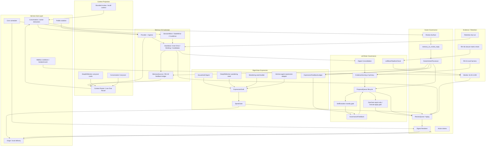

# 41 - Memory-OS Operating Closure Implementation Blueprint

Date: 2026-05-26

Status: implementation blueprint; no runtime behavior by itself.

Purpose: turn the current Memory-OS contracts into an executable development
plan for the next stage: from a safe governance shell to a real left-brain /
right-brain operating system. This document is intentionally concrete: it names
the modules, code seams, tests, live evidence, review gates, and stop signals.

This document does not replace:

- `29-memory-os-module-integration-contract.md`
- `36-module-closure-matrix.md`
- `37-agent-memoryos-collaboration-contract.md`
- `38-right-brain-expression-closure-contract.md`
- `39-left-brain-governance-quality-contract.md`
- `40-memory-os-unified-control-plane.md`

It is the implementation blueprint under those contracts.

## Non-Negotiable Principle

The `10.20.2.88` Hermes/Sannai prototype is a reference system, not a source
tree to copy.

Use it for:

- ownership boundaries;
- scheduler / delivery / profile patterns;
- proven failure classes;
- contract-checker shape;
- cadence separation;
- right-brain expression semantics.

Do not copy:

- Sannai's persona;
- exact cron schedule;
- exact prompt chain;
- exact script pipeline;
- profile-specific assumptions;
- transport or mailbox behavior into Memory-OS.

Memory-OS must synthesize a portable plugin architecture:

```text
Hermes owns conversation, agent interaction, cron, origin/local delivery,
platform channel, profile isolation, mailbox cooldown, and recovery.

Memory-OS owns bounded memory state, projections, drafts, gates, proposals,
owner action state, audit, monitor evidence, and contract checks.
```

## Dynamic Closure Preflight

Every implementation slice under this blueprint must paste and fill this block
in its PR / staged review / evidence note before code changes:

```yaml
source_of_truth:
finding_type:
owning_seam:
reverse_scope:
equivalent_contract_or_project_contract:
affected_modules:
affected_code:
evidence_loop:
monitor_or_validation_fields:
promotion_signal:
stop_or_rollback_signal:
external_review:
```

Minimum rule:

```text
Do not close a task with weaker evidence than the evidence that found it.
```

Examples:

- A live Telegram / Hermes-agent interaction bug needs a live or realistic
  integration smoke.
- A monitor gap needs a monitor field and fixture or live output.
- A right-brain closure claim needs a draft, SpeakGate decision, owner-visible
  preview, and feedback path.
- A left-brain maturity claim needs feature evidence, novelty / duplicate
  gates, proposal lifecycle, and report-only comparison before live apply.

## Target Architecture



## Closure Definition

### Layer 1 - Safety Governance

Already established on the test host:

- no unapproved send;
- no unapproved execute;
- no identity write;
- no unapproved crystallized write;
- no Hindsight export;
- owner actions route through OwnerActionProcessor;
- Hermes owns transport and interaction.

### Layer 2 - Intelligent Left Brain

Not closed until all are true:

- EvidenceScoring v2 uses feature dimensions as the primary score path;
- SelfEvolution has novelty / duplicate / cadence gates;
- approved proposals have visible follow-up state;
- OpsGate can report on follow-up without creating execution tickets;
- feedback backflow can create proposals but cannot mutate live policy;
- monitor distinguishes generated, skipped, duplicate, stale, error, and
  applied counts.

### Layer 3 - Formal Right Brain

Not closed until all are true:

- right-brain draft is a structured `ExpressionDraft`, not only deterministic
  would-send text;
- every non-silent draft has a SpeakGate decision;
- owner can see bounded expression preview and reason;
- normal scheduled expression is Hermes-origin, owner-configured, and low
  frequency;
- exceptional proactive expression uses one-shot permission;
- expression feedback feeds GovernanceFeedback / SelfEvolution as proposal
  input only.

### Layer 4 - Agent Collaboration

Not closed until all are true:

- Hermes agent can read bounded review context;
- Hermes agent can explain owner questions and ask clarifying questions;
- Hermes agent can suggest, but not decide for owner;
- Memory-OS exposes structured tools and stable tokens;
- fallback text parsing is monitored and deprecated;
- gateway hook is safety-only, not the approval path.

## Module Implementation Matrix

| Module / surface | Current key code | Current state | Required next behavior | Required tests |
| --- | --- | --- | --- | --- |
| Provider + tool schema | `plugins/memory/memory_os/__init__.py` | Exposes `memory_os_review_reply`; structured path exists. | Keep Hermes-agent interaction primary; fallback counted, not promoted. | `tests/plugins/memory/test_memory_os_lifecycle.py`, `tests/plugins/memory/test_memory_os_owner_actions.py` |
| Ingress | `plugins/memory/memory_os/ingress.py` | Owns entry classification. | ContextRouter must not grow duplicate ingress keyword authority. | `tests/plugins/memory/test_memory_os_context_router.py`, `test_memory_os_low_clue_recall.py` |
| Context Router | `plugins/memory/memory_os/context_router.py` | Selects context sections and recall behavior. | Consume ingress decision; do not create second ownership table. | Context router regression tests plus RH-28 live probes |
| Cognitive loop | `plugins/memory/memory_os/cognitive_loop.py` | Test-host integration harness. | Keep as integration harness; production cadence moves to Hermes cron classes. | `tests/plugins/memory/test_memory_os_cognitive_loop.py` |
| Household Digest | `plugins/modules/context/household_digest.py` | Builds bounded local digest. | Feed ExpressionDraft and DeepReflection; no owner action by itself. | `tests/system_modularization/test_household_digest_module.py` |
| DeepReflection | `plugins/modules/cognition/deep_reflection.py` | Deterministic reflection / carryover / optional outputs. | Split outputs: carryover to ContextProjection, proposal to ProposalQueue, seed to ExpressionDraft; no identity/write/apply. | `tests/system_modularization/test_deep_reflection_module.py` |
| Wandering Mind | `plugins/modules/cognition/wandering_mind.py` | Deterministic text + would-send artifact. | Become seed/draft producer; formal expression goes through ExpressionDraft + SpeakGate. | `tests/system_modularization/test_wandering_mind_module.py` plus new expression tests |
| ExpressionDraft | `plugins/modules/expression/expression_draft.py` | Implemented and deployed on test host. | Continue as structured bounded draft object: text preview, source refs, feeling tags, risk flags, silence reason. | `tests/system_modularization/test_expression_draft_module.py` |
| SpeakGate | `plugins/modules/expression/speak_gate.py` | Can evaluate wandering output, no full draft policy. | Evaluate every non-silent ExpressionDraft; count silent / allowed / blocked / would-send / permission-required. | `tests/system_modularization/test_speak_gate_module.py` |
| Hermes-Agent Expression Adapter | `scripts/memory_os_right_brain_expression.py` + `scripts/memory_os_right_brain_expression_cron_gate.py` | Implemented and deployed on test host. | Memory-OS emits bounded context; Hermes agent owns final wording, silence judgment, and origin delivery. | `tests/scripts/test_memory_os_right_brain_expression_helper.py`, `tests/scripts/test_memory_os_right_brain_expression_cron_gate.py` |
| ExpressionFeedbackLedger | `plugins/memory/memory_os/owner_actions.py` | Implemented as no-send ledger. | Store `like`, `too_mechanical`, `too_frequent`, `boundary_private`, `off_voice`, `mute_period`; no direct live mutation. | `tests/plugins/memory/test_memory_os_owner_actions.py` |
| GovernanceFeedback | `plugins/modules/governance/feedback_bridge.py` | Consumes evidence / ops / proposal / self-evolution. | Consume expression feedback and delivery outcomes as bounded governance events. | `tests/system_modularization/test_governance_feedback_bridge_module.py` |
| EvidenceScoring | `plugins/modules/evidence/scoring.py` | Feature-maturity v2 is the primary score path; legacy hash is comparison only. | Keep score dimensions visible; do not let scores directly execute, route, or mutate policy. | `tests/system_modularization/test_evidence_scoring_module.py` |
| SelfEvolution | `plugins/modules/governance/self_evolution.py` | Uses primary feature scores, duplicate unresolved skip exists, expression feedback can produce expression-policy proposals. | Add remaining cadence gates; consume governance feedback only as proposal input. | `tests/system_modularization/test_self_evolution_module.py` |
| ProposalQueue | `plugins/modules/governance/proposal_queue.py` | `approve` moves to `approved_for_proposal`; no execution. | Add lifecycle fields: followup_state, ops_reviewed_at, execution_decision_state, verification_refs. | `tests/system_modularization/test_proposal_queue_module.py` |
| OpsGate | `plugins/modules/governance/ops_gate.py` | Report-only gate. | Review approved proposals and expose follow-up status; do not create execution tickets. | `tests/system_modularization/test_ops_gate_module.py` |
| LeftBrainPipelineCheck | new `plugins/modules/governance/pipeline_checker.py` | Missing. | Read-only checker for proposal lifecycle, duplicate classes, cadence, boundary invariants. | new `tests/system_modularization/test_left_brain_pipeline_checker.py` |
| Owner Review Renderer | `plugins/memory/memory_os/owner_actions.py::render_owner_review_digest` | Human-readable digest exists. | Add expression preview and proposal follow-up rendering; keep tokenized actions. | `tests/plugins/memory/test_memory_os_owner_actions.py` |
| Review Surface | `plugins/memory/memory_os/status_tool_contract.py`, provider tool surface | Agent can inspect bounded state. | Add expandable review context and approved proposal follow-up context. | provider/tool tests |
| OwnerActionProcessor | `plugins/memory/memory_os/owner_actions.py::apply_owner_action` | Sole mutation path for owner action. | Add expression feedback actions; keep idempotency and no direct execute. | owner action tests |
| Monitor | `scripts/memory_os_3_200_monitor.py` | Boundary and module artifact monitor. | Add right-brain, pipeline, cadence, fallback, timestamp, proposal lifecycle fields. | `tests/scripts/test_memory_os_3_200_monitor.py` |
| Closure matrix check | `scripts/memory_os_closure_matrix_check.py` | Checks module and active work mapping. | Enforce new modules and active work mapping before closure. | `tests/scripts/test_memory_os_closure_matrix_check.py` |

## Key Code Contracts

### ExpressionDraft

Target file:

```text
plugins/modules/expression/expression_draft.py
```

Required schema:

```python
EXPRESSION_DRAFT_SCHEMA = "hermes.memory_os.expression_draft.v0"

ExpressionDraft = {
    "schema": EXPRESSION_DRAFT_SCHEMA,
    "draft_id": "expr_<timestamp>_<hash>",
    "created_at": "<iso8601>",
    "profile": "<profile>",
    "source_module": "wandering_mind|deep_reflection|household_digest",
    "source_refs": ["... bounded ids only ..."],
    "text_preview": "<bounded owner-visible natural text or [SILENT]>",
    "feeling_tags": ["quiet", "curious"],
    "risk_flags": ["private_context", "too_mechanical"],
    "silence_reason": "<set only when text_preview == [SILENT]>",
    "raw_body_included": False,
    "actual_send": False,
    "actual_execute": False,
    "actual_identity_write": False,
}
```

Required methods:

```python
class ExpressionDraftModule:
    def build_context(self, *, store: MemoryOSStore, max_refs: int = 8) -> dict:
        """Return a bounded context view. No raw transcript body."""

    def create_draft(
        self,
        *,
        store: MemoryOSStore,
        source_module: str,
        text_preview: str,
        source_refs: list[str],
        feeling_tags: list[str] | None = None,
        risk_flags: list[str] | None = None,
        silence_reason: str | None = None,
    ) -> dict:
        """Persist one bounded draft. No delivery."""

    def read_recent_drafts(self, *, limit: int = 20) -> list[dict]:
        """Read bounded draft metadata and previews for monitor/review."""
```

Hard rules:

- no LLM call inside Memory-OS unless a separate owner-approved adapter is
  explicitly designed;
- no delivery;
- no raw body;
- no tool execution;
- `[SILENT]` is a valid product outcome.

### Hermes-Agent Expression Adapter

This is not a Memory-OS transport. It is a bounded tool contract for Hermes
agent usage:

```text
Hermes agent reads bounded right-brain context
-> Hermes agent drafts optional expression or [SILENT]
-> Memory-OS stores ExpressionDraft
-> SpeakGate decides delivery class
```

Memory-OS exposes:

```python
memory_os_expression_context(profile: str, limit: int) -> bounded context
memory_os_expression_draft(text_preview, source_refs, feeling_tags, risk_flags, silence_reason)
```

The first implementation can be CLI/provider-local and disabled by default.
Scheduled origin delivery requires external review.

### SpeakGate v2

Target file:

```text
plugins/modules/expression/speak_gate.py
```

New method:

```python
def evaluate_expression_draft(
    self,
    draft: dict[str, Any],
    *,
    channel: str = "origin",
    delivery_tier: str = "test_host_observation",
) -> dict[str, Any]:
    """Return a gate decision for every non-silent expression draft."""
```

Decision classes:

```text
silent
test_host_would_send
scheduled_allowed
scheduled_blocked
exceptional_permission_required
blocked_private
blocked_mechanical
```

Monitor invariant:

```text
expression_draft_count
= speak_gate_evaluated_count + expression_silent_count + draft_error_count
```

No actual send happens in SpeakGate.

### Expression Feedback

Target file:

```text
plugins/memory/memory_os/owner_actions.py
```

Add owner action target type:

```text
target_type=expression
```

Add feedback actions:

```text
like_expression
too_mechanical
too_frequent
boundary_private
off_voice
mute_period
```

Ledger record:

```python
{
    "schema": "hermes.memory_os.expression_feedback.v0",
    "feedback_id": "efb_<timestamp>_<hash>",
    "created_at": "<iso8601>",
    "owner_id": "<owner>",
    "draft_id": "expr_...",
    "action_type": "too_mechanical",
    "source_refs": ["bounded refs"],
    "raw_body_included": False,
    "live_policy_changed": False,
}
```

Hard rule:

```text
Expression feedback can create governance evidence or proposals. It cannot
directly change prompt, route, cadence, or delivery policy.
```

### GovernanceFeedback Backflow

Target file:

```text
plugins/modules/governance/feedback_bridge.py
```

Add event kinds:

```python
GOVERNANCE_EVENT_KINDS += {
    "expression_feedback",
    "expression_gate_decision",
    "expression_delivery_outcome",
}
```

Expected output:

```text
bounded governance events
-> optional SelfEvolution proposal
-> owner review
-> OwnerActionProcessor
```

No direct live mutation.

### LeftBrainPipelineCheck

Target file:

```text
plugins/modules/governance/pipeline_checker.py
```

Read-only checks:

```python
class LeftBrainPipelineCheckModule:
    def run_once(self, *, store: MemoryOSStore) -> dict[str, Any]:
        return {
            "schema": "hermes.memory_os.left_brain_pipeline_check.v0",
            "status": "ok|warn|fail",
            "proposal_lifecycle": {...},
            "duplicate_unresolved": {...},
            "approved_followup": {...},
            "execution_boundary": {...},
            "cadence": {...},
            "findings": [...],
            "actual_execute": False,
        }
```

Checks:

- approved proposal has follow-up state;
- approved proposal did not create execution ticket;
- duplicate unresolved proposal classes are counted;
- feature scoring is the primary score path, while execution/routing/policy
  apply remains gated;
- expired working is not scored;
- owner feedback is visible to scoring/governance as evidence, not live apply;
- hard boundaries remain false.

### Proposal Lifecycle

Target file:

```text
plugins/modules/governance/proposal_queue.py
```

Add fields for new proposals:

```python
{
    "state": "candidate|approved_for_proposal|owner_declined|owner_defer",
    "followup_state": "none|awaiting_ops_gate|ops_gate_reviewed|awaiting_owner_execution_decision|closed",
    "execution_decision_state": "not_requested|report_only|awaiting_explicit_apply|applied|rejected|snoozed",
    "execution_ticket_count": 0,
    "actual_execute": False,
    "created_at": "<iso8601>",
    "updated_at": "<iso8601>",
}
```

Hard rule:

```text
approve_proposal never creates execution_ticket and never executes.
```

### Module Cadence Report

Target owner:

```text
Hermes owns cron/scheduler. Memory-OS owns bounded module cadence evidence.
```

Add monitor/report fields:

```text
module_cadence.<module>.cadence_class
module_cadence.<module>.generated_count
module_cadence.<module>.skipped_no_new_signal_count
module_cadence.<module>.duplicate_skipped_count
module_cadence.<module>.error_count
module_cadence.<module>.last_run_at
module_cadence.<module>.next_recommended_class
```

Cadence classes:

```text
integration_harness
owner_origin
local_no_agent
monitor_poll
on_demand_manual
disabled_until_opt_in
```

Memory-OS must not create platform cron jobs directly during this slice.

## Implementation Slices

### Slice 0 - Governance Baseline Commit

Purpose:

```text
Freeze the current contract baseline before runtime work starts.
```

Files:

- `docs/system-modularization/07-validation-report-10.20.3.200.md`
- `docs/system-modularization/32-active-roadmap-and-gates.md`
- `docs/system-modularization/36-module-closure-matrix.md`
- `docs/system-modularization/38-right-brain-expression-closure-contract.md`
- `docs/system-modularization/39-left-brain-governance-quality-contract.md`
- `docs/system-modularization/40-memory-os-unified-control-plane.md`
- this document
- closure matrix tests if changed

Commands:

```powershell
git status --short
python scripts\memory_os_closure_matrix_check.py --format summary
python -m pytest tests\scripts\test_memory_os_closure_matrix_check.py -q
git diff --check
```

Stop:

- independent review report accidentally staged;
- RH-36 check not ok;
- docs claim runtime behavior that is not implemented.

### Slice 1 - P1-R.3 ExpressionDraft Surface

Purpose:

```text
Create the bounded artifact that formal right-brain expression can use.
```

Code:

- add `plugins/modules/expression/expression_draft.py`
- export from `plugins/modules/expression/__init__.py`
- add tests in `tests/system_modularization/test_expression_draft_module.py`
- update RH-36 matrix if module row is missing

Tests:

```powershell
python -m pytest tests\system_modularization\test_expression_draft_module.py -q
python scripts\memory_os_closure_matrix_check.py --format summary
git diff --check
```

Acceptance:

- creates draft with stable id and `created_at`;
- stores only bounded text preview and source refs;
- supports `[SILENT]`;
- hard boundary fields false;
- no delivery.

### Slice 2 - P1-R.4 Hermes-Agent Expression Adapter Contract

Purpose:

```text
Let Hermes agent participate in expression without letting Memory-OS become
the conversation agent or transport.
```

Code:

- add provider tool schema only if RH-37 and owner review approve it;
- likely names:
  - `memory_os_expression_context`
  - `memory_os_record_expression_draft`
- model-facing schema must describe capability, not hidden implementation;
- no scheduled delivery in this slice.

Tests:

```powershell
python -m pytest tests\plugins\memory\test_memory_os_lifecycle.py tests\plugins\memory\test_memory_os_owner_actions.py -q
```

Acceptance:

- Hermes can read bounded expression context;
- Hermes can record a draft or `[SILENT]`;
- Memory-OS does not infer owner intent from raw chat;
- no send / no execute / no identity write.

External review:

```text
Required before enabling any owner-origin scheduled expression.
```

### Slice 3 - P1-R.5 SpeakGate Mandatory Decision

Purpose:

```text
Every non-silent expression draft has a SpeakGate decision.
```

Code:

- update `plugins/modules/expression/speak_gate.py`
- update `plugins/memory/memory_os/cognitive_loop.py` only for test-host
  integration harness;
- update monitor fields in `scripts/memory_os_3_200_monitor.py`.

Tests:

```powershell
python -m pytest tests\system_modularization\test_speak_gate_module.py tests\plugins\memory\test_memory_os_cognitive_loop.py tests\scripts\test_memory_os_3_200_monitor.py -q
```

Acceptance:

- silent drafts are counted as silent;
- non-silent drafts are evaluated;
- missing evaluation count is zero for new cycle reports;
- historical missing counts remain classified as historical WARN, not hidden.

Live evidence:

```powershell
python scripts\memory_os_3_200_monitor.py --host 10.20.3.200 --output summary
```

Expected:

```text
right_brain.expression_draft_count >= 0
right_brain.speak_gate_missing_evaluation_count = 0 for new cycle
actual_send=false
```

### Slice 4 - P1-R.6 Expression Feedback Ledger

Purpose:

```text
Owner can judge expression quality, not only allow one exceptional send.
```

Code:

- update `plugins/memory/memory_os/owner_actions.py`
- update digest/review rendering so expression items show:
  - preview;
  - why it appeared;
  - delivery tier;
  - stable token;
  - available feedback actions.
- add monitor fields.

Tests:

```powershell
python -m pytest tests\plugins\memory\test_memory_os_owner_actions.py tests\scripts\test_memory_os_3_200_monitor.py -q
```

Acceptance:

- owner can mark expression `like`, `too_mechanical`, `too_frequent`,
  `boundary_private`, `off_voice`, or `mute_period`;
- idempotency works;
- no prompt/policy/cadence live mutation;
- feedback ledger visible in monitor.

### Slice 5 - Expression Feedback Backflow

Purpose:

```text
Expression feedback becomes governance evidence and proposal input.
```

Precondition:

```text
Run this after Slice 6 LeftBrainPipelineCheck and Slice 7 proposal lifecycle /
follow-up are implemented, or explicitly document why bounded feedback events
cannot create proposal backlog. This keeps the RH-39 ordering authoritative:
checker and lifecycle come before feedback starts feeding governance proposals.
```

Code:

- update `plugins/modules/governance/feedback_bridge.py`
- update `plugins/modules/governance/self_evolution.py` only to consume bounded
  governance events as proposal evidence;
- no direct policy update.

Tests:

```powershell
python -m pytest tests\system_modularization\test_governance_feedback_bridge_module.py tests\system_modularization\test_self_evolution_module.py -q
```

Acceptance:

- expression feedback produces governance event;
- repeated feedback can produce a proposal;
- proposal still needs owner approval;
- feedback cannot directly alter SpeakGate or prompt.

### Slice 6 - P1-S.5 LeftBrainPipelineCheck

Purpose:

```text
Add a read-only checker equivalent in spirit to the prototype contract checker,
but generalized for Memory-OS modules.
```

Code:

- add `plugins/modules/governance/pipeline_checker.py`
- expose through CLI/module status if existing patterns support it;
- update monitor.

Tests:

```powershell
python -m pytest tests\system_modularization\test_left_brain_pipeline_checker.py tests\scripts\test_memory_os_3_200_monitor.py -q
```

Acceptance:

- reports ok/warn/fail;
- detects approved proposals without follow-up;
- detects duplicate unresolved proposal classes;
- detects execution ticket creation as failure;
- does not mutate state.

### Slice 7 - P1-S.6 Proposal Lifecycle and P1-Q Follow-Up

Purpose:

```text
Proposal approval must not execute, but must not disappear.
```

Code:

- update `plugins/modules/governance/proposal_queue.py`
- update `plugins/modules/governance/ops_gate.py`
- update owner review surface and renderer;
- update monitor.

Tests:

```powershell
python -m pytest tests\system_modularization\test_proposal_queue_module.py tests\system_modularization\test_ops_gate_module.py tests\plugins\memory\test_memory_os_owner_actions.py tests\scripts\test_memory_os_3_200_monitor.py -q
```

Acceptance:

- `approve_proposal` sets `approved_for_proposal`;
- follow-up state becomes `awaiting_ops_gate`;
- OpsGate report-only can mark `ops_gate_reviewed`;
- no execution ticket;
- repeated review is idempotent.

### Slice 8 - P1-T Module Cadence Report

Purpose:

```text
Stop treating the 6h cognitive loop as production cadence.
```

Code:

- add cadence classification report in monitor or a module-local status helper;
- no scheduler change yet;
- no cron creation by Memory-OS.

Tests:

```powershell
python -m pytest tests\scripts\test_memory_os_3_200_monitor.py tests\system_modularization\test_memory_os_agent_os_shell.py -q
```

Acceptance:

- every active module has cadence class;
- generated/skipped/duplicate/error counters visible;
- owner-origin modules remain disabled unless Hermes config enables them;
- cognitive loop is labelled integration harness.

### Slice 9 - 10.20.3.200 Live Closure Smoke

Purpose:

```text
Prove the integrated path works on the test host without expanding boundaries.
```

Live checks:

```powershell
python scripts\memory_os_3_200_monitor.py --host 10.20.3.200 --output summary
```

If deployment is needed:

```text
Use the existing installer / deployment path only.
Do not hand-edit live state except for documented test-host configuration.
```

Evidence to append to 07:

- commit hash;
- deployed files;
- monitor status;
- expression draft count;
- SpeakGate decision distribution;
- expression feedback counts;
- proposal follow-up counts;
- hard boundary counts;
- raw body / forbidden field counts;
- any WARN reason.

## Test and Audit Gates

### Contract Gate

Always run:

```powershell
python scripts\memory_os_closure_matrix_check.py --format summary
git diff --check
```

Expected now:

```text
status=ok
finding_count=0
```

When new modules are added, update RH-36 before claiming closure.

### Local Unit / Integration Gate

Per slice:

```powershell
python -m pytest <slice tests> -q
```

Before commit on a major slice:

```powershell
python -m pytest tests\system_modularization tests\plugins\memory tests\scripts -q
```

### Monitor Gate

Any monitor field must have:

- fixture-backed test;
- bounded summary field;
- PASS/WARN/FAIL classification;
- no raw body;
- no unbounded scores dump.

Monitor fields required by this blueprint:

```text
right_brain.expression_draft_count
right_brain.expression_silent_count
right_brain.speak_gate_evaluated_count
right_brain.speak_gate_missing_evaluation_count
right_brain.decision_distribution
right_brain.expression_preview_count
right_brain.expression_feedback_by_type
right_brain.draft_error_count

left_brain.pipeline_check_status
left_brain.approved_followup_count
left_brain.ops_gate_reviewed_count
left_brain.execution_ticket_count
left_brain.duplicate_unresolved_proposal_count
left_brain.feature_score_live_applied

cadence.<module>.cadence_class
cadence.<module>.generated_count
cadence.<module>.skipped_count
cadence.<module>.duplicate_skipped_count
cadence.<module>.error_count

owner_review.structured_review_reply_count
owner_review.reply_fallback_used_count
owner_review.gateway_safety_skip_count
owner_review.owner_review_command_pollution_count
```

### Live Gate

Live evidence is required for:

- Telegram / gateway behavior;
- Hermes-agent review tool behavior;
- owner-origin delivery behavior;
- installer / deployment behavior.

Live evidence is not required for pure documentation or local-only fixture
repairs, but those cannot claim runtime closure.

### External Review Gate

Required before:

- scheduled right-brain owner-origin expression delivery;
- feature scoring influences live proposal ranking;
- generic shell/service/filesystem execution/apply ability;
- any prompt/policy/cadence update is applied automatically;
- public product claims.

Bounded policy/config apply may be implemented on the test host without a
separate external review only when all are true: owner approval exists, OpsGate
has report-only `would_allow`, the proposal kind owns the runtime target, the
apply writes rollback evidence, and monitor proves no actual send/execute/raw
body exposure.

## Stop Signals

Stop implementation and return to design if any appears:

### Boundary stop

- Memory-OS sends directly through platform transport;
- Memory-OS creates Hermes cron jobs outside installer/operator opt-in;
- `actual_send=true` without owner-configured scheduled expression;
- `actual_execute=true`;
- identity or crystallized memory written without owner-approved processor path;
- raw body included in digest/draft/monitor.

### Right-brain stop

- expression text contains task/proposal/KPI/report language;
- expression path requires per-message owner approval for normal scheduled
  expression;
- owner cannot see bounded expression preview;
- expression feedback directly mutates prompt/cadence/policy;
- SpeakGate missing evaluations for new non-silent drafts.

### Left-brain stop

- feature score becomes live input without external review;
- approved proposal creates execution ticket;
- feedback directly changes routing/prompt/cadence without an owner-approved
  proposal and explicit apply record;
- duplicate unresolved proposal class keeps growing;
- expired working dominates scoring again.

### Process stop

- RH-36 mapping missing for a new module or active work item;
- 07 evidence claims a behavior without a matching test/live signal;
- implementation duplicates Hermes-owned scheduler / transport / conversation
  logic;
- external review required but skipped.

## Promotion Criteria

### Promote Right-Brain Observation to Formal Scheduled Expression

All required:

- ExpressionDraft implemented and monitored;
- every non-silent draft has SpeakGate decision;
- owner can see expression preview and provide feedback;
- expression feedback creates governance evidence only;
- Hermes cron/origin owner-configured schedule exists;
- no raw body;
- no actual send outside Hermes owner-origin path;
- external review accepted.

### Promote Feature Scoring Toward Direct Apply Use

All required:

- primary feature scores have stable comparison history against legacy hashes;
- owner feedback and source diversity are included as features;
- duplicate unresolved proposals are suppressed;
- expired working not scored;
- scorecard / monitor shows no boundary issues;
- external review accepted;
- explicit apply gate exists.

### Promote Approved Proposal Follow-Up Toward Manual Apply

All required:

- approved proposals visible in review surface;
- OpsGate report-only review exists;
- owner/Hermes agent can inspect follow-up context;
- execution ticket count remains 0 until explicit apply design;
- external review accepted before any apply.

## Review Checklist

Before a staged commit:

```text
1. Does the diff match one named slice?
2. Did the slice fill the dynamic closure preflight?
3. Did it check Hermes / 10.20.2.88 ownership?
4. Did it update RH-36 if a module/surface/work item changed?
5. Did it add monitor fields for any new observation claim?
6. Did it add tests at the public seam?
7. Did it avoid raw body and hard boundary changes?
8. Did it append 07 evidence if live behavior was tested?
9. Did it leave unrelated dirty files alone?
```

Before declaring done:

```text
local PASS:
integration PASS:
live PASS:
monitor PASS:
architecture PASS:
residual WARN:
stop signals checked:
external review required:
```

## Expected Near-Term Order

1. Commit current governance / contract baseline.
2. Implement Slice 1 ExpressionDraft.
3. Implement Slice 2 Hermes-agent expression adapter contract.
4. Implement Slice 3 SpeakGate mandatory draft decision.
5. Implement Slice 4 expression feedback ledger.
6. Implement Slice 6 left-brain pipeline checker.
7. Implement Slice 7 proposal lifecycle / follow-up.
8. Implement Slice 5 expression feedback backflow.
9. Implement Slice 8 cadence report.
10. Only then discuss scheduled right-brain owner-origin expression.

This order is deliberate:

- right-brain needs draft and gate before delivery;
- feedback needs owner-visible content before learning;
- Hermes-agent expression adapter must be explicit before Memory-OS starts
  recording formal expression drafts from agent output;
- left-brain needs checker and lifecycle before feedback backflow can safely
  create proposal pressure;
- left-brain needs checker and lifecycle before execution;
- cadence report comes before scheduler changes;
- Hermes delivery remains host-owned throughout.
